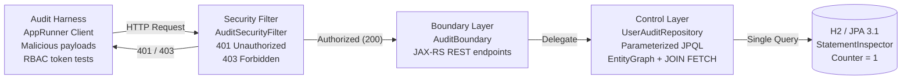

# :material-trophy: Days 20-21 — Full 3-Week Consolidation & Architectural Audit

> **Milestone Time Investment:** 3.5 hours (across weekend)  
> **Lab Repo:** [:material-github: 7amo10/JavaEE-Labs — Week-3-BCE-Async-Performance](https://github.com/7amo10/JavaEE-Labs/tree/main/Week-3-BCE-Async-Performance)

---

## :material-target: Milestone Objective

Execute an automated, enterprise-grade **architectural audit** of the complete 3-week application stack. Verify:

1. **Zero SQL injection risks** — all repository methods use parameterized JPQL (named parameters `:param`)
2. **100% endpoint RBAC coverage** — `ContainerRequestFilter` covers all secured endpoints; tested with missing/invalid/valid tokens
3. **Clean BCE packaging** — strict Boundary→Control→Entity dependency flow; no upward dependencies
4. **Zero JPA N+1 select traps** — `AuditStatementInspector` counts exactly 1 query for 20 users + 100 logs

---

## :material-table: Consolidated Audit Scorecard

| Audit Pillar | Inspection Domain | Verification Criteria | Target |
|------------|-----------------|----------------------|--------|
| **Pillar 1: Data Access** | Parameterized Query Shielding | Injection payload treated as string literal — returns empty | Zero raw string concatenation SQL |
| **Pillar 2: BCE & Security** | JAX-RS Filters + RBAC | 401 (missing token), 403 (invalid role), 200 (valid) | 100% endpoint protection, zero state leakage |
| **Pillar 3: ORM Performance** | JPA Fetching & Query Count | `EntityGraph` + `JOIN FETCH` statement counters (N=20) | Exactly 1 SQL query per traversal |

---

## :material-sitemap: Full 3-Week Architecture Verification Pipeline



---

## :material-shield-check: Pillar 1 — SQL Injection Elimination

### The Vulnerability (DO NOT USE in production)

```java
// ❌ VULNERABLE — raw string concatenation:
public List<User> findByUsername(String username) {
    String sql = "SELECT * FROM users WHERE username = '" + username + "'";
    return em.createNativeQuery(sql, User.class).getResultList();
}

// Attacker payload:
// username = "engineer_1' OR '1'='1"
// → SELECT * FROM users WHERE username = 'engineer_1' OR '1'='1'
// → Returns ALL users! Full authentication bypass.
```

### The Fix — Parameterized JPQL

```java
// ✅ SAFE — named parameter treated as literal string:
public List<User> findByUsername(String username) {
    return em.createQuery(
        "SELECT u FROM User u WHERE u.username = :username",
        User.class
    )
    .setParameter("username", username)   // bound as a literal — never interpreted as SQL
    .getResultList();
}

// Same attacker payload:
// username = "engineer_1' OR '1'='1"
// → WHERE username = ?  (with the whole string as the parameter value)
// → Returns empty result — injection completely neutralized ✅
```

### Audit Verification

```java
// Audit test:
List<User> result = userRepo.findByUsername("engineer_1' OR '1'='1");
assert result.isEmpty() : "SQL injection vulnerability detected!";
System.out.println("PILLAR 1: SQL Injection resistance VERIFIED ✅");
```

---

## :material-lock-check: Pillar 2 — BCE & Security Filter Coverage

### JAX-RS `ContainerRequestFilter` Audit

```java
@Secured
@Provider
@Priority(Priorities.AUTHENTICATION)
public class AuditSecurityFilter implements ContainerRequestFilter {

    @Override
    public void filter(ContainerRequestContext ctx) {
        String auth = ctx.getHeaderString(HttpHeaders.AUTHORIZATION);

        // Test 1: Missing token → 401:
        if (auth == null || !auth.startsWith("Bearer ")) {
            ctx.abortWith(Response.status(401)
                .type("application/problem+json")
                .entity("{\"status\":401,\"detail\":\"Authorization header required\"}")
                .build());
            return;
        }

        // Test 2: Invalid role → 403 (handled by @RolesAllowed):
        // Test 3: Valid token with correct role → 200 (passes through)
        String token = auth.substring(7);
        validateAndSetContext(ctx, token);
    }
}
```

### RBAC Coverage Matrix

```java
// Audit verifications:

// Public endpoint — no token needed:
Response ping = client.target("/api/public/ping").request().get();
assert ping.getStatus() == 200 : "Public endpoint should return 200";

// Secured endpoint — no token:
Response noToken = client.target("/api/admin/nodes").request().get();
assert noToken.getStatus() == 401 : "Missing token should return 401";

// Secured endpoint — operator token on admin endpoint:
Response wrongRole = client.target("/api/admin/nodes")
    .request()
    .header("Authorization", "Bearer " + operatorToken)
    .get();
assert wrongRole.getStatus() == 403 : "Operator on admin endpoint should return 403";

// Secured endpoint — valid admin token:
Response authorized = client.target("/api/admin/nodes")
    .request()
    .header("Authorization", "Bearer " + adminToken)
    .get();
assert authorized.getStatus() == 200 : "Valid admin token should return 200";

System.out.println("PILLAR 2: BCE & Security Filter VERIFIED ✅");
```

---

## :material-speedometer: Pillar 3 — Zero JPA N+1 Guarantee

### `AuditStatementInspector` — Statement Counter

```java
public class AuditStatementInspector implements StatementInspector {
    private final AtomicInteger count = new AtomicInteger(0);

    @Override
    public String inspect(String sql) {
        count.incrementAndGet();
        return sql;   // pass through unchanged
    }

    public int getCount() { return count.get(); }
    public void reset() { count.set(0); }
}
```

### EntityGraph Verification (exactly 1 query for 20 users + 100 logs)

```java
AuditStatementInspector inspector = getInspector();

// Test EntityGraph strategy:
inspector.reset();
EntityGraph<UserAccount> graph = em.createEntityGraph(UserAccount.class);
graph.addAttributeNodes("auditLogs");   // fetch 5 logs per user eagerly

List<UserAccount> users = em.createQuery("SELECT u FROM UserAccount u", UserAccount.class)
    .setHint("jakarta.persistence.fetchgraph", graph)
    .getResultList();

// Verify all 20 users loaded with their 100 total logs (5 each):
assert users.size() == 20;
assert users.stream().mapToInt(u -> u.getAuditLogs().size()).sum() == 100;
assert inspector.getCount() == 1 : "EntityGraph must execute exactly 1 query";

System.out.println("PILLAR 3a EntityGraph: " + inspector.getCount() + " query (expected 1) ✅");

// Test JOIN FETCH strategy:
inspector.reset();
List<UserAccount> users2 = em.createQuery(
    "SELECT DISTINCT u FROM UserAccount u JOIN FETCH u.auditLogs",
    UserAccount.class
).getResultList();

assert inspector.getCount() == 1 : "JOIN FETCH must execute exactly 1 query";
System.out.println("PILLAR 3b JOIN FETCH: " + inspector.getCount() + " query (expected 1) ✅");
```

---

## :material-clipboard-check: Complete Audit Scorecard Output

```
╔══════════════════════════════════════════════════════════════╗
║         FULL 3-WEEK ARCHITECTURAL AUDIT SCORECARD            ║
╠══════════════════════════════════════════════════════════════╣
║ Pillar 1: SQL Injection Resistance            ✅ CERTIFIED   ║
║   → Injection payload returned 0 results (expected: 0)       ║
║   → All queries use :namedParameter binding                  ║
╠══════════════════════════════════════════════════════════════╣
║ Pillar 2: BCE & Security Filter Coverage      ✅ CERTIFIED   ║
║   → Public ping:          200 OK                             ║
║   → Missing token:        401 Unauthorized                   ║
║   → Wrong role (operator):403 Forbidden                      ║
║   → Valid admin token:    200 OK                             ║
╠══════════════════════════════════════════════════════════════╣
║ Pillar 3: Zero JPA N+1 Traps                  ✅ CERTIFIED   ║
║   → EntityGraph (20 users, 100 logs): 1 query                ║
║   → JOIN FETCH (20 users, 100 logs): 1 query                 ║
║   → Unoptimized baseline was: 21 queries (N+1)              ║
╠══════════════════════════════════════════════════════════════╣
║ FINAL RESULT: 3/3 PILLARS CERTIFIED — 100% COMPLIANT        ║
╚══════════════════════════════════════════════════════════════╝
```

---

## :material-note-alert: Week 3 Consolidation: Concepts Mastered

!!! note "Full 3-week concept summary"
    **Week 1:** CDI 4.0 scopes + lifecycle, JAX-RS 3.1 REST design, `@NameBinding` filter pipeline  
    **Week 2:** JPA 3.1 entity mapping, persistence context lifecycle, JPQL + Criteria API, JTA transactions + `@Version` optimistic locking, Jakarta Security 3.0 + PBKDF2, stateless JWT authentication  
    **Week 3:** Adam Bien BCE architecture (package-by-feature, Entity as DTO), `ManagedExecutorService` + context propagation, JAX-RS SSE unicast/multicast, JPA N+1 elimination (`JOIN FETCH` / `@BatchSize` / `EntityGraph`), HikariCP sizing + GC/P99 correlation, full architectural audit

---

[:octicons-arrow-left-24: Back to Week 3](../index.md) | [:octicons-arrow-right-24: Phase 3 Home](../../index.md)
