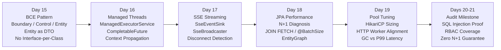

# Week 3 — Architecture Patterns (BCE), Async Execution & Performance

**Goal:** Implement clean enterprise patterns, managed async threads, Server-Sent Events (SSE), and ORM/HTTP performance tuning.

---

## :material-calendar-week: Weekly Schedule

| Day | Topic | Books | Time | Lab Focus |
|-----|-------|-------|------|-----------|
| **15** | Adam Bien's BCE Architecture Pattern | EE Patterns Ch3 | 2.5h | Refactor monolith → strict boundary/control/entity packages; eliminate DTO explosion |
| **16** | Enterprise Concurrency & Managed Threads | EE Patterns Ch3 + EE8 AppDev Ch13 | 2.0h | Context-propagating `ManagedExecutorService` + `CompletableFuture` parallel fan-out |
| **17** | Real-Time Communication via SSE | EE8 AppDev Ch10 | 2.5h | `SseBroadcaster` multicast + unicast streaming; disconnect lifecycle |
| **18** | JPA Performance Tuning & Batch Fetching | Pro Persistence Ch11 + Ch12 | 2.5h | N+1 profiling → `JOIN FETCH` / `@BatchSize` / `EntityGraph` / DTO projections |
| **19** | Connection Pool & HTTP Throughput Tuning | Pro Persistence Ch14 | 2.0h | HikariCP sizing experiments; GC pause vs P99 latency correlation |
| **20-21** | Full 3-Week Consolidation & Architectural Audit | All above | 3.5h | SQL injection proof, 100% RBAC coverage, BCE packaging audit, zero N+1 guarantee |

---

## :material-timeline: Week 3 Progression

---

## :material-folder-open: Days

-   :material-layers-triple:{ .lg .middle } **Day 15 — Adam Bien's BCE Architecture Pattern**

    ---

    Boundary (JAX-RS facade), Control (reusable business logic), Entity (JPA as DTO). Eliminates interface-per-class anti-pattern, DTO explosion, and anemic domain models. Package-by-feature structure.

    **Books:** EE Patterns Ch3

    [:octicons-arrow-right-24: Day 15 Notes](day-15-bce-architecture/index.md)

-   :material-clock-fast:{ .lg .middle } **Day 16 — Enterprise Concurrency & Managed Threads**

    ---

    Why raw threads are forbidden in enterprise containers. `ManagedExecutorService`, `ManagedThreadFactory`, context propagation (security principal + correlation ID), `CompletableFuture.allOf()` parallel fan-out/fan-in, non-blocking timeout fallback, `@Asynchronous`.

    **Books:** EE Patterns Ch3 + EE8 AppDev Ch13

    [:octicons-arrow-right-24: Day 16 Notes](day-16-enterprise-concurrency/index.md)

-   :material-broadcast:{ .lg .middle } **Day 17 — Real-Time Communication via SSE**

    ---

    JAX-RS SSE API: `SseEventSink`, `Sse` factory, `OutboundSseEvent` (name/id/data/retry/comment), `SseBroadcaster` multicast fan-out, `onClose`/`onError` lifecycle hooks, `sink.isClosed()` disconnect detection. SSE vs WebSockets vs Polling.

    **Books:** EE8 AppDev Ch10

    [:octicons-arrow-right-24: Day 17 Notes](day-17-sse-realtime/index.md)

-   :material-speedometer:{ .lg .middle } **Day 18 — JPA Performance Tuning & Batch Fetching**

    ---

    N+1 diagnosis with Hibernate `StatisticsService`, `JOIN FETCH` (1 query), `@BatchSize` (`IN(...)` grouping), JPA 3.1 `EntityGraph` (fetchgraph vs loadgraph), scalar DTO projections. Strategies comparison table.

    **Books:** Pro Persistence Ch11 + Ch12

    [:octicons-arrow-right-24: Day 18 Notes](day-18-jpa-performance-tuning/index.md)

-   :material-database-cog:{ .lg .middle } **Day 19 — Connection Pool & HTTP Throughput Tuning**

    ---

    HikariCP sizing formula: `(CPU_cores × 2) + spindles`. Thread starvation under undersized pools, context-switch degradation under oversized pools, `connectionTimeout` tuning, GC pause → P99 latency correlation.

    **Books:** Pro Persistence Ch14

    [:octicons-arrow-right-24: Day 19 Notes](day-19-connection-pool-tuning/index.md)

-   :material-trophy:{ .lg .middle } **Days 20-21 — Full 3-Week Consolidation & Architectural Audit**

    ---

    Automated audit: SQL injection resistance (parameterized JPQL), 100% endpoint RBAC coverage, clean BCE package decoupling, zero JPA N+1 traps via `StatementInspector` (exactly 1 query for 20 users × 100 logs).

    **Lab Repo:** [7amo10/JavaEE-Labs](https://github.com/7amo10/JavaEE-Labs/tree/main/Week-3-BCE-Async-Performance)

    [:octicons-arrow-right-24: Audit Milestone](day-20-21-consolidation-audit/index.md)

---

## :material-checkbox-marked-outline: Week 3 Progress

- [ ] Day 15: Adam Bien's BCE Architecture Pattern
- [ ] Day 16: Enterprise Concurrency & Managed Threads
- [ ] Day 17: Real-Time Communication via SSE
- [ ] Day 18: JPA Performance Tuning & Batch Fetching
- [ ] Day 19: Connection Pool & HTTP Throughput Tuning
- [ ] Days 20-21: Full 3-Week Consolidation & Architectural Audit

---

[:octicons-arrow-left-24: Back to Phase 3](../index.md)
