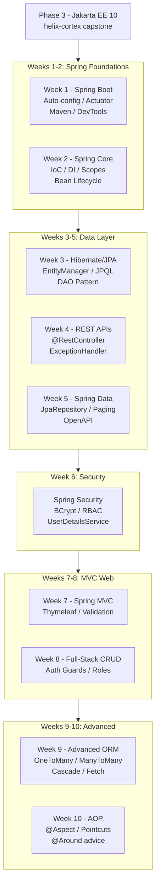

# Phase 4: Spring Ecosystem — Enterprise Microservices with Spring & Spring Boot

Master the Spring framework from first principles: IoC container internals, dependency injection mechanics, Spring Data JPA, REST API design, security, MVC web layers, advanced ORM relationships, and Aspect-Oriented Programming — building real production-grade systems at every step.

**Duration:** 10 Weeks  
**Primary Course:** Chad Darby's Spring Boot 3 & Spring 6 for Beginners  
**Companion Book:** Spring in Action (6th Edition) — Craig Walls (Manning, 2022)

---

## :material-bookshelf: Learning Resources

| Label | Resource | Coverage |
|-------|----------|----------|
| **Course** | Chad Darby — Spring Boot 4, Spring 7 & Hibernate for Beginners | Primary lecture content, all 10 sections |
| **Book A** | *Spring in Action (6th Ed.)* — Craig Walls | Ch 1–3, 5–8, 10, 15 |
| **Lab Repo** | [darbyluv2code/spring-boot-4-spring-7-hibernate-for-beginners](https://github.com/darbyluv2code/spring-boot-4-spring-7-hibernate-for-beginners) | Sections 01–11 |

> **Daily Time Budget:** 2.5–3.0 hours/day split as:
> - **45–60 min** — Core theory & lecture walkthrough
> - **30–45 min** — Spring in Action book reading
> - **60–75 min** — Practical engineering lab

---

## :material-folder-open: Weeks

-   :material-rocket-launch:{ .lg .middle } **Week 1 — Spring Boot Core Foundations**

    ---

    Bootstrap projects with Spring Initializr, understand Maven build lifecycle, master auto-configuration, DevTools hot-reload, Actuator production endpoints, `@Value` property injection, and server configuration.

    **Books:** Spring in Action Ch 1 · Ch 18.1-18.2  
    **Lab Guide:** [Enterprise Service Metadata & Health Gateway](week-1-spring-boot-foundations/lab-guide.md)  
    **Lab Repo:** [:material-github: 7amo10/Spring-Labs — Week-01](https://github.com/7amo10/Spring-Labs/tree/main/Week-01-Spring-Boot-Overview)

    [:octicons-arrow-right-24: Explore Week 1](week-1-spring-boot-foundations/index.md)

-   :material-injection-syringe:{ .lg .middle } **Week 2 — Spring Core: IoC, DI & Bean Lifecycle**

    ---

    Dissect the IoC container, compare constructor vs setter vs field injection, resolve multi-implementation ambiguity with `@Qualifier`/`@Primary`, manage bean scopes, implement lifecycle hooks, and wire 3rd-party classes via Java `@Configuration`.

    **Books:** Spring in Action Ch 1.1-1.2 · Ch 6.1-6.3  
    **Lab Guide:** [Dynamic Athletic Dispatcher & 3rd-Party Adapter](week-2-spring-core-ioc-di/lab-guide.md)  
    **Lab Repo:** [:material-github: 7amo10/Spring-Labs — Week-02](https://github.com/7amo10/Spring-Labs/tree/main/Week-02-Spring-Core-IoC-Lifecycle)

    [:octicons-arrow-right-24: Explore Week 2](week-2-spring-core-ioc-di/index.md)

-   :material-database:{ .lg .middle } **Week 3 — Hibernate / JPA Data Access & DAO Layer**

    ---

    Bridge domain models to relational databases with Jakarta Persistence and Hibernate: entity lifecycle, `EntityManager` transactions, JPQL queries, dirty checking, DDL auto generation, and DAO layer patterns.

    **Books:** Spring in Action Ch 3  
    **Lab Guide:** [Student Information System DAO Tier](week-3-hibernate-jpa-crud/lab-guide.md)  
    **Lab Repo:** [:material-github: 7amo10/Spring-Labs — Week-03](https://github.com/7amo10/Spring-Labs/tree/main/Week-03-Hibernate-JPA-CRUD)

    [:octicons-arrow-right-24: Explore Week 3](week-3-hibernate-jpa-crud/index.md)

-   :material-api:{ .lg .middle } **Week 4 — RESTful Services & Error Handling**

    ---

    Design and build production-grade REST APIs with Spring MVC: `@RestController`, HTTP verb semantics, Jackson data binding, global error handling via `@ControllerAdvice`, 3-tier layering with service transactions, and partial resource modifications via `PATCH`.

    **Books:** Spring in Action Ch 7 (pp. 163–174)  
    **Lab Guide:** [Corporate Enterprise Employee REST Gateway](week-4-restful-services/lab-guide.md)  
    **Lab Repo:** [:material-github: 7amo10/Spring-Labs — Week-04](https://github.com/7amo10/Spring-Labs/tree/main/Week-04-RESTful-Services-Error-Handling)

    [:octicons-arrow-right-24: Explore Week 4](week-4-restful-services/index.md)

-   :material-magnify:{ .lg .middle } **Week 5 — Spring Data JPA, REST & OpenAPI**

    ---

    Eliminate DAO boilerplate with Spring Data JPA repositories, add pagination and sorting, auto-generate REST endpoints with Spring Data REST, and document APIs with OpenAPI/Swagger.

    **Books:** Spring in Action Ch 3.2 · Ch 7.2  
    **Lab:** Automated Repositories & Sorting

    :material-clock-outline: *Upcoming in Week 5*

-   :material-shield-lock:{ .lg .middle } **Week 6 — Stateless REST Security**

    ---

    Secure REST APIs with Spring Security: HTTP Basic auth, BCrypt password hashing, RBAC with roles and authorities, in-memory and database-backed `UserDetailsService`.

    **Books:** Spring in Action Ch 5 · Ch 8.1-8.3  
    **Lab:** HTTP Basic & BCrypt RBAC Shield

    :material-clock-outline: *Upcoming in Week 6*

-   :material-web:{ .lg .middle } **Week 7 — Spring MVC Web & Bean Validation**

    ---

    Build server-side MVC web applications: Thymeleaf templates, model binding, form processing, `BindingResult`, JSR-380 bean validation with `@Valid`, custom validators.

    **Books:** Spring in Action Ch 2  
    **Lab:** Form Model Binding & Custom Validator

    :material-clock-outline: *Upcoming in Week 7*

-   :material-account-lock:{ .lg .middle } **Week 8 — Full-Stack MVC CRUD & Auth Guard**

    ---

    Build a complete CRUD web application with authentication guards, role-based view rendering, and database-backed `UserDetailsService`.

    **Books:** Spring in Action Ch 2.3-2.4 · Ch 5.2  
    **Lab:** Secure Corporate HR Portal

    :material-clock-outline: *Upcoming in Week 8*

-   :material-graph:{ .lg .middle } **Week 9 — Advanced JPA Relational Mappings**

    ---

    Master complex entity relationships: `@OneToOne`, `@OneToMany`, `@ManyToMany`, fetch strategies, cascade types, bidirectional mapping pitfalls, and join table management.

    **Books:** Spring in Action Ch 3.2.2-3.2.4  
    **Lab:** University Multi-Relationship Topology

    :material-clock-outline: *Upcoming in Week 9*

-   :material-eye:{ .lg .middle } **Week 10 — Aspect-Oriented Programming (AOP)**

    ---

    Cross-cutting concerns with Spring AOP: pointcut expressions, `@Before`/`@After`/`@Around` advice, `JoinPoint` and `ProceedingJoinPoint`, logging, audit, and performance measurement aspects.

    **Books:** Spring in Action Ch 10 · Ch 15  
    **Lab:** Enterprise AOP Telemetry & Audit

    :material-clock-outline: *Upcoming in Week 10*

---

## :material-timeline: Phase 4 Architecture

---

## :material-checkbox-marked-outline: Phase Progress

**Week 1 — Spring Boot Core Foundations**

- [ ] Spring Boot overview and philosophy
- [ ] Spring Initializr and Maven project structure
- [ ] Spring Boot Starters and parent BOM
- [ ] DevTools hot reload
- [ ] Actuator endpoints and security
- [ ] Command-line execution (fat JAR)
- [ ] @Value property injection
- [ ] Server configuration via application.properties
- [ ] Week 1 Lab: Enterprise Service Metadata & Health Gateway

**Week 2 — Spring Core: IoC, DI & Bean Lifecycle**

- [ ] Inversion of Control and the Spring Container
- [ ] Constructor injection (recommended)
- [ ] Setter injection and field injection
- [ ] Component scanning and @Component
- [ ] @Qualifier and @Primary for ambiguity resolution
- [ ] @Lazy initialization
- [ ] Singleton vs Prototype bean scopes
- [ ] @PostConstruct and @PreDestroy lifecycle hooks
- [ ] Java Config (@Configuration + @Bean)
- [ ] Week 2 Lab: Dynamic Athletic Dispatcher & 3rd-Party Adapter Service

**Week 3 — Hibernate / JPA Data Access & DAO Layer**

- [x] Entity mapping: `@Entity`, `@Table`, `@Id`, `@GeneratedValue`, `@Column`
- [x] Spring Boot auto-configuration for JPA and DataSource
- [x] DAO architecture and `EntityManager` constructor injection
- [x] CRUD operations: `persist()`, `find()`, `merge()`, `remove()`
- [x] JPQL queries: `TypedQuery`, filtering, sorting, named parameters
- [x] In-memory dirty checking vs explicit `merge()`
- [x] Bulk JPQL DML and First-Level Cache eviction considerations
- [x] Hibernate DDL auto schema generation (`spring.jpa.hibernate.ddl-auto`)
- [x] Week 3 Lab: Student Information System DAO Tier

**Week 4 — RESTful Services & Error Handling**

- [x] REST architecture constraints and HTTP verb semantics
- [x] Jackson JSON serialization (getters) and deserialization (setters/constructors)
- [x] `@RestController` and URI routing with `@PathVariable`
- [x] Controller-local vs Global exception handling (`@ControllerAdvice`)
- [x] Enterprise 3-tier layering (Controller -> Service -> DAO)
- [x] Service-tier transaction demarcation with `@Transactional`
- [x] Defensive `POST` primary key reset (`setId(0)`)
- [x] Partial entity modification via HTTP `PATCH` and Jackson `JsonMapper`
- [x] Week 4 Lab: Corporate Enterprise Employee REST Gateway

**Weeks 5–10** *(Upcoming)*

- [ ] Week 5: Spring Data JPA Advanced, Paging & OpenAPI
- [ ] Week 6: Stateless REST Security & BCrypt
- [ ] Week 7: Spring MVC Web & Bean Validation
- [ ] Week 8: Full-Stack MVC CRUD & Auth Guard
- [ ] Week 9: Advanced JPA Relational Mappings
- [ ] Week 10: Aspect-Oriented Programming (AOP)

---

*Phase 4 Start Date: 2026-10-01 | Target Completion: 2026-12-10*
