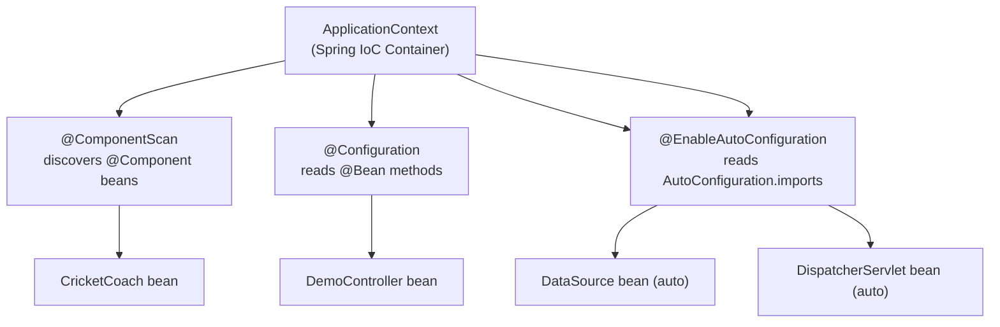

# :material-book-open-variant: Spring in Action Ch 1 — Getting Started with Spring

*Craig Walls, Manning Publications, 6th Edition (Spring Boot 3 / Spring 6)*

---

## :material-head-lightbulb: 1.1 What Is Spring?

Craig Walls opens with the most important statement in the book: **Spring is not a single framework** — it is a complete ecosystem of projects, all rooted in a shared foundation called the **Spring Framework**.

At its philosophical core, Spring stands for three things:

1. **POJO-based programming**: Write plain Java classes — no framework inheritance, no framework interfaces, no framework annotations required on domain objects. Spring manages your POJOs from the outside.

2. **Loose coupling via Dependency Injection**: Objects declare what they need; the container delivers it. Objects never reach out to find or create their own dependencies.

3. **Declarative programming via AOP**: Cross-cutting concerns (security, transaction, caching, logging) are expressed as aspects applied to your business logic declaratively — without polluting your business code.

### The POJO Philosophy in Practice

```java
// This is a valid Spring bean:
public class CricketCoach {
    public String getDailyWorkout() {
        return "Practice fast bowling for 15 minutes!";
    }
}
```

No `extends SpringBean`, no `implements Manageable`, no framework annotation required on the class. Spring manages this purely from the outside via configuration. This is what Walls means by "POJO programming" — the domain model remains clean.

Contrast with pre-Spring EJB 2.x:
```java
// EJB 2.x horror — your class is married to the framework:
public class CricketCoachBean implements SessionBean {
    private SessionContext ctx;

    public void setSessionContext(SessionContext ctx) { this.ctx = ctx; }
    public void ejbCreate() { }
    public void ejbRemove() { }
    public void ejbActivate() { }
    public void ejbPassivate() { }

    public String getDailyWorkout() {
        return "Practice fast bowling for 15 minutes!";
    }
}
```

Spring's POJO approach liberated Java enterprise development from this ceremony.

---

## :material-archive: 1.1.1 The Spring Application Context

The **Application Context** is the central container in Spring — the object that holds all your beans, wires their dependencies, and manages their lifecycle.



Key `ApplicationContext` implementations:

| Class | When Used |
|-------|----------|
| `AnnotationConfigApplicationContext` | Standalone Java SE apps, tests |
| `AnnotationConfigServletWebServerApplicationContext` | Spring Boot web apps (most common) |
| `AnnotationConfigReactiveWebServerApplicationContext` | Spring WebFlux reactive apps |

### BeanFactory vs ApplicationContext

`ApplicationContext` extends `BeanFactory`. The difference:

| Feature | BeanFactory | ApplicationContext |
|---------|------------|-------------------|
| Bean instantiation | Lazy (on first `getBean()`) | Eager (singletons at startup) |
| AOP proxy support | Manual | Auto-detected via BPPs |
| Event publishing | ❌ | ✅ `ApplicationEvent` |
| Internationalization | ❌ | ✅ `MessageSource` |
| Environment / Properties | ❌ | ✅ `Environment` abstraction |
| `@PostConstruct` / `@PreDestroy` | ❌ | ✅ (via CommonAnnotationBPP) |

**Rule**: Always use `ApplicationContext`. `BeanFactory` is a historical API — nothing in modern Spring code should use it directly.

---

## :material-connection: 1.1.2 Wiring Beans Together

Walls explains that Spring wires beans in two ways:

**Automatic configuration (the preferred way):**
```java
// Step 1: Mark the dependency as a bean
@Component
public class CricketCoach implements Coach {
    public String getDailyWorkout() { return "Bowl 15 min!"; }
}

// Step 2: Inject it via constructor — Spring finds CricketCoach and wires it in
@Component
public class DemoController {
    private final Coach coach;

    @Autowired
    public DemoController(Coach coach) {
        this.coach = coach;
    }
}
```

**Explicit Java configuration (for 3rd-party classes):**
```java
@Configuration
public class AppConfig {

    @Bean
    public Coach cricketCoach() {
        return new CricketCoach();  // No @Component needed
    }

    @Bean
    public DemoController demoController(Coach coach) {
        return new DemoController(coach);  // Spring injects cricketCoach()
    }
}
```

Walls recommends **automatic configuration** whenever possible. Explicit configuration is for cases where component scanning isn't an option.

---

## :material-cog-transfer: 1.2 Examining Spring Auto-Configuration

The single biggest developer experience improvement in Spring Boot is **auto-configuration**. It answers the question: "How does adding `spring-boot-starter-data-jpa` to my POM magically give me a working database connection?"

### The Auto-Configuration File

Spring Boot ships with a file inside `spring-boot-autoconfigure.jar`:

```
META-INF/spring/org.springframework.boot.autoconfigure.AutoConfiguration.imports
```

This file lists ~140 fully-qualified class names, one per line:
```
org.springframework.boot.autoconfigure.jdbc.DataSourceAutoConfiguration
org.springframework.boot.autoconfigure.orm.jpa.HibernateJpaAutoConfiguration
org.springframework.boot.autoconfigure.web.servlet.DispatcherServletAutoConfiguration
org.springframework.boot.autoconfigure.security.servlet.SecurityAutoConfiguration
...
```

At startup, `@EnableAutoConfiguration` reads this file and attempts to apply each configuration class.

### Conditional Annotations — The Decision Engine

Each auto-configuration class is wrapped in `@ConditionalOn*` annotations:

```java
// Example: DataSourceAutoConfiguration (simplified)
@AutoConfiguration
@ConditionalOnClass(DataSource.class)          // Only if DataSource is on classpath
@ConditionalOnMissingBean(DataSource.class)    // Only if you haven't defined your own
@EnableConfigurationProperties(DataSourceProperties.class)
public class DataSourceAutoConfiguration {

    @Bean
    @ConditionalOnProperty(prefix = "spring.datasource", name = "url")
    public DataSource dataSource(DataSourceProperties props) {
        return DataSourceBuilder.create()
            .url(props.getUrl())
            .username(props.getUsername())
            .password(props.getPassword())
            .build();
    }
}
```

**The key conditional annotations:**

| Annotation | Condition Passes When |
|-----------|----------------------|
| `@ConditionalOnClass(X.class)` | Class `X` is present on the classpath |
| `@ConditionalOnMissingClass(X.class)` | Class `X` is NOT on the classpath |
| `@ConditionalOnBean(X.class)` | A bean of type `X` already exists |
| `@ConditionalOnMissingBean(X.class)` | No bean of type `X` has been defined |
| `@ConditionalOnProperty("prop")` | Property `prop` is set and not `false` |
| `@ConditionalOnWebApplication` | Application is a web application |
| `@ConditionalOnExpression("#{...}")` | SpEL expression evaluates to `true` |

### Auto-Configuration Transparency

You can inspect every auto-configuration decision Spring Boot made:

```bash
# Run with debug output — prints CONDITIONS EVALUATION REPORT
java -jar app.jar --debug

# Or via Actuator (requires exposure)
curl http://localhost:8080/actuator/conditions
```

The report shows:
- **Positive matches**: configs that were applied and why
- **Negative matches**: configs that were skipped and which condition failed
- **Unconditional classes**: configs that always apply

---

## :material-controller: 1.2.1 Spring MVC Web Layer

Spring MVC handles the web layer — mapping HTTP requests to Java methods:

```java
@Controller  // Stereotype of @Component — MVC controller
public class HomeController {

    @GetMapping("/")
    public String home(Model model) {
        model.addAttribute("greeting", "Welcome to Spring!");
        return "home";  // Resolves to templates/home.html (Thymeleaf)
    }
}
```

For REST APIs, `@RestController` = `@Controller` + `@ResponseBody`:

```java
@RestController
@RequestMapping("/api/v1")
public class CoachRestController {

    private final Coach coach;

    @Autowired
    public CoachRestController(Coach coach) {
        this.coach = coach;
    }

    @GetMapping("/workout")  // GET /api/v1/workout
    public String getWorkout() {
        return coach.getDailyWorkout();  // Returned as text/plain body
    }

    @GetMapping("/coach")    // GET /api/v1/coach → JSON response
    public CoachInfo getCoach() {
        return new CoachInfo("Cricket", coach.getDailyWorkout());
        // Jackson auto-serializes CoachInfo to JSON
    }
}
```

---

## :material-test-tube: 1.2.2 Testing Spring Boot Applications

Spring Boot provides powerful test slicing — loading only the parts of the context needed for each test type:

### Full Context Integration Test

```java
@SpringBootTest  // Loads the ENTIRE ApplicationContext
class DemoApplicationTests {

    @Autowired
    private CoachRestController controller;

    @Test
    void contextLoads() {
        // If ANY bean has a wiring error, this test fails
        assertThat(controller).isNotNull();
    }
}
```

### Web Layer Slice Test (MVC)

```java
@WebMvcTest(CoachRestController.class)  // Only loads MVC layer — fast
class CoachRestControllerTests {

    @Autowired
    private MockMvc mockMvc;  // Simulates HTTP without a real server

    @MockBean
    private Coach coach;  // Mocks the dependency — no real bean needed

    @Test
    void getWorkout_returnsCoachWorkout() throws Exception {
        when(coach.getDailyWorkout()).thenReturn("Run 5km!");

        mockMvc.perform(get("/api/v1/workout"))
               .andExpect(status().isOk())
               .andExpect(content().string("Run 5km!"));
    }
}
```

### Test Slices in Spring Boot

| Annotation | What It Loads | Use Case |
|-----------|--------------|----------|
| `@SpringBootTest` | Full context | Integration tests |
| `@WebMvcTest` | MVC layer only | Controller unit tests |
| `@DataJpaTest` | JPA layer + in-memory DB | Repository tests |
| `@RestClientTest` | REST client layer | Client tests |
| `@JsonTest` | JSON serialization only | Jackson mapping tests |

---

## :material-lightbulb: Key Takeaways from Chapter 1

1. **Spring Framework = DI + AOP**. Everything else is built on these two pillars.
2. **ApplicationContext manages your beans**. You declare what you need; it creates and wires everything.
3. **Auto-configuration is conditional**. It only activates when conditions are met — classpath contents, missing beans, property values.
4. **Spring Boot = opinionated defaults**. Override only what you actually need to change.
5. **@SpringBootApplication = @Configuration + @EnableAutoConfiguration + @ComponentScan**. These three annotations bootstrap the entire framework.
6. **Test slicing is idiomatic Spring**. Don't load the full context for every test — use the right slice.
