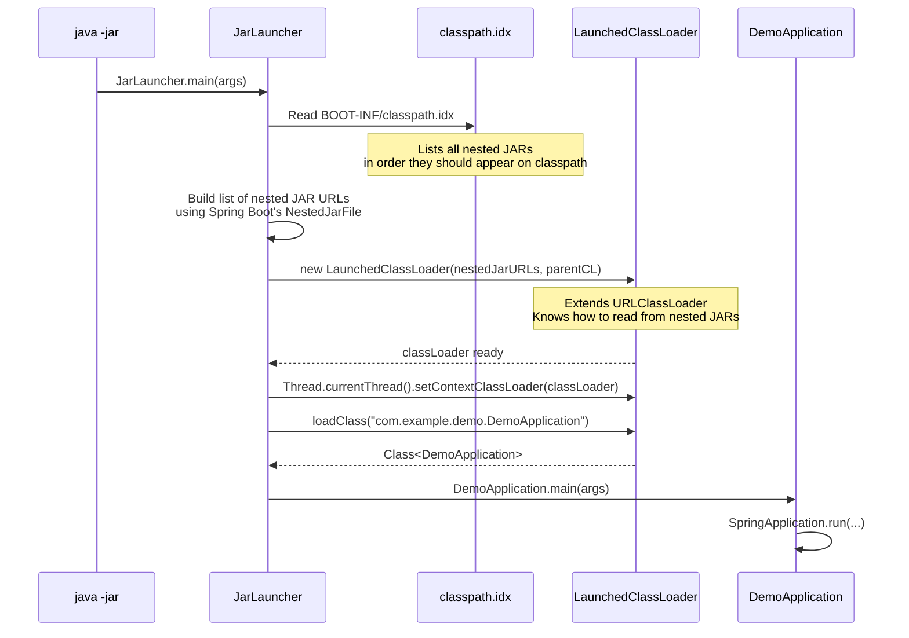

# :material-book-open-variant: Spring in Action Ch 18 — Deploying Spring (Sections 18.1–18.2)

*Craig Walls, Manning Publications, 6th Edition*

---

## :material-rocket-launch: 18.1 The Challenge of Deploying Spring Applications

Walls opens Chapter 18 with the practical question every developer faces after building their application: **how do I get this from my machine to production?**

For traditional Spring (pre-Boot), the answer was a WAR file deployed to a shared Tomcat or JBoss server. This approach has serious problems in the cloud and microservices era:
- The server must be pre-configured and maintained separately
- Deploying multiple applications to one server creates dependency conflicts (JAR hell)
- Scaling means provisioning more servers, not running more JVM processes
- The application and server are tightly coupled — upgrading Tomcat affects all apps on it

Spring Boot's answer: **executable fat JARs** — every application is its own server.

---

## :material-package-variant-closed: 18.1.1 Building Executable JAR Files

The `spring-boot-maven-plugin` in your POM is what creates the fat JAR:

```xml
<build>
    <plugins>
        <plugin>
            <groupId>org.springframework.boot</groupId>
            <artifactId>spring-boot-maven-plugin</artifactId>
            <!-- No configuration needed — parent BOM provides defaults -->
        </plugin>
    </plugins>
</build>
```

Building the JAR:
```bash
./mvnw clean package

# Output:
# target/demo-0.0.1-SNAPSHOT.jar        ← The fat JAR (50-100MB)
# target/demo-0.0.1-SNAPSHOT.jar.original ← The thin JAR (your code only, ~20KB)
```

Running it:
```bash
java -jar target/demo-0.0.1-SNAPSHOT.jar

# Override any property at runtime:
java -jar target/demo-0.0.1-SNAPSHOT.jar \
    --server.port=9090 \
    --spring.profiles.active=production \
    --spring.datasource.url=jdbc:postgresql://prod-db:5432/mydb
```

---

## :material-file-cabinet: 18.1.2 The Fat JAR Internal Structure

A standard Java JAR cannot contain other JARs on its classpath — this is a fundamental limitation of `java.util.jar.JarFile`. Spring Boot works around it with a custom nested JAR format.

### Directory Layout Inside the Fat JAR

```
demo-0.0.1-SNAPSHOT.jar
│
├── META-INF/
│   ├── MANIFEST.MF                          ← JVM entry point configuration
│   └── maven/com.example/demo/pom.xml       ← Build metadata
│
├── BOOT-INF/
│   ├── classes/                             ← Your compiled application code
│   │   └── com/example/demo/
│   │       ├── DemoApplication.class
│   │       ├── controller/
│   │       │   └── FunRestController.class
│   │       └── ...
│   ├── lib/                                 ← ALL dependency JARs (nested)
│   │   ├── spring-core-6.1.4.jar
│   │   ├── spring-context-6.1.4.jar
│   │   ├── spring-webmvc-6.1.4.jar
│   │   ├── spring-boot-3.3.0.jar
│   │   ├── tomcat-embed-core-10.1.20.jar
│   │   ├── tomcat-embed-websocket-10.1.20.jar
│   │   ├── jackson-databind-2.17.0.jar
│   │   ├── jackson-core-2.17.0.jar
│   │   ├── hibernate-validator-8.0.1.Final.jar
│   │   └── ... (50+ more JARs)
│   └── classpath.idx                        ← Index of nested JAR order
│
└── org/springframework/boot/loader/         ← Spring Boot loader classes
    ├── JarLauncher.class
    ├── LaunchedClassLoader.class
    ├── archive/
    │   ├── Archive.class
    │   └── JarFileArchive.class
    └── jar/
        ├── NestedJarFile.class
        └── ...
```

---

## :material-launch: 18.1.3 The `MANIFEST.MF` — Where Execution Begins

When `java -jar demo.jar` is invoked, the JVM reads `META-INF/MANIFEST.MF`:

```manifest
Manifest-Version: 1.0
Spring-Boot-Version: 3.3.0
Implementation-Title: demo
Implementation-Version: 0.0.1-SNAPSHOT
Main-Class: org.springframework.boot.loader.launch.JarLauncher
Start-Class: com.example.demo.DemoApplication
Spring-Boot-Classes: BOOT-INF/classes/
Spring-Boot-Lib: BOOT-INF/lib/
Spring-Boot-Classpath-Index: BOOT-INF/classpath.idx
```

Two critical fields:
- **`Main-Class`**: `JarLauncher` — this is what the JVM invokes, NOT your class
- **`Start-Class`**: your `DemoApplication` — `JarLauncher` will eventually call this

---

## :material-cog-play: 18.1.4 JarLauncher — The Real Entry Point

`JarLauncher` is Spring Boot's solution to the nested JAR problem. Its job:



The `LaunchedClassLoader` is a custom `URLClassLoader` subclass that knows how to:
1. Read class data from `BOOT-INF/classes/` (your code)
2. Read class data from nested JARs in `BOOT-INF/lib/` using Spring Boot's `NestedJarFile` handler

This is pure ClassLoader engineering — the same mechanisms covered in Phase 2.

!!! note "LaunchedClassLoader extends URLClassLoader — Phase 2 Connection"
    `java.net.URLClassLoader` is the standard JDK class for loading classes from a list of URLs (JAR files, directories, remote URLs). `LaunchedClassLoader` extends `URLClassLoader` and adds one capability: it registers a custom `URLStreamHandlerFactory` that handles the `jar:file:/app.jar!/BOOT-INF/lib/spring-core.jar!/` URL format — a JAR entry inside another JAR. The JDK's default `URLStreamHandler` cannot handle this double-nesting; Spring Boot's custom handler can.

---

## :material-docker: 18.2 Deploying to the Cloud — Layered JARs

For Docker deployments, a monolithic 80MB fat JAR as a single Docker layer is inefficient. When you change one line of code and push:
- Docker must re-upload the entire 80MB layer
- The layer cache is invalidated — downstream layers must also rebuild

Spring Boot's **layered JAR** feature solves this by splitting the JAR content into ordered layers:

```bash
# Extract layers to see the layer structure
java -Djarmode=tools -jar demo.jar extract --layers --launcher
```

Default layers in order (least-likely-to-change first):

1. **`dependencies`** — standard library JARs (`spring-core`, `jackson`, etc.)
2. **`spring-boot-loader`** — the `JarLauncher` and loader classes
3. **`snapshot-dependencies`** — SNAPSHOT library versions (change occasionally)
4. **`application`** — YOUR application code (changes every build)

### Multi-Stage Dockerfile Using Layers

```dockerfile
# Stage 1: Extract layers
FROM eclipse-temurin:21-jre AS builder
WORKDIR /application
COPY target/demo-0.0.1-SNAPSHOT.jar app.jar
RUN java -Djarmode=tools -jar app.jar extract --layers --launcher --destination extracted

# Stage 2: Build the actual image with separated layers
FROM eclipse-temurin:21-jre
WORKDIR /application

# Each COPY is a separate Docker layer — Docker caches them independently
COPY --from=builder /application/extracted/dependencies/     ./   # 60MB — rarely changes
COPY --from=builder /application/extracted/spring-boot-loader/ ./  # 1MB — rarely changes
COPY --from=builder /application/extracted/snapshot-dependencies/ ./ # Varies
COPY --from=builder /application/extracted/application/       ./   # <1MB — changes every build

EXPOSE 8080
ENTRYPOINT ["java", "org.springframework.boot.loader.launch.JarLauncher"]
```

With this Dockerfile:
- Changing one line of application code: only the `application` layer (~1MB) is re-uploaded
- Adding a new library dependency: only the `dependencies` layer (~60MB) is re-uploaded
- Everything else is served from Docker's cache

---

## :material-package: 18.2.1 WAR Deployment — When You Need It

Spring Boot can produce a WAR file for organizations requiring traditional application servers (WebSphere, JBoss, WebLogic):

```xml
<packaging>war</packaging>

<dependencies>
    <!-- Mark embedded Tomcat as provided — the server provides it -->
    <dependency>
        <groupId>org.springframework.boot</groupId>
        <artifactId>spring-boot-starter-tomcat</artifactId>
        <scope>provided</scope>
    </dependency>
</dependencies>
```

```java
// Extend SpringBootServletInitializer for WAR deployment
@SpringBootApplication
public class DemoApplication extends SpringBootServletInitializer {

    public static void main(String[] args) {
        SpringApplication.run(DemoApplication.class, args);
    }

    @Override
    protected SpringApplicationBuilder configure(SpringApplicationBuilder application) {
        return application.sources(DemoApplication.class);
    }
}
```

This produces a WAR file that:
1. Can be dropped into any Servlet 5.0+ container (Tomcat 10+, WildFly 26+)
2. Also remains runnable as `java -jar` via the embedded Tomcat (both modes work)

### JAR vs WAR — The Decision

| Factor | Fat JAR | WAR |
|--------|---------|-----|
| Deployment | `java -jar app.jar` | Copy to `$TOMCAT_HOME/webapps/` |
| Server required? | ❌ — self-contained | ✅ — external server required |
| Microservices? | ✅ Ideal | ❌ Awkward |
| Multiple apps on one server? | ❌ — each runs its own server | ✅ — shared server |
| Cloud-native (K8s, Docker)? | ✅ Perfect | ⚠️ Possible but non-idiomatic |
| Startup time | Fast (dedicated JVM) | Faster per-app (shared JVM) |

**Default for new apps**: always Fat JAR unless you have a specific requirement for WAR.

---

## :material-key-takeaway: Key Takeaways from Chapter 18

1. `java -jar` invokes `JarLauncher`, which creates `LaunchedClassLoader`, which loads your `DemoApplication`.
2. The fat JAR is self-contained — Tomcat, Spring, all libraries live inside `BOOT-INF/lib/`.
3. `MANIFEST.MF` has two critical entries: `Main-Class` (JarLauncher) and `Start-Class` (your app).
4. Layered JARs optimize Docker image builds — only changed layers are re-uploaded.
5. WAR deployment is still supported for legacy environments but Fat JAR is the modern standard.
