# :material-rocket-launch: Week 1 — Spring Boot Core Foundations

Master Spring Boot from first principles: understand why it exists, how auto-configuration works internally, how Maven manages your dependencies, and how to leverage DevTools, Actuator, and property injection to build production-ready microservices.

**Blueprint Goal:** Master Spring Boot project bootstrapping, build systems, automatic configuration, DevTools reload cycles, production telemetry via Actuator, and environment property bindings.

---

## :material-map: Week 1 Learning Path

```mermaid
flowchart LR
    PROB["The Problem<br/>Manual Spring setup<br/>Config hell"]
    BOOT["Spring Boot<br/>Auto-config + Starters<br/>Embedded server"]
    INIT["Spring Initializr<br/>Project generation<br/>start.spring.io"]
    MAVEN["Maven<br/>Dependency management<br/>Build lifecycle"]
    PROJ["Project Structure<br/>POM + Starters + Parent BOM<br/>Auto-config internals"]
    DEV["DevTools<br/>Dual-ClassLoader restart<br/>Hot reload"]
    ACT["Actuator<br/>Production monitoring<br/>/health /beans /metrics"]
    PROP["Properties<br/>@Value injection<br/>Server configuration"]

    PROB --> BOOT --> INIT --> MAVEN --> PROJ --> DEV --> ACT --> PROP
```

---

## :material-calendar: Week 1 Schedule

| Topic | Lectures | Key Annotations / Concepts |
|-------|----------|-----------------------------|
| Spring Boot fundamentals | 1, 5, 6, 7, 8 | `@SpringBootApplication`, `@RestController`, `@GetMapping` |
| Maven crash course | 9, 10, 11 | POM, coordinates, Central Repository, `~/.m2`, build lifecycle |
| Project files & Starters | 12, 13, 14, 15 | `spring-boot-starter-*`, parent BOM, auto-config imports |
| DevTools | 16, 17 | Dual ClassLoader, hot restart, `<optional>true</optional>` |
| Actuator | 18, 19, 20, 21, 22 | `/actuator/*` endpoints, exposure config, Spring Security lockdown |
| Command-line execution | 23, 24, 25, 26 | `java -jar`, `./mvnw spring-boot:run`, Maven wrapper |
| Custom properties | 27, 28 | `@Value("${...}")`, `application.properties`, default values |
| Server configuration | 29, 30 | `server.port`, `server.servlet.context-path`, `spring.application.name` |
| Hands-on Lab | Blueprint Lab 1 | Enterprise Service Metadata & Health Gateway, Actuator, @Value |

---

## :material-folder-open: Week 1 Content

-   :material-note-text:{ .lg .middle } **Topic Notes — Part 1**

    ---

    Spring Boot fundamentals, Maven internals, project structure deep-dive, Spring Initializr, the Starters system, and the parent BOM — with auto-configuration mechanics and ClassLoader connections.

    [:octicons-arrow-right-24: Topic Notes Part 1](topic-notes-part1.md)

-   :material-note-text:{ .lg .middle } **Topic Notes — Part 2**

    ---

    DevTools dual-ClassLoader restart mechanism, Actuator endpoint map and security, command-line execution and fat JAR internals, `@Value` property injection, and server configuration.

    [:octicons-arrow-right-24: Topic Notes Part 2](topic-notes-part2.md)

-   :material-book-open-variant:{ .lg .middle } **Book Reading — Spring in Action Ch 1**

    ---

    Craig Walls on what Spring is, the ApplicationContext, POJO programming philosophy, auto-configuration internals, and writing your first Spring MVC controller.

    [:octicons-arrow-right-24: Book Reading Ch 1](book-reading-ch1.md)

-   :material-book-open-variant:{ .lg .middle } **Book Reading — Spring in Action Ch 18**

    ---

    Deploying Spring applications: executable JAR structure, `JarLauncher`, `LaunchedURLClassLoader`, nested JAR mechanics, MANIFEST.MF, and WAR deployment.

    [:octicons-arrow-right-24: Book Reading Ch 18](book-reading-ch18.md)

-   :material-flask:{ .lg .middle } **Lab Guide — Enterprise Service Metadata & Health Gateway**

    ---

    Step-by-step practical implementation of Spring Boot 3 bootstrapping, Actuator telemetry, DevTools hot reloading, and custom `@Value` property injection.

    [:octicons-arrow-right-24: Lab Guide](lab-guide.md)

-   :material-clipboard-check:{ .lg .middle } **Week 1 Summary**

    ---

    Annotation cheat sheet, auto-configuration deep-dive, Maven goal reference, property source priority, Actuator endpoint table, JarLauncher internals, and lab checklist.

    [:octicons-arrow-right-24: Summary](summary.md)

---

## :material-checkbox-marked-outline: Week 1 Progress

- [ ] Understand why Spring Boot exists and what problems it solves
- [ ] Create a Spring Boot project using Spring Initializr
- [ ] Write a `@RestController` with `@GetMapping`
- [ ] Understand `@SpringBootApplication` as three meta-annotations
- [ ] Understand Maven: POM, coordinates, Central Repository, `~/.m2`, transitive deps
- [ ] Understand the Maven build lifecycle: `clean → compile → test → package → install`
- [ ] Understand Spring Boot Starters and the parent BOM version pinning mechanism
- [ ] Understand how auto-configuration uses `@ConditionalOnClass` / `@ConditionalOnMissingBean`
- [ ] Add DevTools and observe hot-restart — explain the dual-ClassLoader mechanism
- [ ] Add Actuator and explore `/health`, `/info`, `/beans`, `/mappings`, `/metrics`
- [ ] Secure Actuator endpoints with Spring Security
- [ ] Build and run a fat JAR from the command line with `java -jar`
- [ ] Inject custom properties with `@Value("${...}")` and default fallback values
- [ ] Configure `server.port` and `server.servlet.context-path`
- [ ] Complete Week 1 Lab: Enterprise Service Metadata & Health Gateway
