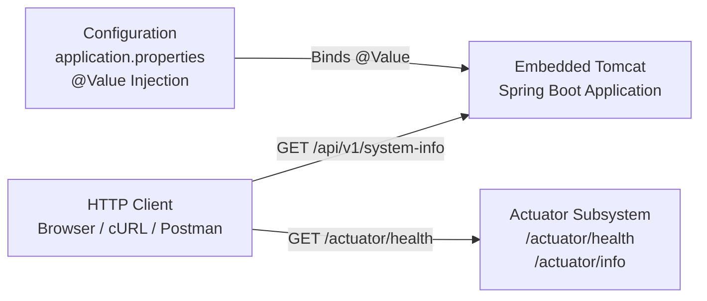

# :material-flask: Week 01 Lab Guide — Enterprise Service Metadata & Health Gateway

> **Module:** Week 1 — Spring Boot Overview, DevTools, Actuator & Configuration Properties  
> **Lab Repo:** [:material-github: 7amo10/Spring-Labs — Week-01-Spring-Boot-Overview](https://github.com/7amo10/Spring-Labs/tree/main/Week-01-Spring-Boot-Overview)

---

## :material-target: Lab Objective

Master the foundational runtime mechanics of **Spring Boot 3**. Understand the role of opinionated starter POMs, explore `@SpringBootApplication` composite annotations, observe live development cycle reloading with **Spring Boot DevTools**, inspect production application telemetry through **Spring Boot Actuator** endpoints, and implement dynamic property injection using `@Value` and `application.properties`.

---

## :material-list-box: Key Concepts Covered

- **Spring Boot Bootstrapping:** Structure of `@SpringBootApplication` combining `@SpringBootConfiguration`, `@EnableAutoConfiguration`, and `@ComponentScan`.
- **DevTools Reloading:** Automatic classpath restart, dual-ClassLoader mechanism, and configuration cache disabling.
- **Spring Boot Actuator:** Exposing, customizing, and filtering administrative endpoints (`/actuator/health`, `/actuator/info`, `/actuator/metrics`) with `management.endpoints.web.exposure.include`.
- **Dynamic Configuration:** Externalizing environment configuration, property placeholders, and injecting values via `@Value("${...}")`.

---

## :material-code-braces: Component Architecture

Package: `com.spring.lab.overview`

| Component | Annotation / Type | Responsibility |
|-----------|-------------------|----------------|
| `SystemInfoController` | `@RestController` | Exposes `GET /` (welcome message) and `GET /api/v1/system-info` returning application metadata, active profile, and cluster node information |
| `ApplicationConfig` | Configuration Class | Binds and provides custom properties (`coach.name`, `team.name`, `app.environment`, `cluster.node.id`) |
| `CustomHealthIndicator` | `HealthIndicator` | *(Optional / Advanced)* Custom Spring Boot Actuator health check contributing custom status to `/actuator/health` |
| `OverviewApplication` | Main Class | Entry point annotated with `@SpringBootApplication` executing `SpringApplication.run()` |

---

## :material-cog: Configuration Specifications (`application.properties`)

Configure the following properties in `src/main/resources/application.properties`:

```properties
# Server Configuration
server.port=8080

# Actuator Web Exposure
management.endpoints.web.exposure.include=health,info,metrics

# Actuator Health & Info Details
management.endpoint.health.show-details=always
management.info.env.enabled=true

# Custom Business Properties
coach.name=Coach Carter
team.name=Apex Raptors
app.environment=development
cluster.node.id=node-alpha-01
```

---

## :material-stairs: Step-by-Step Implementation Guide

### Step 1: Project Setup & Maven Dependencies

Create a standard Maven project inheriting from `spring-boot-starter-parent` with Java 21 LTS:

```xml
<parent>
    <groupId>org.springframework.boot</groupId>
    <artifactId>spring-boot-starter-parent</artifactId>
    <version>3.3.0</version>
    <relativePath/>
</parent>

<dependencies>
    <!-- Embedded Tomcat container & Spring MVC -->
    <dependency>
        <groupId>org.springframework.boot</groupId>
        <artifactId>spring-boot-starter-web</artifactId>
    </dependency>

    <!-- Health, metrics, and application observability -->
    <dependency>
        <groupId>org.springframework.boot</groupId>
        <artifactId>spring-boot-starter-actuator</artifactId>
    </dependency>

    <!-- Automatic restart & hot reload during development -->
    <dependency>
        <groupId>org.springframework.boot</groupId>
        <artifactId>spring-boot-devtools</artifactId>
        <optional>true</optional>
    </dependency>

    <!-- Testing Starter -->
    <dependency>
        <groupId>org.springframework.boot</groupId>
        <artifactId>spring-boot-starter-test</artifactId>
        <scope>test</scope>
    </dependency>
</dependencies>
```

### Step 2: Build the REST Endpoint

In `SystemInfoController`, inject properties using `@Value`:

```java
package com.spring.lab.overview.controller;

import org.springframework.beans.factory.annotation.Value;
import org.springframework.web.bind.annotation.GetMapping;
import org.springframework.web.bind.annotation.RestController;

import java.time.Instant;
import java.util.Map;

@RestController
public class SystemInfoController {

    @Value("${coach.name:Default Coach}")
    private String coachName;

    @Value("${team.name:Default Team}")
    private String teamName;

    @Value("${cluster.node.id:node-0}")
    private String nodeId;

    @GetMapping("/")
    public String welcome() {
        return "System Gateway is Online!";
    }

    @GetMapping("/api/v1/system-info")
    public Map<String, Object> getSystemInfo() {
        return Map.of(
            "coach", coachName,
            "team", teamName,
            "nodeId", nodeId,
            "status", "RUNNING",
            "timestamp", Instant.now().toString()
        );
    }
}
```

### Step 3: Verification & Execution

Execute the service via Maven:

```bash
./mvnw spring-boot:run
```

Verify endpoints:

1. `GET http://localhost:8080/api/v1/system-info` returns the injected custom property values.
2. `GET http://localhost:8080/actuator/health` returns detailed status (`"status": "UP"`).
3. `GET http://localhost:8080/actuator/info` displays application metadata.

---

## :material-sitemap: Request Pipeline Architecture



---

## :material-check-all: Verification Checklist

- [ ] Project bootstraps cleanly with `@SpringBootApplication` on port `8080`
- [ ] `GET /` responds with HTTP 200 and gateway online message
- [ ] `GET /api/v1/system-info` returns JSON containing `coach`, `team`, and `nodeId`
- [ ] Changing a Java source file triggers DevTools automatic restart
- [ ] `GET /actuator/health` returns `"status": "UP"` with detailed component status
- [ ] `GET /actuator/metrics` returns the list of available JVM and system metrics
- [ ] Overriding port via CLI (`--server.port=9090`) shifts the running port dynamically
