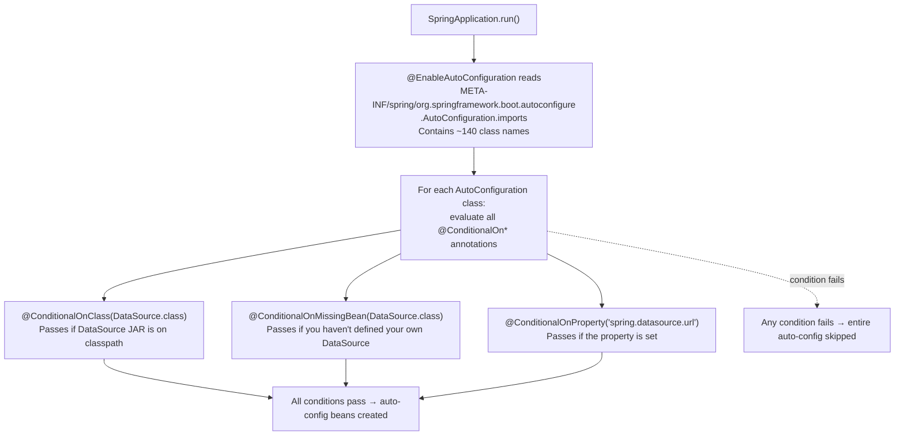
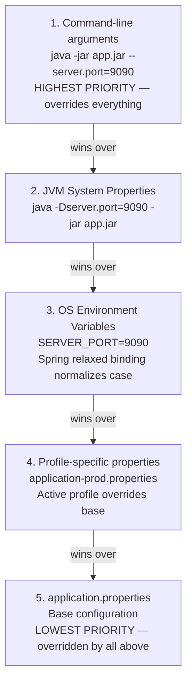
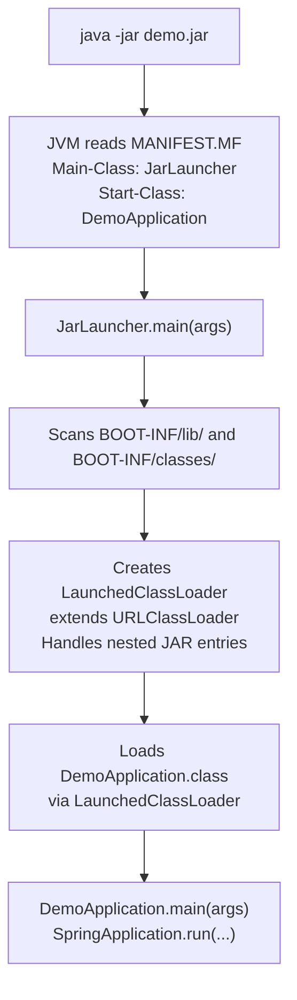

# :material-clipboard-check: Week 1 Summary — Annotations, Internals & Mental Models

---

## :material-table: 1. Complete Annotation Cheat Sheet

| Annotation | Package | What It Does | Internal Mechanism | Common Pitfall |
|-----------|---------|-------------|-------------------|----------------|
| `@SpringBootApplication` | `org.springframework.boot.autoconfigure` | Combines `@Configuration` + `@EnableAutoConfiguration` + `@ComponentScan` | Meta-annotation — composes three Spring annotations | Main class in wrong package → scanning misses components |
| `@RestController` | `org.springframework.web.bind.annotation` | Marks class as MVC controller where every method returns response body (not a view) | Combines `@Controller` + `@ResponseBody`; registered with `DispatcherServlet` | Returning a model object without Jackson on classpath → HTTP 406 |
| `@Controller` | `org.springframework.stereotype` | MVC controller — methods can return view names (Thymeleaf templates) | `@Component` stereotype + `RequestMappingHandlerMapping` registration | Forgetting `@ResponseBody` on methods that should return data, not views |
| `@GetMapping("/path")` | `org.springframework.web.bind.annotation` | Maps HTTP GET requests to a method | Shortcut for `@RequestMapping(method = GET)`; registered in `HandlerMapping` | Duplicate paths → ambiguous mapping exception at startup |
| `@PostMapping`, `@PutMapping`, `@DeleteMapping` | `org.springframework.web.bind.annotation` | Maps HTTP verbs to methods | Same as `@GetMapping` for respective HTTP verbs | Forgetting `@RequestBody` for POST/PUT endpoints that receive JSON |
| `@RequestBody` | `org.springframework.web.bind.annotation` | Deserializes HTTP request body to Java object | Jackson's `HttpMessageConverter` reads the body and calls `ObjectMapper.readValue()` | Missing `Content-Type: application/json` header in client request |
| `@Value("${prop}")` | `org.springframework.beans.factory.annotation` | Injects a property from the Spring `Environment` into a field | `AutowiredAnnotationBPP` → `PropertySourcesPropertyResolver.resolveRequiredPlaceholders()` | Property not defined and no default value → `IllegalArgumentException` at startup |
| `@Component` | `org.springframework.stereotype` | Marks POJO as a Spring-managed bean | Detected by `ClassPathBeanDefinitionScanner` using ASM bytecode reading | Class in a package NOT under the main class package — not scanned |
| `@Service` | `org.springframework.stereotype` | Business layer stereotype of `@Component` | Identical to `@Component` at runtime — semantic distinction only | None beyond `@Component` pitfalls |
| `@Repository` | `org.springframework.stereotype` | Data access layer stereotype with exception translation | `PersistenceExceptionTranslationPostProcessor` adds proxy for exception conversion | Not applying to DAO classes — lose automatic `DataAccessException` wrapping |
| `@Autowired` | `org.springframework.beans.factory.annotation` | Injects dependencies into constructor, setter, or field | `AutowiredAnnotationBeanPostProcessor` uses reflection | Multiple matching beans → `NoUniqueBeanDefinitionException` |
| `@SpringBootTest` | `org.springframework.boot.test.context` | Loads the full `ApplicationContext` for integration tests | Creates the full app context including embedded server (if `webEnvironment` set) | Slow tests — use slice annotations (`@WebMvcTest`) for unit tests |

---

## :material-cog-sync: 2. Auto-Configuration Deep Dive

### How Spring Boot Knows What to Configure



### Key @ConditionalOn* Annotations

| Annotation | Passes When |
|-----------|------------|
| `@ConditionalOnClass(X.class)` | Class `X` is present on classpath |
| `@ConditionalOnMissingBean(X.class)` | No bean of type `X` is defined |
| `@ConditionalOnProperty("prop")` | Property `prop` is set and not `false` |
| `@ConditionalOnWebApplication` | App is a web application |
| `@ConditionalOnExpression("#{...}")` | SpEL expression evaluates to `true` |

### Debugging Auto-Configuration

```bash
# See every condition evaluated — positive and negative matches:
java -jar app.jar --debug

# Via Actuator (expose first):
curl http://localhost:8080/actuator/conditions | jq '.contexts.application.positiveMatches'
```

### Disabling a Specific Auto-Config

```java
@SpringBootApplication(exclude = {DataSourceAutoConfiguration.class})
public class DemoApplication { ... }
```

---

## :material-package-variant: 3. Maven Quick-Reference

### Build Lifecycle Cheat Sheet

| Goal | Command | When to Use |
|------|---------|-------------|
| Clean build output | `mvn clean` | Before any fresh build |
| Compile only | `mvn compile` | Quick syntax check |
| Compile + test | `mvn test` | Verify tests pass |
| Build JAR/WAR | `mvn package` | Create distributable |
| Install to ~/.m2 | `mvn install` | Share locally between projects |
| Full clean build | `mvn clean package` | Standard CI build command |
| Check dep tree | `mvn dependency:tree` | Diagnose version conflicts |
| Run app directly | `./mvnw spring-boot:run` | Dev mode — no JAR produced |

### POM Coordinates Format

```xml
<dependency>
    <groupId>org.springframework.boot</groupId>   <!-- Reverse domain -->
    <artifactId>spring-boot-starter-web</artifactId> <!-- Project name -->
    <!-- No <version> needed when using parent BOM -->
</dependency>
```

### Dependency Scope Summary

| Scope | Compile | Test | In JAR | Use Case |
|-------|---------|------|--------|----------|
| `compile` (default) | ✅ | ✅ | ✅ | Normal dependencies |
| `test` | ❌ | ✅ | ❌ | JUnit, Mockito |
| `provided` | ✅ | ✅ | ❌ | Servlet API (server provides it) |
| `optional` | ✅ | ✅ | ❌ | DevTools, annotation processors |

---

## :material-priority-high: 4. Property Source Priority Order



---

## :material-heart-pulse: 5. Actuator Endpoint Quick Reference

| Endpoint | Safe for Prod? | Useful For |
|----------|---------------|------------|
| `/actuator/health` | ✅ Yes | Load balancer health checks, uptime monitoring |
| `/actuator/info` | ✅ Yes | App version, build info, contact details |
| `/actuator/metrics` | ⚠️ Sensitive | JVM memory, GC, HTTP request counts |
| `/actuator/beans` | ❌ Sensitive | Debugging — shows ALL Spring beans |
| `/actuator/mappings` | ❌ Sensitive | Debugging — shows ALL registered routes |
| `/actuator/env` | ❌ Very sensitive | Shows ALL properties — exposes config structure |
| `/actuator/loggers` | ⚠️ Careful | Change log levels at runtime (POST to change) |
| `/actuator/threaddump` | ❌ Sensitive | Diagnose deadlocks, thread exhaustion |
| `/actuator/heapdump` | ❌ Dangerous | Binary heap dump — can expose secrets |
| `/actuator/conditions` | ❌ Sensitive | See auto-configuration decisions |
| `/actuator/shutdown` | ❌ Disabled | Graceful shutdown via HTTP POST |

**Production minimum exposure:**
```properties
management.endpoints.web.exposure.include=health,info
management.server.port=9090
```

---

## :material-package-up: 6. Fat JAR / JarLauncher Internals



**Key insight**: `java -jar` never directly calls `DemoApplication.main()`. `JarLauncher` is invoked first, creates `LaunchedClassLoader` (which knows how to read nested JARs), then reflectively calls your `main()` via that ClassLoader.

Fat JAR internal structure:
```
demo.jar
├── META-INF/MANIFEST.MF      ← Main-Class: JarLauncher, Start-Class: DemoApplication
├── BOOT-INF/classes/         ← Your compiled .class files
├── BOOT-INF/lib/             ← ALL dependency JARs (nested)
└── org/springframework/boot/loader/  ← JarLauncher + LaunchedClassLoader
```

---

## :material-chip: 7. Low-Level Internals (Phase 2 Connections)

| Spring Boot Mechanism | Underlying JVM/Java Mechanism | Phase 2 Connection |
|----------------------|------------------------------|-------------------|
| `LaunchedClassLoader` | Extends `URLClassLoader`, custom `URLStreamHandler` for nested JARs | Same `URLClassLoader` helix used for dynamic rule class loading |
| DevTools Restart ClassLoader | Two `URLClassLoader` instances (base + restart) | ClassLoader hierarchy and parent delegation from JVM internals |
| `@ConditionalOnClass` | `ClassLoader.loadClass()` — passes if no `ClassNotFoundException` | ClassLoader visibility rules from Phase 2 |
| `@Configuration` CGLIB (Week 2+) | CGLIB generates `SportConfig$$SpringCGLIB$$0.class` at runtime | Same as ByteBuddy in helix — runtime bytecode generation via `defineClass()` |
| `@Value` resolution | `Field.setAccessible(true)` + `field.set()` | Java Reflection API from Phase 1 |
| Component scanning | ASM bytecode reading of `.class` files (no classloading!) | ASM library from Phase 2 — Spring scans bytecode before loading classes |

---

## :material-flask: 8. Week 1 Lab Checklist

**Lab: Enterprise Service Metadata & Health Gateway**

- [ ] Create Spring Boot project via [start.spring.io](https://start.spring.io) with `Spring Web` dependency
- [ ] Write `@RestController` with `@GetMapping("/")` returning a greeting string
- [ ] Define three custom properties in `application.properties`: `app.env`, `app.version`, `cluster.node`
- [ ] Inject all three via `@Value("${...}")` into the controller
- [ ] Add `@Value("${app.max-connections:10}")` with a default value
- [ ] Add `spring-boot-starter-actuator` dependency
- [ ] Set `management.endpoints.web.exposure.include=*` and verify `/actuator/beans` responds
- [ ] Populate `/actuator/info` with `info.app.*` properties
- [ ] Add `spring-boot-starter-security` — verify all endpoints require HTTP Basic auth
- [ ] Set fixed credentials in `application.properties`
- [ ] Add `spring-boot-devtools` — change a method and observe auto-restart in console
- [ ] Build the fat JAR: `./mvnw clean package`
- [ ] Run from command line: `java -jar target/*.jar`
- [ ] Override port from command line: `java -jar target/*.jar --server.port=9090`
- [ ] Set `server.servlet.context-path=/api` — verify all URLs shift

---

## :material-road: 9. Prerequisites to Continue to Week 2 (Spring Core IoC/DI)

!!! note "Prerequisites to Continue"
    **Before Week 2 (Spring Core: IoC, DI, Bean Scopes & Lifecycle), make sure you understand:**
    
    - **`@SpringBootApplication` and what it does** — the three meta-annotations it combines
    - **Maven build lifecycle** — `clean`, `compile`, `test`, `package`, `install` and when to use each
    - **Spring Starters and BOM** — why you don't specify versions for Spring Boot dependencies
    - **Auto-configuration mechanics** — how `@ConditionalOnClass` and `@ConditionalOnMissingBean` work
    - **`application.properties`** — how Spring Boot reads it, how `@Value` injects from it
    - **Java Reflection API (Phase 1)** — Spring uses reflection heavily in Week 2 for DI
    - **ClassLoader hierarchy (Phase 2)** — DevTools restart CL + Week 2's CGLIB for `@Lazy`/`@Configuration`
    
    **New concepts introduced in Week 2:**
    - `ApplicationContext` — the IoC container in depth (BeanFactory vs ApplicationContext)
    - `@Component`, `@Service`, `@Repository` — the full stereotype hierarchy
    - Constructor vs Setter vs Field injection — which to use and why
    - `@Qualifier`, `@Primary` — resolving bean ambiguity
    - `@Scope("singleton")`, `@Scope("prototype")` — instance lifecycle
    - `@PostConstruct`, `@PreDestroy` — lifecycle hooks
    - `@Configuration` + `@Bean` — programmatic bean definition
