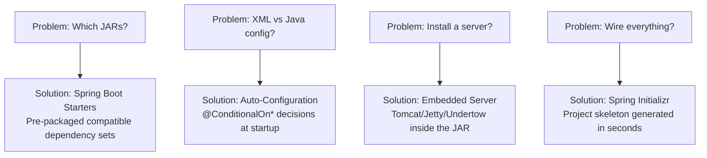
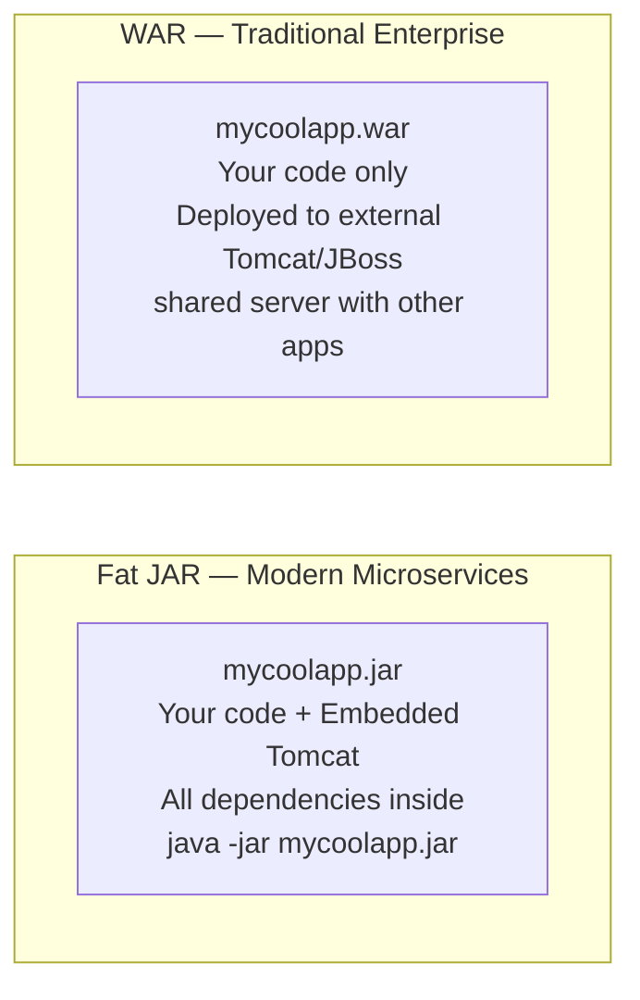
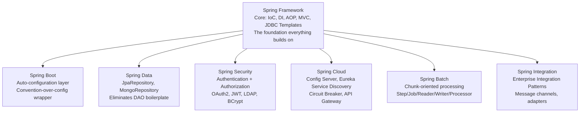
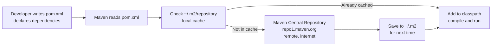
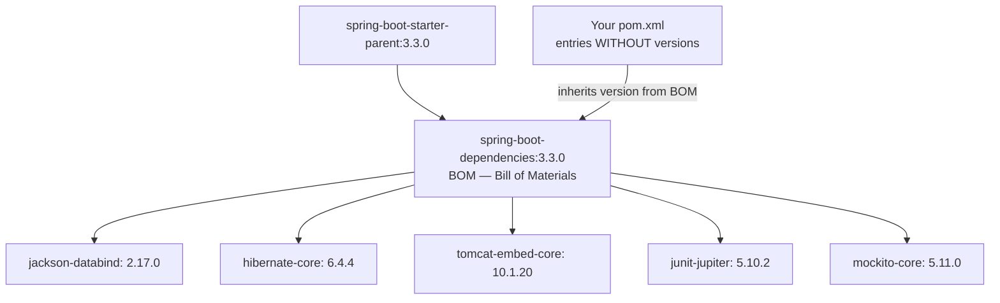
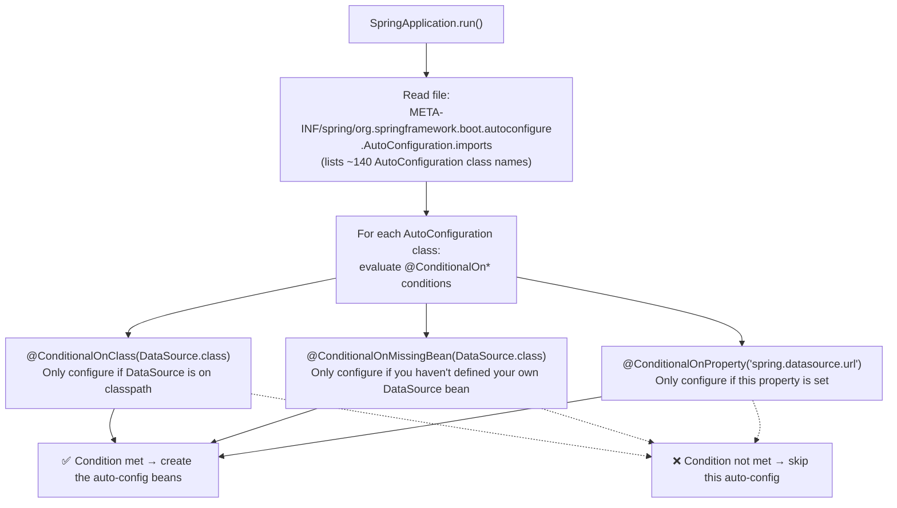

# :material-note-text: Topic Notes — Part 1: Spring Boot Fundamentals & Maven

---

## :material-alert-circle: 1. The Problem Spring Boot Solves

Before Spring Boot, building a Spring application was genuinely painful. Four compounding problems made it daunting:

**Problem 1 — Which JAR dependencies do I need?**  
A minimal Spring MVC + Hibernate app required manually tracking: `spring-core`, `spring-context`, `spring-webmvc`, `hibernate-core`, `hibernate-entitymanager`, `jackson-databind`, `commons-logging`, and their transitive dependencies. Finding a set that was mutually compatible required trial and error or expert knowledge.

**Problem 2 — XML vs Java configuration?**  
Early Spring required verbose XML (`applicationContext.xml`, `dispatcher-servlet.xml`) to declare every bean, data source, and transaction manager. Switching to Java `@Configuration` helped but still required extensive boilerplate.

**Problem 3 — Which server do I install and how?**  
You needed to install Apache Tomcat, JBoss, or WebSphere separately. Configure the servlet container. Build a WAR file. Deploy it. Configure context paths. This was an entire second job before your application even ran.

**Problem 4 — How do I wire everything together?**  
Setting up a `DispatcherServlet`, view resolvers, message converters, and exception handlers — each with its own configuration — consumed days before you wrote a single line of business logic.

### Spring Boot's Four Solutions



The philosophical shift: **Convention over Configuration**. Spring Boot makes opinionated decisions that work for 90% of applications. You override only what you actually need to change.

---

## :material-information: 2. Spring Boot Overview (Lectures 5–7)

### What Spring Boot IS and IS NOT

!!! important "Spring Boot is NOT a replacement for Spring"
    Spring Boot does **not** replace Spring Framework, Spring MVC, Spring REST, or Spring Data. It uses all of them behind the scenes.
    
    - Does Spring Boot make your app run faster? **No.** Same JVM, same Spring code underneath.
    - Does Spring Boot require a special IDE? **No.** IntelliJ, Eclipse, VS Code, or even Vim work fine.
    - Does Spring Boot replace Spring MVC? **No.** `@RestController`, `@GetMapping` are Spring MVC annotations — Boot just auto-configures MVC for you.

### The Three Embedded Server Options

Spring Boot ships with three embedded HTTP server options, all on the same JVM process as your app:

| Server | Default? | Character | When to Switch |
|--------|----------|-----------|----------------|
| **Tomcat** | ✅ Yes | Battle-tested, widely deployed | Default — keep it |
| **Jetty** | ❌ | Lighter, lower memory footprint | Embedded / constrained environments |
| **Undertow** | ❌ | High performance, non-blocking I/O | High-throughput async workloads |

To switch: exclude `spring-boot-starter-tomcat` and add `spring-boot-starter-jetty`.

### JAR vs WAR Deployment



Fat JAR is the standard for microservices and cloud deployments. WAR is for legacy enterprise environments requiring shared application servers.

### First REST Controller (Lecture 7)

```java
// @RestController = @Controller + @ResponseBody
// All methods return data directly as HTTP response body (no view template)
@RestController
public class FunRestController {

    // Maps HTTP GET requests to / to this method
    @GetMapping("/")
    public String sayHello() {
        return "Hello World! Time on server is: " + LocalDateTime.now();
    }
}
```

When you run this and hit `http://localhost:8080/`, Spring's `DispatcherServlet` receives the request, routes it to `sayHello()`, calls the method, and writes the returned `String` directly to the HTTP response body. Jackson (via `@ResponseBody`) handles object-to-JSON serialization automatically for non-String return types.

---

## :material-compass: 3. The Spring Projects Ecosystem (Lecture 8)

Spring is not a single framework — it is a **family of projects** built on top of Spring Framework:



This course covers: **Spring Boot** + **Spring Core** (Weeks 1-2), **Hibernate/JPA with Spring Data** (Weeks 3-5), **Spring Security** (Week 6), **Spring MVC** (Weeks 7-8), **Advanced JPA** (Week 9), **Spring AOP** (Week 10).

---

## :material-package-variant: 4. What Is Maven? (Lecture 9)

### The Problem Without Maven

Without a build tool, you are your own dependency manager:
1. Go to spring.io and download `spring-core-6.x.jar`
2. Go to hibernate.org and download `hibernate-core-6.x.jar`
3. Go to jackson.github.io and download `jackson-databind-2.x.jar`
4. Manually add all to your project classpath
5. Discover Spring needs `commons-logging` — go download that too
6. Discover a version conflict — start over

This is error-prone, time-consuming, and not reproducible between teammates.

### Maven's Solution

Maven is a **project management and build automation tool**. Its primary jobs:
1. **Dependency management**: declare what you need, Maven downloads it and all transitive deps
2. **Build lifecycle**: standardized phases (`compile`, `test`, `package`, `install`, `deploy`)
3. **Convention enforcement**: standard directory structure every Maven project follows



!!! tip "Maven as Your Personal Shopper"
    The instructor's analogy from the lecture: Maven is like a personal shopper. You hand it a shopping list (pom.xml), it goes to the store (Maven Central), buys everything on your list *plus* anything those items depend on, and delivers it ready to use. You never touch a download page again.

!!! note "Low-Level: URLClassLoader and the Local Repository"
    When Maven builds your app, it adds all downloaded JARs from `~/.m2/repository` to the JVM classpath. The JVM's `URLClassLoader` then loads classes from those JARs on demand. This is the same `URLClassLoader` mechanism covered in Phase 2 — Maven is just the tool that populates the JAR cache that `URLClassLoader` reads from.

---

## :material-folder-open: 5. Maven Project Structure (Lecture 10)

The Maven Standard Directory Layout — every Maven tool (compiler, test runner, packager) knows exactly where to find things:

```
my-spring-app/
├── src/
│   ├── main/
│   │   ├── java/                ← All production Java source files
│   │   │   └── com/example/
│   │   │       ├── DemoApplication.java
│   │   │       └── controller/FunRestController.java
│   │   └── resources/           ← Non-Java resources
│   │       ├── application.properties
│   │       ├── static/          ← Static files (CSS, JS, images)
│   │       └── templates/       ← Thymeleaf HTML templates
│   └── test/
│       ├── java/                ← Test source files
│       │   └── com/example/DemoApplicationTests.java
│       └── resources/           ← Test-specific properties
├── target/                      ← AUTO-GENERATED (git-ignored)
│   ├── classes/                 ← Compiled .class files
│   └── my-spring-app-0.0.1-SNAPSHOT.jar ← Packaged fat JAR
└── pom.xml                      ← Project descriptor
```

!!! important "Never Commit the `target/` Directory"
    `target/` is generated by Maven during build. It must be in `.gitignore`. Committing compiled bytecode pollutes the repository and causes conflicts between teammates with different JDK versions.

---

## :material-key-variant: 6. Maven Key Concepts (Lecture 11)

### POM — Project Object Model

The `pom.xml` is the project's complete descriptor. Every Maven project has exactly one:

```xml
<?xml version="1.0" encoding="UTF-8"?>
<project xmlns="http://maven.apache.org/POM/4.0.0">
    <modelVersion>4.0.0</modelVersion>

    <!-- Project coordinates — globally unique identity -->
    <groupId>com.example</groupId>       <!-- Organization/company -->
    <artifactId>demo-app</artifactId>    <!-- Project name -->
    <version>0.0.1-SNAPSHOT</version>   <!-- Version (-SNAPSHOT = in development) -->
    <packaging>jar</packaging>           <!-- Output type: jar or war -->

    <!-- Dependencies section — your shopping list -->
    <dependencies>
        <dependency>
            <groupId>org.springframework.boot</groupId>
            <artifactId>spring-boot-starter-web</artifactId>
            <!-- No <version> needed — parent BOM pins it -->
        </dependency>
    </dependencies>
</project>
```

### Maven Coordinates

Every artifact in Maven has a unique address: `groupId:artifactId:version`

| Part | Example | Description |
|------|---------|-------------|
| `groupId` | `org.springframework.boot` | Reverse domain name — identifies the organization |
| `artifactId` | `spring-boot-starter-web` | Specific project/module name |
| `version` | `3.3.0` | The release version |

Together: `org.springframework.boot:spring-boot-starter-web:3.3.0` pinpoints one exact JAR.

### Build Lifecycle Phases

Maven executes phases in strict order — running a later phase runs all previous phases:

| Phase | What Happens | Common Use |
|-------|-------------|------------|
| `validate` | Check POM is valid | Rarely invoked directly |
| `compile` | Compile `src/main/java` → `target/classes` | `mvn compile` |
| `test` | Compile + run `src/test/java` | `mvn test` |
| `package` | Create JAR/WAR in `target/` | `mvn package` |
| `verify` | Run integration tests | `mvn verify` |
| `install` | Copy to `~/.m2/repository` | `mvn install` (share locally) |
| `deploy` | Upload to remote repository | `mvn deploy` (CI/CD) |
| `clean` | Delete `target/` directory | `mvn clean` (always run first) |

**Most-used command:** `mvn clean package` — wipe the build output, then compile + test + package fresh.

### Dependency Scopes

| Scope | On Compile Classpath | On Test Classpath | In Packaged JAR |
|-------|---------------------|-------------------|-----------------|
| `compile` (default) | ✅ | ✅ | ✅ |
| `test` | ❌ | ✅ | ❌ |
| `provided` | ✅ | ✅ | ❌ (server provides it) |
| `runtime` | ❌ | ✅ | ✅ |
| `optional` | ✅ | ✅ | ❌ (not pulled transitively) |

### Transitive Dependencies

If `A` depends on `B` which depends on `C`, Maven automatically includes `C` when you declare `A`. This is **transitive dependency resolution** — one of Maven's most powerful features:

```
spring-boot-starter-web
    ├── spring-boot-starter
    │   ├── spring-core
    │   ├── spring-beans
    │   └── spring-context
    ├── spring-boot-starter-tomcat
    │   ├── tomcat-embed-core
    │   └── tomcat-embed-websocket
    ├── spring-webmvc
    ├── jackson-databind
    └── hibernate-validator
```

Declaring one `spring-boot-starter-web` pulls **15+ JARs** automatically.

!!! tip "Diagnosing Dependency Conflicts"
    When two transitive dependencies bring different versions of the same JAR:
    ```bash
    mvn dependency:tree -Dincludes=groupId:artifactId
    ```
    Use `<exclusions>` to remove conflicting transitive deps:
    ```xml
    <dependency>
        <groupId>org.springframework.boot</groupId>
        <artifactId>spring-boot-starter-web</artifactId>
        <exclusions>
            <exclusion>
                <groupId>org.springframework.boot</groupId>
                <artifactId>spring-boot-starter-tomcat</artifactId>
            </exclusion>
        </exclusions>
    </dependency>
    ```

---

## :material-file-document: 7. Exploring Spring Boot Project Files (Lectures 12–13)

### The Main Application Class

```java
package com.example.demo;

import org.springframework.boot.SpringApplication;
import org.springframework.boot.autoconfigure.SpringBootApplication;

@SpringBootApplication  // THREE annotations in one — see below
public class DemoApplication {

    public static void main(String[] args) {
        // This single call:
        // 1. Creates AnnotationConfigServletWebServerApplicationContext
        // 2. Triggers @ComponentScan on "com.example.demo" and sub-packages
        // 3. Runs @EnableAutoConfiguration — loads conditional auto-configs
        // 4. Starts embedded Tomcat on port 8080
        // 5. Registers JVM shutdown hook to call context.close() on Ctrl+C
        SpringApplication.run(DemoApplication.class, args);
    }
}
```

!!! note "@SpringBootApplication = Three Annotations"
    ```java
    @SpringBootApplication
    // Is exactly equivalent to:
    @SpringBootConfiguration    // = @Configuration — this class can define @Bean methods
    @EnableAutoConfiguration    // Enable conditional auto-configuration from classpath
    @ComponentScan              // Scan THIS package + all sub-packages for @Component
    public class DemoApplication { }
    ```
    
    The key implication: **the package of your main class is the root scanning boundary**. Any `@Component` class outside this package tree will NOT be discovered.

### The `application.properties` File

Located at `src/main/resources/application.properties`. Spring Boot's `ConfigFileApplicationListener` reads this file automatically at startup — no annotation or code required.

It serves three purposes:
1. Configure Spring Boot's own behavior (server port, logging, datasource URL)
2. Configure third-party library behavior (e.g., `spring.jpa.hibernate.ddl-auto`)
3. Define your own custom application properties (read via `@Value`)

### The Generated Test Class

```java
@SpringBootTest  // Loads the full ApplicationContext — integration test
class DemoApplicationTests {

    @Test
    void contextLoads() {
        // If the ApplicationContext fails to start (wiring error, missing bean),
        // this test fails immediately — your first safety net
    }
}
```

Running `mvn test` executes this. If your wiring is broken, CI/CD fails here.

### Maven Wrapper Files

- `mvnw` (Linux/macOS) and `mvnw.cmd` (Windows): shell scripts that download and run the exact Maven version declared in `.mvn/wrapper/maven-wrapper.properties`
- **Purpose**: zero-installation Maven — teammates and CI/CD servers don't need Maven installed
- `./mvnw spring-boot:run` compiles and runs the app without packaging
- `./mvnw clean package` builds the fat JAR

---

## :material-star-box: 8. Spring Boot Starters (Lecture 14)

### The Problem They Solve

Before Starters, adding Spring MVC to a project meant manually declaring 8-12 individual dependencies and praying their versions were compatible. Starters collapse this into a single dependency entry.

### What a Starter IS

A Spring Boot Starter is a **POM file** (not a JAR) that lists a curated, pre-tested set of dependencies. When you declare the starter, Maven pulls in everything it lists transitively.

### The Most Important Starters

| Starter | What It Brings | Use Case |
|---------|---------------|----------|
| `spring-boot-starter-web` | Spring MVC, Jackson, Embedded Tomcat, Hibernate Validator | REST APIs, web apps |
| `spring-boot-starter-data-jpa` | Hibernate, Spring Data JPA, Jakarta Persistence API | Database ORM |
| `spring-boot-starter-security` | Spring Security core, filter chain | Auth and authz |
| `spring-boot-starter-test` | JUnit 5, Mockito, AssertJ, Spring Test | Testing |
| `spring-boot-starter-actuator` | Micrometer, management endpoints | Production monitoring |
| `spring-boot-starter-thymeleaf` | Thymeleaf template engine | Server-side HTML rendering |
| `spring-boot-starter-validation` | Jakarta Validation, Hibernate Validator | Bean validation |
| `spring-boot-starter-mail` | JavaMail, Spring Mail | Sending emails |
| `spring-boot-starter-cache` | Spring Cache abstraction | Caching layer |
| `spring-boot-starter-aop` | Spring AOP, AspectJ weaver | Cross-cutting concerns |

Pattern: `spring-boot-starter-{feature}` — 30+ official starters exist.

### Inspecting Starter Contents

In IntelliJ: **View → Tool Windows → Maven → Dependencies** — expand any starter to see every transitive JAR it pulls.

From the command line:
```bash
mvn dependency:tree | grep -A 20 "spring-boot-starter-web"
```

---

## :material-family-tree: 9. Spring Boot Parent POM & BOM (Lecture 15)

### The Parent Declaration

Every Spring Boot project declares `spring-boot-starter-parent` as its Maven parent:

```xml
<parent>
    <groupId>org.springframework.boot</groupId>
    <artifactId>spring-boot-starter-parent</artifactId>
    <version>3.3.0</version>  <!-- Only version you ever specify -->
    <relativePath/>
</parent>
```

This single declaration gives your project:
1. **A Bill of Materials (BOM)**: pins exact compatible versions for 300+ dependencies
2. **Maven plugin defaults**: compiler version, resource filtering, test configuration
3. **`spring-boot-maven-plugin`** configuration for building the fat JAR

### How the BOM Works



**You never need to specify dependency versions** when using a parent — the BOM handles it. If the BOM pins `jackson-databind: 2.17.0`, that's what you get. If you need a different version, override it:

```xml
<properties>
    <!-- Override BOM's jackson version for your project -->
    <jackson-bom.version>2.16.0</jackson-bom.version>
</properties>
```

### Without a Parent (Alternative BOM Import)

If you have your own corporate parent POM, use `<dependencyManagement>` import instead:

```xml
<dependencyManagement>
    <dependencies>
        <dependency>
            <groupId>org.springframework.boot</groupId>
            <artifactId>spring-boot-dependencies</artifactId>
            <version>3.3.0</version>
            <type>pom</type>
            <scope>import</scope>
        </dependency>
    </dependencies>
</dependencyManagement>
```

---

## :material-cog-sync: 10. Auto-Configuration Internals

Understanding how `@EnableAutoConfiguration` actually works is the most important low-level insight of Week 1.



**Example**: `DataSourceAutoConfiguration` fires ONLY if:
1. `DataSource` class is on the classpath (`@ConditionalOnClass`)
2. No `DataSource` bean was manually defined (`@ConditionalOnMissingBean`)

This is why adding `spring-boot-starter-data-jpa` automatically gives you a working DataSource — the starter brings `DataSource` onto the classpath, the condition passes, auto-config creates it.

**To disable an auto-configuration:**
```java
@SpringBootApplication(exclude = {DataSourceAutoConfiguration.class})
```

**To see what was configured:** run with `--debug` flag, or hit `/actuator/conditions` endpoint.

!!! note "Low-Level: @ConditionalOnClass Uses ClassLoader.loadClass()"
    `@ConditionalOnClass` checks if a class is present by attempting `ClassLoader.loadClass(className)`. If the class is found (the JAR is on the classpath), the condition passes. This is pure Phase 2 ClassLoader mechanics — Spring Boot's auto-configuration is fundamentally a sophisticated conditional ClassLoader inspection system.
