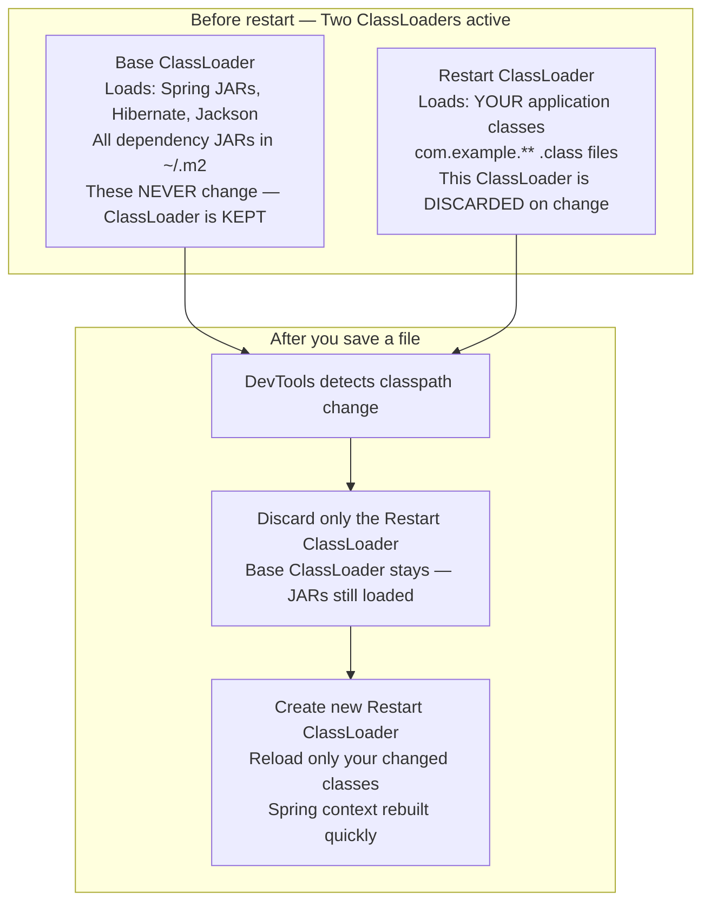
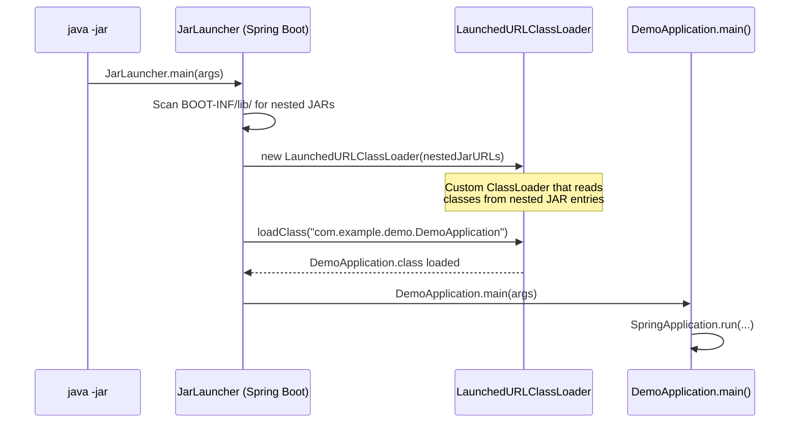
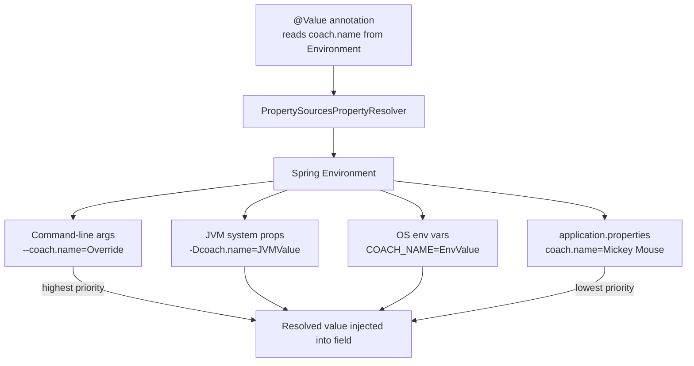

# :material-note-text: Topic Notes — Part 2: DevTools, Actuator, Deployment & Properties

---

## :material-refresh: 1. Spring Boot DevTools (Lectures 16–17)

### The Problem

Every time you change source code — even a one-line fix — you must:
1. Stop the running application
2. Recompile
3. Restart the JVM
4. Wait for the full Spring context to initialize

For a large application with 500+ beans, this can take 30–60 seconds per change. Multiplied by dozens of changes per hour, this destroys developer productivity.

### The Solution: `spring-boot-devtools`

```xml
<dependency>
    <groupId>org.springframework.boot</groupId>
    <artifactId>spring-boot-devtools</artifactId>
    <optional>true</optional>  <!-- CRITICAL: excluded from fat JAR -->
</dependency>
```

With DevTools on the classpath, Spring Boot monitors your classpath for changes. When you save/compile a file, the application **automatically restarts** — in 1–3 seconds instead of 30–60.

### Why Restarts Are Fast — The Dual ClassLoader Mechanism

This is the most important concept to understand about DevTools:



**Key insight**: Spring JARs (30MB+ of bytecode) are loaded by the Base ClassLoader and never touched again. Only your application classes (~KB) are reloaded. This is why restarts take seconds instead of minutes.

!!! note "Low-Level: Two ClassLoaders — Phase 2 Connection"
    This is the same ClassLoader hierarchy discussed in Phase 2. DevTools literally creates two `URLClassLoader` instances:
    
    1. **Base ClassLoader** — parent, loads all library JARs (never garbage collected during development)
    2. **Restart ClassLoader** — child, loads your `target/classes` directory (discarded and recreated on change)
    
    When the Restart ClassLoader is discarded, the JVM GCs all classes it loaded. A new one is created and loads the updated `.class` files. The Base ClassLoader survives — its classes are immediately available to the new child without re-loading.

### IntelliJ Configuration for DevTools

IntelliJ doesn't auto-compile on save by default. Two settings required:

1. **Settings → Build, Execution, Deployment → Compiler** → Check **"Build project automatically"**
2. **Settings → Advanced Settings** → Check **"Allow auto-make to start even if developed application is currently running"**

After this, saving any `.java` file triggers a recompile + DevTools restart automatically.

### DevTools Features Beyond Hot Restart

- **LiveReload**: built-in LiveReload server (port 35729) — browser auto-refreshes when static files change
- **Relaxed property overrides**: DevTools sets certain properties for dev (H2 console enabled, Thymeleaf caching disabled)
- **Remote DevTools**: can trigger restarts on a remote server (rare, but possible)

!!! warning "DevTools Must NEVER Be in Production"
    The `<optional>true</optional>` tag ensures DevTools is:
    1. Available on your development classpath
    2. **NOT included** when another project depends on yours
    3. **NOT packaged** into the fat JAR (Spring Boot's packaging plugin detects `optional=true` and excludes it)
    
    DevTools in production exposes your classpath, allows arbitrary class reloading, and wastes memory with the file system watcher.

---

## :material-heart-pulse: 2. Spring Boot Actuator (Lectures 18–22)

### The Production Monitoring Problem

Once your application is deployed: How do you know if it's healthy? How many requests per second? What beans are loaded? What environment properties are active? Without Actuator, you'd need to build all this monitoring yourself.

### Adding Actuator

```xml
<dependency>
    <groupId>org.springframework.boot</groupId>
    <artifactId>spring-boot-starter-actuator</artifactId>
</dependency>
```

That single dependency adds 10+ production-ready REST endpoints to your application — **zero additional code required**.

### The Actuator Endpoint Map

All endpoints live under the `/actuator` prefix:

| Endpoint | Method | What It Returns | Default Exposed? |
|----------|--------|-----------------|-----------------|
| `/actuator/health` | GET | App health status (UP/DOWN + detail) | ✅ Yes |
| `/actuator/info` | GET | Custom app metadata from `info.*` properties | ❌ (needs config) |
| `/actuator/beans` | GET | All Spring beans in the ApplicationContext | ❌ |
| `/actuator/mappings` | GET | All `@RequestMapping` routes in the app | ❌ |
| `/actuator/metrics` | GET | List of available metric names | ❌ |
| `/actuator/metrics/{name}` | GET | Specific metric value (e.g., `jvm.memory.used`) | ❌ |
| `/actuator/env` | GET | All `Environment` properties from all sources | ❌ |
| `/actuator/loggers` | GET/POST | Get or change logging levels at runtime | ❌ |
| `/actuator/threaddump` | GET | Live JVM thread dump | ❌ |
| `/actuator/heapdump` | GET | Binary heap dump (download) | ❌ |
| `/actuator/conditions` | GET | Auto-configuration conditions report | ❌ |
| `/actuator/caches` | GET | All active caches | ❌ |
| `/actuator/scheduledtasks` | GET | All `@Scheduled` tasks | ❌ |
| `/actuator/shutdown` | POST | Graceful application shutdown | ❌ (disabled by default) |

### Exposing Endpoints

```properties
# application.properties

# Expose ONLY health and info (production default — most conservative)
management.endpoints.web.exposure.include=health,info

# Expose ALL endpoints (development — use with security)
management.endpoints.web.exposure.include=*

# Expose all except env and heapdump (good middle ground)
management.endpoints.web.exposure.include=*
management.endpoints.web.exposure.exclude=env,heapdump

# Run Actuator on a separate port (common in production)
management.server.port=9090
```

### Customizing the `/info` Endpoint

By default, `/actuator/info` returns an empty `{}`. Populate it:

```properties
# Enable the env info contributor
management.info.env.enabled=true

# Anything prefixed with info. appears in /actuator/info response
info.app.name=My Cool App
info.app.description=A production-grade Spring Boot microservice
info.app.version=2.1.0
info.app.author=Ahmed Ashour
info.contact.email=ahmed@example.com
```

Response from `GET /actuator/info`:
```json
{
  "app": {
    "name": "My Cool App",
    "description": "A production-grade Spring Boot microservice",
    "version": "2.1.0",
    "author": "Ahmed Ashour"
  },
  "contact": { "email": "ahmed@example.com" }
}
```

### The `/health` Endpoint in Depth

```json
// GET /actuator/health — with management.endpoint.health.show-details=always
{
  "status": "UP",
  "components": {
    "db": {
      "status": "UP",
      "details": { "database": "H2", "validationQuery": "isValid()" }
    },
    "diskSpace": {
      "status": "UP",
      "details": { "total": 500107898880, "free": 250000000000, "threshold": 10485760 }
    },
    "ping": { "status": "UP" }
  }
}
```

Health indicators are pluggable via the `HealthIndicator` SPI — Spring auto-configures indicators for DataSource, Redis, RabbitMQ, Elasticsearch, and more when their starters are on the classpath.

### Securing Actuator Endpoints (Lectures 21–22)

`/actuator/beans` and `/actuator/env` expose sensitive internal information. **Always secure in production**:

```xml
<dependency>
    <groupId>org.springframework.boot</groupId>
    <artifactId>spring-boot-starter-security</artifactId>
</dependency>
```

Once added, Spring Security auto-configuration locks ALL endpoints (including Actuator) behind HTTP Basic authentication. A random password is generated and printed to the console at startup:

```
Using generated security password: 3f2a8b41-c2d4-4e1a-9fba-12345678abcd
```

Override with fixed credentials:
```properties
spring.security.user.name=admin
spring.security.user.password=s3cr3tP@ss
```

!!! warning "Actuator Security in Production — Critical"
    `/actuator/env` shows ALL environment properties — including database passwords, API keys, and secret tokens (partially masked, but not perfectly). `/actuator/heapdump` exposes a binary dump of your JVM heap which can be analyzed to extract secrets.
    
    Production configuration:
    ```properties
    # Only expose safe, non-sensitive endpoints
    management.endpoints.web.exposure.include=health,info,metrics
    management.server.port=9090  # Separate port — block in firewall
    ```

---

## :material-console: 3. Running from the Command Line (Lectures 23–26)

### Two Ways to Run Without an IDE

**Option 1: Maven Wrapper (compile + run without packaging)**
```bash
./mvnw spring-boot:run          # Linux/macOS
mvnw.cmd spring-boot:run        # Windows
```
This compiles your source and runs it via the `spring-boot-maven-plugin`. Faster for development iteration — no JAR is produced.

**Option 2: Fat JAR (build once, run anywhere)**
```bash
# Step 1: Package
./mvnw clean package
# Output: target/demo-0.0.1-SNAPSHOT.jar

# Step 2: Run
java -jar target/demo-0.0.1-SNAPSHOT.jar

# Override properties at runtime (highest priority):
java -jar target/demo-0.0.1-SNAPSHOT.jar --server.port=9090
java -jar target/demo-0.0.1-SNAPSHOT.jar --spring.profiles.active=prod
```

The fat JAR is completely self-contained: no Tomcat installation needed, no classpath configuration, nothing. It runs identically on any machine with a JVM.

---

## :material-package-up: 4. Fat JAR / Nested JAR Internals (Spring in Action Ch 18)

This is the most technically fascinating aspect of Spring Boot — and directly connects to Phase 2 ClassLoader knowledge.

### The Standard Java JAR Problem

The Java JAR specification does NOT allow JARs to contain other JARs on their classpath. A standard `URLClassLoader` cannot read classes from a JAR nested inside another JAR. Before Spring Boot, WAR files used an exploded directory structure to work around this. Spring Boot needed a different solution.

### The Solution: Custom ClassLoader + JarLauncher

Spring Boot's fat JAR has a unique internal structure:

```
demo-0.0.1-SNAPSHOT.jar
├── META-INF/
│   └── MANIFEST.MF
├── BOOT-INF/
│   ├── classes/                ← YOUR compiled .class files
│   │   └── com/example/demo/
│   │       ├── DemoApplication.class
│   │       └── controller/FunRestController.class
│   └── lib/                    ← ALL dependency JARs (nested!)
│       ├── spring-core-6.1.x.jar
│       ├── spring-webmvc-6.1.x.jar
│       ├── tomcat-embed-core-10.x.jar
│       ├── jackson-databind-2.x.jar
│       └── ... (50+ more JARs)
└── org/springframework/boot/loader/
    ├── JarLauncher.class       ← The actual main class!
    ├── LaunchedURLClassLoader.class
    └── ... (the loader classes)
```

### How `java -jar` Actually Works

When you run `java -jar demo.jar`, the JVM reads `MANIFEST.MF`:

```
Main-Class: org.springframework.boot.loader.JarLauncher
Start-Class: com.example.demo.DemoApplication
```

**`JarLauncher`** is the real entry point — NOT your `DemoApplication`! The sequence:



!!! note "Low-Level: LaunchedURLClassLoader — Phase 2 Connection"
    `LaunchedURLClassLoader` **extends `URLClassLoader`** — the same base class covered in Phase 2. The difference: it adds the ability to read class data from entries inside nested JAR files (using Spring Boot's own `JarFile` implementation that wraps `java.util.zip.ZipFile`).
    
    This is why the helix knowledge is directly applicable: `URLClassLoader.defineClass()` is the same call, just with a different URL handler that understands nested JAR paths like `jar:file:/app.jar!/BOOT-INF/lib/spring-core.jar!/org/springframework/core/SpringVersion.class`.

### Why This Architecture Matters

- **Single deployable artifact**: one JAR file, copy anywhere, run anywhere
- **Fast startup**: no classpath explosion, no directory scanning of extracted files
- **Reproducible**: the same JAR always runs identically regardless of filesystem state
- **Cloud-native**: Docker `COPY demo.jar /app/ && CMD java -jar /app/demo.jar` just works

---

## :material-cog-outline: 5. @Value — Injecting Custom Properties (Lectures 27–28)

### The Problem: Hard-Coded Values

```java
// BAD: hard-coded — to change, you must edit source and recompile
public class FunRestController {
    private String coachName = "Mickey Mouse";
    private String teamName = "The Mouse Club";
}
```

For any real application, configuration must be externalized — names, URLs, timeouts, ports should be changeable without touching source code.

### The Solution: `application.properties` + `@Value`

**Step 1: Define properties** in `src/main/resources/application.properties`:
```properties
# Custom application properties — any key=value pairs you define
coach.name=Mickey Mouse
team.name=The Mouse Club
app.max-retry-count=3
app.api-endpoint=https://api.example.com/v1
```

**Step 2: Inject with `@Value`**:
```java
@RestController
public class FunRestController {

    // Spring reads "coach.name" from Environment and injects the String value
    @Value("${coach.name}")
    private String coachName;

    @Value("${team.name}")
    private String teamName;

    // With default value if property is missing — colon syntax
    @Value("${app.max-retry-count:5}")
    private int maxRetryCount;

    // Injecting a boolean
    @Value("${feature.dark-mode:false}")
    private boolean darkModeEnabled;

    @GetMapping("/teaminfo")
    public String getTeamInfo() {
        return "Coach: " + coachName + " | Team: " + teamName
               + " | Retries: " + maxRetryCount;
    }
}
```

### How @Value Works Internally

`@Value` is processed by `AutowiredAnnotationBeanPostProcessor` (same BPP that handles `@Autowired`). The resolution chain:



**Priority order** (highest wins): command-line args > JVM system props > OS env vars > `application.properties`.

### @Value Type Coercions

Spring automatically converts the String property value to the target field type:

```java
@Value("${server.port:8080}")     private int port;           // String → int
@Value("${feature.enabled:true}") private boolean enabled;    // String → boolean
@Value("${app.timeout:5000}")     private long timeoutMs;     // String → long
@Value("${coach.name:Default}")   private String name;        // String → String
```

---

## :material-server: 6. Configuring the Spring Boot Server (Lectures 29–30)

### The Most Important `application.properties` Settings

```properties
# ============================================================
# SERVER CONFIGURATION
# ============================================================

# HTTP port (default: 8080)
server.port=7070

# Context path prefix — all URLs move under this path
# With this set: /dailyworkout becomes /myapp/dailyworkout
server.servlet.context-path=/myapp

# Application name — used by Actuator, Spring Cloud service discovery
spring.application.name=my-cool-app


# ============================================================
# ACTUATOR CONFIGURATION
# ============================================================

# Expose all Actuator endpoints (dev/staging only)
management.endpoints.web.exposure.include=*

# Actuator on its own port (production pattern — block 8080, allow 9090 internally)
management.server.port=9090

# Enable environment info in /actuator/info
management.info.env.enabled=true

# Show full health detail (development)
management.endpoint.health.show-details=always

# App info for /actuator/info
info.app.name=My Cool App
info.app.version=1.0.0
info.app.author=Ahmed Ashour


# ============================================================
# LOGGING CONFIGURATION
# ============================================================

# Logging level for specific packages
logging.level.org.springframework=DEBUG
logging.level.com.example=TRACE

# Log to file
logging.file.name=logs/app.log


# ============================================================
# SPRING SECURITY (when starter-security is on classpath)
# ============================================================

spring.security.user.name=admin
spring.security.user.password=mypassword
```

### Overriding Properties at Runtime

Properties can be overridden without touching the JAR — at any of these points:

```bash
# Command-line argument (highest priority of all)
java -jar app.jar --server.port=9090 --spring.profiles.active=prod

# JVM system property
java -Dserver.port=9090 -jar app.jar

# OS environment variable (Spring relaxed binding converts SERVER_PORT → server.port)
export SERVER_PORT=9090
java -jar app.jar
```

This is the **twelve-factor app** principle: configuration in the environment, not in the code.

### Running on a Random Port

Setting `server.port=0` tells Spring Boot to pick any available port at startup — extremely useful for integration tests where multiple test contexts might start concurrently:

```java
@SpringBootTest(webEnvironment = SpringBootTest.WebEnvironment.RANDOM_PORT)
class DemoApplicationTests {

    @LocalServerPort   // Injects the actual assigned port
    private int port;

    @Test
    void testEndpoint() {
        String url = "http://localhost:" + port + "/dailyworkout";
        // ... make HTTP call
    }
}
```

!!! tip "Context Path Affects ALL URLs"
    When `server.servlet.context-path=/myapp` is set, every URL in your application shifts:
    
    - `/dailyworkout` → `/myapp/dailyworkout`
    - `/actuator/health` → `/myapp/actuator/health`
    - Static files: `/css/style.css` → `/myapp/css/style.css`
    
    This is important to remember when writing links in Thymeleaf templates or configuring API clients.
