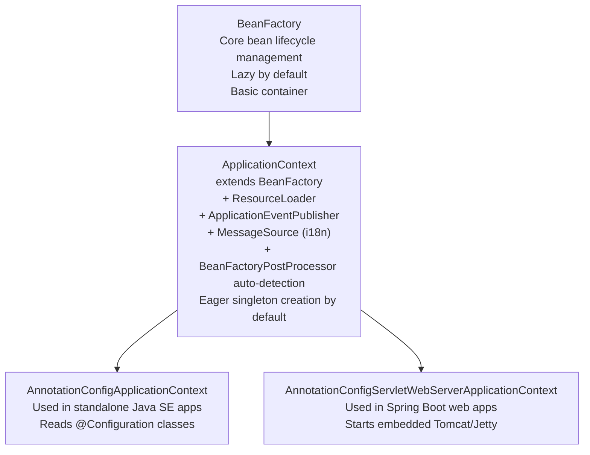
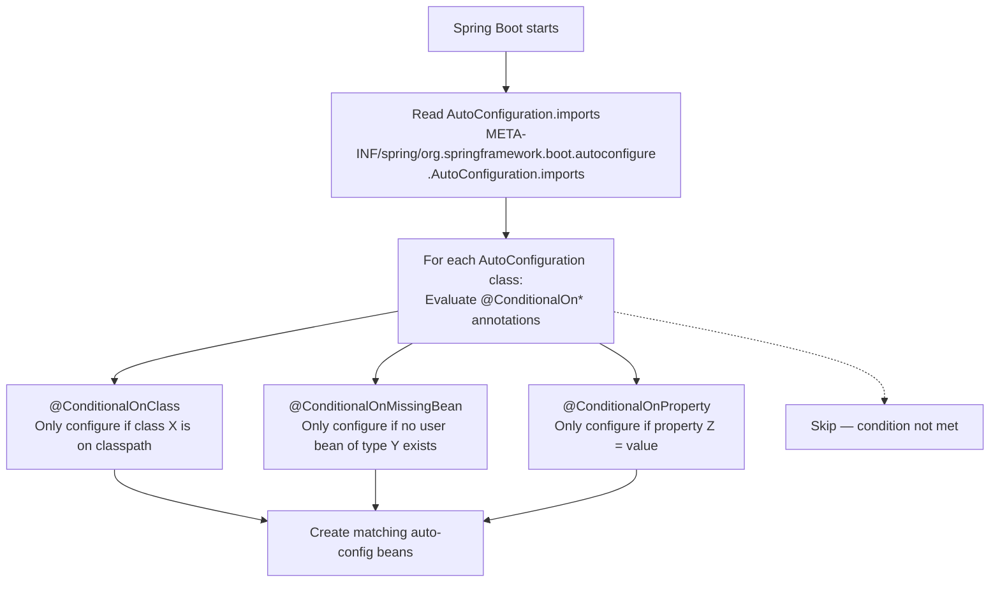
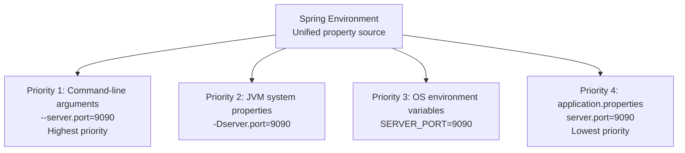

# :material-book-open-variant: Book Reading — Spring in Action (6th Ed.) Ch 1 & Ch 6

*Craig Walls, Manning Publications, 2022*

---

## :material-numeric-1-box: Chapter 1 — Getting Started with Spring (Sections 1.1–1.2)

### 1.1 What Is Spring?

Craig Walls opens with a fundamental question: what does "Spring" actually mean? The answer is that Spring is not a single framework but a **portfolio of frameworks** that all share a common foundation.

The **Spring Framework** at its core provides two capabilities:
1. **Dependency Injection (DI)** — a form of loose coupling where objects declare their dependencies and the container satisfies them
2. **Aspect-Oriented Programming (AOP)** — a way to express behaviors that span multiple classes (cross-cutting concerns) in a modular way

Spring's philosophy is: write **POJO-based applications**. A POJO (Plain Old Java Object) is simply a Java class with no framework-specific inheritance or interface requirements. Spring manages POJOs; it doesn't require them to extend `SpringBean` or implement `Manageable`.

```java
// This is a valid Spring bean — just a POJO:
public class CricketCoach {
    public String getDailyWorkout() {
        return "Practice bowling for 15 minutes";
    }
}
```

Contrast with the pre-Spring EJB world where beans had to extend `EJBObject` or implement `SessionBean`, carrying framework ceremony into every class.

### 1.1.1 The Spring Application Context

The heart of Spring is the **application context** — an object that loads bean configurations and creates, wires, and manages the lifecycle of the configured beans.

`ApplicationContext` is the primary interface (extends `BeanFactory`):



**BeanFactory vs ApplicationContext:**

| Feature | `BeanFactory` | `ApplicationContext` |
|---------|--------------|---------------------|
| Bean instantiation | Lazy (on-demand) | Eager (at startup) for singletons |
| AOP integration | Manual | Automatic |
| Event publishing | ❌ | ✅ `ApplicationEvent` |
| i18n support | ❌ | ✅ `MessageSource` |
| Use case | Lightweight, embedded | All production Spring apps |

In practice, **always use `ApplicationContext`** — `BeanFactory` is a historical artifact.

### 1.1.2 Wiring Beans Together

Walling explains two primary ways beans get wired in Spring:

**1. Automatic Configuration (Component Scanning + Autowiring):**
```java
@Component
public class CricketCoach implements Coach { ... }

@Component
public class DemoController {
    @Autowired
    public DemoController(Coach coach) { ... }
}
```

**2. Explicit Java Configuration:**
```java
@Configuration
public class AppConfig {
    @Bean
    public Coach coach() { return new CricketCoach(); }

    @Bean
    public DemoController controller() {
        return new DemoController(coach());  // @Configuration CGLIB ensures singleton
    }
}
```

Walls recommends **automatic configuration** whenever possible. Explicit Java configuration is for cases where component scanning isn't appropriate (3rd-party classes, conditional construction logic).

### 1.2 The Spring Application

Walls walks through bootstrapping a complete Spring Boot application, showing how all the pieces connect:

**`@SpringBootApplication`** = three meta-annotations:
```java
@Target(ElementType.TYPE)
@Retention(RetentionPolicy.RUNTIME)
@SpringBootConfiguration    // = @Configuration — this class is a config source
@EnableAutoConfiguration    // Enable auto-configuration based on classpath
@ComponentScan              // Scan this package + sub-packages for @Component
public @interface SpringBootApplication { ... }
```

**`SpringApplication.run()`** creates the `ApplicationContext`, fires up the embedded server, loads all beans, and starts the application:

```java
public static void main(String[] args) {
    // This single line:
    // 1. Creates AnnotationConfigServletWebServerApplicationContext
    // 2. Runs @ComponentScan — discovers all @Component classes
    // 3. Runs @EnableAutoConfiguration — applies conditional auto-configs
    // 4. Starts embedded Tomcat on port 8080
    // 5. Registers the ApplicationContext as a shutdown hook
    SpringApplication.run(DemoApplication.class, args);
}
```

### Spring MVC Web Layer

A Spring MVC controller handles HTTP requests:

```java
@Controller  // Stereotype of @Component; marks as MVC controller
public class HomeController {

    @GetMapping("/")  // Maps HTTP GET / to this method
    public String home(Model model) {
        model.addAttribute("message", "Hello, Spring!");
        return "home";  // Thymeleaf template name: templates/home.html
    }
}
```

For REST APIs (`@RestController` = `@Controller` + `@ResponseBody`):

```java
@RestController  // Return value is directly written to HTTP response body
@RequestMapping("/api")
public class CoachRestController {

    @GetMapping("/workout")
    public String getWorkout() {
        return "Run 5km!";  // Written as text/plain response body
    }

    @GetMapping("/coach")
    public Coach getCoach() {
        return new Coach("track");  // Jackson serializes to JSON automatically
    }
}
```

### Spring Boot Auto-Configuration

Walls dedicates significant space to explaining how **auto-configuration** works. The key insight: auto-configuration is **conditional**. Spring Boot only configures what's needed based on what's on the classpath.



Example: `DataSourceAutoConfiguration` only fires if `DataSource` class is on the classpath AND no `DataSource` bean is manually defined. Adding `spring-boot-starter-data-jpa` brings the class → auto-config creates the DataSource automatically.

### Testing in Spring Boot

```java
@SpringBootTest  // Loads full application context — integration test
class DemoApplicationTests {

    @Autowired
    private DemoController controller;  // Real Spring-wired bean

    @Test
    void contextLoads() {
        // Just verifies the application context starts without errors
        assertThat(controller).isNotNull();
    }
}

@WebMvcTest(DemoController.class)  // Loads ONLY MVC layer — slice test
class DemoControllerTests {

    @Autowired
    private MockMvc mockMvc;  // For HTTP request simulation

    @MockBean
    private Coach coach;  // Mock the dependency

    @Test
    void getDailyWorkout_returnsWorkout() throws Exception {
        when(coach.getDailyWorkout()).thenReturn("Run 5km!");
        mockMvc.perform(get("/dailyworkout"))
               .andExpect(status().isOk())
               .andExpect(content().string("Run 5km!"));
    }
}
```

**Test slicing** (`@WebMvcTest`, `@DataJpaTest`, `@RestClientTest`) is a Spring Boot technique for loading only the relevant layers of the context — much faster than `@SpringBootTest`.

---

## :material-numeric-6-box: Chapter 6 — Working with Configuration Properties (Sections 6.1–6.3)

### 6.1 Fine-Tuning Auto-Configuration

Walls distinguishes between two types of Spring configuration:
- **Bean wiring configuration** (what beans to create and how to wire them) — done via `@Component`, `@Configuration`
- **Injection configuration** (runtime values for properties) — done via `application.properties` / YAML

### The Spring Environment Abstraction

The `Environment` object represents the complete view of all property sources in priority order:



Higher priority sources **override** lower ones. A command-line arg always wins over `application.properties`.

### @Value — Single Property Injection

```java
@RestController
public class DemoController {

    // Reads "coach.name" from Environment (any property source)
    @Value("${coach.name}")
    private String coachName;

    // With default value if property not found
    @Value("${team.name:The Default Team}")
    private String teamName;

    // SpEL expression — evaluate and assign
    @Value("#{10 * 2}")
    private int maxAttempts;
}
```

### 6.2 @ConfigurationProperties — Binding Property Groups

For complex configuration (multiple related properties), `@ConfigurationProperties` binds an entire property prefix to a typed POJO:

```properties
# application.properties
app.service.name=CricketService
app.service.timeout-ms=5000
app.service.max-retries=3
app.service.endpoint=https://api.example.com
```

```java
@Component
@ConfigurationProperties(prefix = "app.service")
@Validated  // Enable JSR-380 validation on properties
public class ServiceProperties {

    private String name;
    private int timeoutMs;  // Spring binds "timeout-ms" to "timeoutMs" (relaxed binding)
    private int maxRetries;

    @NotBlank  // Validation: endpoint must be provided
    private String endpoint;

    // Getters and setters required by Spring for binding
    public String getName() { return name; }
    public void setName(String name) { this.name = name; }
    // ...
}
```

**Relaxed binding** means Spring understands:
- `app.service.timeout-ms` → `timeoutMs` (kebab-case to camelCase)
- `APP_SERVICE_TIMEOUT_MS` → `timeoutMs` (OS env var format)
- `app.service.timeoutMs` → `timeoutMs` (direct camelCase)

**Why `@ConfigurationProperties` over `@Value`:**

| Feature | `@Value` | `@ConfigurationProperties` |
|---------|---------|--------------------------|
| Type safety | ❌ String-based | ✅ Strongly typed POJO |
| Validation | Manual | ✅ `@Validated` + JSR-380 |
| IDE support | Limited | ✅ Full autocomplete in IntelliJ |
| Grouped properties | One at a time | ✅ Entire prefix at once |
| Testing | Requires `@TestPropertySource` | ✅ Easy to construct and set |

### 6.3 Profiles — Environment-Specific Configuration

Profiles allow different configuration for different environments (dev, test, prod):

```properties
# application.properties (active in all profiles)
spring.application.name=my-app

# application-dev.properties (active when spring.profiles.active=dev)
server.port=8080
spring.datasource.url=jdbc:h2:mem:testdb

# application-prod.properties (active when spring.profiles.active=prod)
server.port=80
spring.datasource.url=jdbc:postgresql://prod-db:5432/mydb
```

Activate a profile:
```bash
# Command line:
java -jar app.jar --spring.profiles.active=prod

# In application.properties:
spring.profiles.active=dev

# As JVM system property:
-Dspring.profiles.active=prod

# As OS environment variable:
SPRING_PROFILES_ACTIVE=prod
```

### @Profile — Conditional Bean Creation

```java
// Only created when "dev" profile is active
@Profile("dev")
@Component
public class DevDataSourceConfig {
    @Bean
    public DataSource dataSource() {
        return new EmbeddedDatabaseBuilder()
            .setType(EmbeddedDatabaseType.H2)
            .build();
    }
}

// Only created when "prod" profile is active
@Profile("prod")
@Component
public class ProdDataSourceConfig {
    @Bean
    public DataSource dataSource() {
        return DataSourceBuilder.create()
            .url("jdbc:postgresql://prod-db:5432/mydb")
            .build();
    }
}

// Created in all profiles EXCEPT prod
@Profile("!prod")
@Bean
public DebugLogger debugLogger() { ... }

// Created when dev OR test profile is active
@Profile({"dev", "test"})
@Bean
public TestDataLoader testDataLoader() { ... }
```

### Viewing Live Property Values

Spring Boot Actuator's `/env` endpoint shows all property sources and their current values:

```bash
curl http://localhost:8080/actuator/env | jq '.propertySources'
```

Output shows each property source in priority order with all keys and values. Sensitive values (passwords) are automatically masked as `"******"` by Spring Boot.

!!! warning "Sensitive Properties in /env"
    Even with masking, the `/env` endpoint exposes your complete configuration. Always:
    1. Restrict Actuator access with Spring Security
    2. Use `management.endpoints.web.exposure.include=health,info` in production (exclude `env`)
    3. Consider `spring.cloud.config.server` or HashiCorp Vault for secrets management

### Property Encryption (Brief)

For encrypting sensitive properties like database passwords:
- **Spring Cloud Config Vault Integration**: stores secrets in HashiCorp Vault, Spring fetches at startup
- **Jasypt Spring Boot**: `ENC(encryptedValue)` in properties, decrypted at runtime
- **Environment Variables**: never store plaintext passwords in `application.properties` for production
