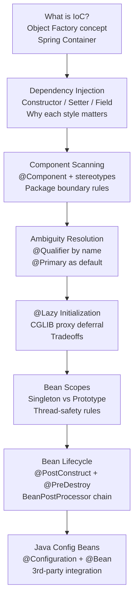

# :material-injection-syringe: Week 2 — Spring Core: IoC, Dependency Injection & Bean Lifecycle

Master Spring's most fundamental mechanism: the **IoC container**. Understand how Spring creates, wires, and manages the lifecycle of every object in your application — and see exactly what happens at the reflection and bytecode level underneath the annotations.

**Blueprint Goal:** Dissect Spring's core IoC container, contrast all injection styles, resolve multi-implementation ambiguities with `@Qualifier` / `@Primary`, manage bean scopes, implement lifecycle hooks, and wire 3rd-party classes via Java `@Configuration`.

---

## :material-map: Week 2 Learning Path

---

## :material-calendar: Week 2 Schedule

| Topic | Lectures | Key Annotations / Concepts |
|-------|----------|-----------------------------|
| IoC — What it is | 1 | Spring container, Object Factory, BeanFactory |
| Dependency Injection overview | 2, 3 | DI definition, Hollywood Principle, injection points |
| Constructor Injection | 4, 5, 6, 7 | `@Autowired`, `final` fields, `Constructor.newInstance()` |
| Component Scanning | 8, 9, 10 | `@Component`, `@ComponentScan`, package boundary |
| Setter & Field Injection | 11, 12, 13 | `@Autowired` on methods/fields, `Field.setAccessible(true)` |
| @Qualifier & @Primary | 14, 15, 16, 17, 18 | Ambiguity resolution, `NoUniqueBeanDefinitionException` |
| @Lazy Initialization | 19, 20, 21 | Eager vs lazy, global `spring.main.lazy-initialization` |
| Bean Scopes | 22, 23 | Singleton, Prototype, web scopes |
| Bean Lifecycle Methods | 24, 25, 26 | `@PostConstruct`, `@PreDestroy`, Prototype destroy caveat |
| Java Config Beans | 27, 28, 29 | `@Configuration`, `@Bean`, CGLIB subclass interception |
| Hands-on Lab | Blueprint Lab 2 | Dynamic Athletic Dispatcher & 3rd-Party Adapter Service |

---

## :material-folder-open: Week 2 Content

-   :material-note-text:{ .lg .middle } **Topic Notes — Part 1**

    ---

    IoC container concept, all three DI styles with deep reflection internals, component scanning mechanics, and the complete behind-the-scenes story of constructor injection.

    [:octicons-arrow-right-24: Topic Notes Part 1](topic-notes-part1.md)

-   :material-note-text:{ .lg .middle } **Topic Notes — Part 2**

    ---

    @Qualifier / @Primary ambiguity resolution, @Lazy CGLIB proxy internals, Singleton vs Prototype scope deep-dive, complete bean lifecycle with BeanPostProcessor chain, and @Configuration CGLIB interception.

    [:octicons-arrow-right-24: Topic Notes Part 2](topic-notes-part2.md)

-   :material-book-open-variant:{ .lg .middle } **Book Reading — Spring in Action Ch 1 & Ch 6**

    ---

    Craig Walls on the Spring container philosophy, ApplicationContext, wiring strategies, the Environment abstraction, @ConfigurationProperties, and Spring profiles.

    [:octicons-arrow-right-24: Book Reading](book-reading.md)

-   :material-flask:{ .lg .middle } **Lab Guide — Dynamic Athletic Dispatcher & 3rd-Party Adapter**

    ---

    Step-by-step practical implementation of IoC/DI injection styles, `@Qualifier` / `@Primary` resolution, `@Lazy` proxies, Prototype vs Singleton scope checks, and Java Config bean adaptation.

    [:octicons-arrow-right-24: Lab Guide](lab-guide.md)

-   :material-clipboard-check:{ .lg .middle } **Week 2 Summary**

    ---

    Annotation cheat sheet, DI style comparison table, scope decision matrix, full lifecycle state diagram, CGLIB internals, DefaultListableBeanFactory data structures, and lab checklist.

    [:octicons-arrow-right-24: Summary](summary.md)

---

## :material-checkbox-marked-outline: Week 2 Progress

- [ ] Understand IoC as object lifecycle outsourcing to the Spring container
- [ ] Implement constructor injection with `@Autowired` and `final` fields
- [ ] Understand what `Constructor.newInstance()` does behind the scenes
- [ ] Implement setter injection and field injection; understand why field injection is discouraged
- [ ] Configure component scanning explicitly with `@ComponentScan`
- [ ] Resolve multi-implementation ambiguity with `@Qualifier`
- [ ] Use `@Primary` as the default bean marker
- [ ] Apply `@Lazy` and understand its CGLIB proxy deferral mechanism
- [ ] Compare Singleton vs Prototype scope with a live `==` reference test
- [ ] Implement `@PostConstruct` and `@PreDestroy` lifecycle callbacks
- [ ] Wire a 3rd-party class using `@Configuration` + `@Bean`
- [ ] Understand CGLIB subclassing of `@Configuration` classes
- [ ] Complete Week 2 Lab: Dynamic Athletic Dispatcher & 3rd-Party Adapter Service
