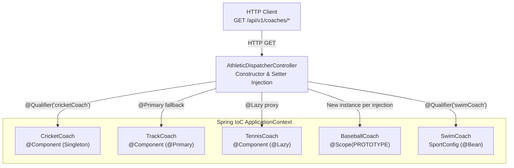

# :material-flask: Week 02 Lab Guide — Dynamic Athletic Dispatcher & 3rd-Party Adapter Service

> **Module:** Week 2 — Spring Core, Inversion of Control, Dependency Injection & Bean Lifecycle  
> **Lab Repo:** [:material-github: 7amo10/Spring-Labs — Week-02-Spring-Core-IoC-Lifecycle](https://github.com/7amo10/Spring-Labs/tree/main/Week-02-Spring-Core-IoC-Lifecycle)

---

## :material-target: Lab Objective

Master Spring's **Inversion of Control (IoC)** container and **Dependency Injection (DI)** paradigms. Contrast constructor versus setter injection, resolve multi-implementation bean candidate ambiguities using `@Qualifier` and `@Primary`, control container startup memory and initialization timing using `@Lazy`, contrast **Singleton** versus **Prototype** scopes (`@Scope`) with state isolation, observe bean lifecycle hooks (`@PostConstruct` and `@PreDestroy`), and adapt unmodifiable legacy/third-party classes into the container using Java Configuration (`@Configuration` and `@Bean`).

---

## :material-list-box: Key Concepts Covered

- **Inversion of Control & Dependency Injection:** Architectural decoupling of object creation from consumption. Best practice enforcement of constructor injection for mandatory dependencies and setter injection for optional dependencies.
- **Disambiguation with `@Qualifier` and `@Primary`:** Selecting targeted implementations from polymorphic bean hierarchies without tight coupling.
- **Lazy Initialization (`@Lazy`):** Defeating container startup memory spikes by deferring bean instantiation until first invocation.
- **Bean Scopes (Singleton vs. Prototype):** Analyzing default singleton shared instances versus prototype independent instances (`SCOPE_PROTOTYPE`) with object identity hashing.
- **Lifecycle Hooks (`@PostConstruct` / `@PreDestroy`):** Intercepting bean post-initialization and container shutdown cleanup phases.
- **Java Config & 3rd-Party Bean Adaptation:** Wrapping external third-party classes into Spring beans using `@Configuration` and factory `@Bean` methods.

---

## :material-code-braces: Component Architecture

Package: `com.spring.lab.core`

| Component | Scope / Annotations | Responsibility |
|-----------|---------------------|----------------|
| `Coach` | Interface | Declares core contract: `getDailyWorkout()` and `getCoachType()` |
| `CricketCoach` | `@Component` (Singleton) | Standard singleton coach returning cricket training routines |
| `TrackCoach` | `@Component`, `@Primary` | Primary default coach used when no explicit qualifier is supplied |
| `TennisCoach` | `@Component`, `@Lazy` | Lazy-initialized bean demonstrating deferred container construction |
| `BaseballCoach` | `@Component`, `@Scope(SCOPE_PROTOTYPE)` | Prototype-scoped bean maintaining local state to demonstrate instance isolation |
| `SwimCoach` | POJO (Unannotated) | External/third-party unmodifiable POJO without Spring annotations, featuring custom `init()` and `cleanup()` |
| `SportConfig` | `@Configuration` | Java configuration class exposing `@Bean("swimCoach")` to adapt `SwimCoach` into the container |
| `AthleticDispatcherController` | `@RestController` | Exposes endpoints demonstrating constructor injection with `@Qualifier`, `@Primary` fallback, setter injection, and prototype scope identity checks |
| `CoreApplication` | Main Class | Entry point annotated with `@SpringBootApplication` |

---

## :material-routes: REST Endpoints Specification

Base Path: `/api/v1/coaches`

| HTTP Method | Endpoint | Injection Technique / Mechanism | Expected Result |
|-------------|----------|--------------------------------|-----------------|
| `GET` | `/api/v1/coaches/cricket` | Constructor Injection with `@Qualifier("cricketCoach")` | Returns cricket daily workout |
| `GET` | `/api/v1/coaches/primary` | Constructor Injection with `@Primary` fallback | Returns `TrackCoach` workout without explicit qualifier |
| `GET` | `/api/v1/coaches/tennis` | Injected `@Lazy TennisCoach` | Triggers deferred bean creation on first request |
| `GET` | `/api/v1/coaches/swim` | Injected `@Bean` adapted `SwimCoach` | Returns adapted third-party workout |
| `GET` | `/api/v1/coaches/scope-check` | Dual injection of Singleton & Prototype beans | Compares identity: `singletonA == singletonB` is `true`, `prototypeA == prototypeB` is `false` |

---

## :material-stairs: Step-by-Step Implementation Guide

### Step 1: Project Setup & Maven Dependencies

Create a Maven module with Spring Boot 3, Java 21, and web starters:

```xml
<dependencies>
    <dependency>
        <groupId>org.springframework.boot</groupId>
        <artifactId>spring-boot-starter-web</artifactId>
    </dependency>
    <dependency>
        <groupId>org.springframework.boot</groupId>
        <artifactId>spring-boot-starter-test</artifactId>
        <scope>test</scope>
    </dependency>
</dependencies>
```

### Step 2: Define Contract and Implementations

```java
package com.spring.lab.core.coach;

public interface Coach {
    String getDailyWorkout();
    String getCoachType();
}
```

Implement `CricketCoach`, `TrackCoach` (with `@Primary`), `TennisCoach` (with `@Lazy`), and `BaseballCoach` (with `@Scope(ConfigurableBeanFactory.SCOPE_PROTOTYPE)`):

```java
@Component
@Scope(ConfigurableBeanFactory.SCOPE_PROTOTYPE)
public class BaseballCoach implements Coach {
    private int sessionCounter = 0;

    @Override
    public String getDailyWorkout() {
        sessionCounter++;
        return "Batting practice for 30 minutes. Session count: " + sessionCounter;
    }

    @Override
    public String getCoachType() {
        return "Baseball";
    }
}
```

### Step 3: Adapt 3rd-Party `SwimCoach` with `@Bean`

Create an unannotated POJO representing an unmodifiable external library class:

```java
package com.spring.lab.core.external;

import com.spring.lab.core.coach.Coach;

public class SwimCoach implements Coach {
    @Override
    public String getDailyWorkout() {
        return "Swim 1,000 meters as a warm-up.";
    }

    @Override
    public String getCoachType() {
        return "Aquatic / Swim";
    }
}
```

Register it via Java Config:

```java
package com.spring.lab.core.config;

import com.spring.lab.core.coach.Coach;
import com.spring.lab.core.external.SwimCoach;
import org.springframework.context.annotation.Bean;
import org.springframework.context.annotation.Configuration;

@Configuration
public class SportConfig {

    @Bean("swimCoach")
    public Coach swimCoach() {
        return new SwimCoach();
    }
}
```

### Step 4: Build `AthleticDispatcherController`

Inject dependencies via constructor and setters demonstrating `@Qualifier`, `@Primary`, and scope comparisons:

```java
package com.spring.lab.core.controller;

import com.spring.lab.core.coach.Coach;
import org.springframework.beans.factory.annotation.Autowired;
import org.springframework.beans.factory.annotation.Qualifier;
import org.springframework.web.bind.annotation.GetMapping;
import org.springframework.web.bind.annotation.RequestMapping;
import org.springframework.web.bind.annotation.RestController;

import java.util.Map;

@RestController
@RequestMapping("/api/v1/coaches")
public class AthleticDispatcherController {

    private final Coach cricketCoach;
    private final Coach primaryCoach;
    private final Coach swimCoach;
    private Coach tennisCoach;

    // Prototype scope check beans
    private final Coach prototypeA;
    private final Coach prototypeB;
    private final Coach singletonA;
    private final Coach singletonB;

    @Autowired
    public AthleticDispatcherController(
            @Qualifier("cricketCoach") Coach cricketCoach,
            Coach primaryCoach,
            @Qualifier("swimCoach") Coach swimCoach,
            @Qualifier("baseballCoach") Coach prototypeA,
            @Qualifier("baseballCoach") Coach prototypeB,
            @Qualifier("cricketCoach") Coach singletonA,
            @Qualifier("cricketCoach") Coach singletonB) {
        this.cricketCoach = cricketCoach;
        this.primaryCoach = primaryCoach;
        this.swimCoach = swimCoach;
        this.prototypeA = prototypeA;
        this.prototypeB = prototypeB;
        this.singletonA = singletonA;
        this.singletonB = singletonB;
    }

    @Autowired
    public void setTennisCoach(@Qualifier("tennisCoach") Coach tennisCoach) {
        this.tennisCoach = tennisCoach;
    }

    @GetMapping("/cricket")
    public Map<String, String> getCricket() {
        return Map.of("type", cricketCoach.getCoachType(), "workout", cricketCoach.getDailyWorkout());
    }

    @GetMapping("/primary")
    public Map<String, String> getPrimary() {
        return Map.of("type", primaryCoach.getCoachType(), "workout", primaryCoach.getDailyWorkout());
    }

    @GetMapping("/tennis")
    public Map<String, String> getTennis() {
        return Map.of("type", tennisCoach.getCoachType(), "workout", tennisCoach.getDailyWorkout());
    }

    @GetMapping("/swim")
    public Map<String, String> getSwim() {
        return Map.of("type", swimCoach.getCoachType(), "workout", swimCoach.getDailyWorkout());
    }

    @GetMapping("/scope-check")
    public Map<String, Object> checkScope() {
        return Map.of(
            "singletonSameReference", (singletonA == singletonB),
            "singletonA_hash", System.identityHashCode(singletonA),
            "singletonB_hash", System.identityHashCode(singletonB),
            "prototypeSameReference", (prototypeA == prototypeB),
            "prototypeA_hash", System.identityHashCode(prototypeA),
            "prototypeB_hash", System.identityHashCode(prototypeB)
        );
    }
}
```

---

## :material-sitemap: Spring IoC Container & Dependency Wiring Architecture



---

## :material-check-all: Verification Checklist

- [ ] `GET /api/v1/coaches/cricket` returns cricket workout via explicit `@Qualifier`
- [ ] `GET /api/v1/coaches/primary` resolves to `TrackCoach` via `@Primary` annotation
- [ ] `TennisCoach` constructor executes lazily only upon receiving request to `/tennis`
- [ ] `SwimCoach` unannotated POJO is successfully resolved via `SportConfig` `@Bean` definition
- [ ] `GET /api/v1/coaches/scope-check` returns `"singletonSameReference": true` and `"prototypeSameReference": false`
- [ ] `@PostConstruct` logs upon bean initialization and `@PreDestroy` logs upon context shutdown for singletons
- [ ] Verify container does **not** invoke `@PreDestroy` on prototype-scoped `BaseballCoach` instances
