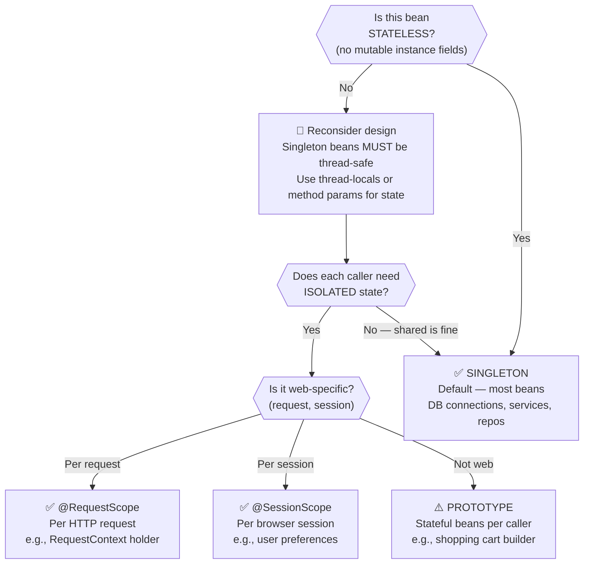
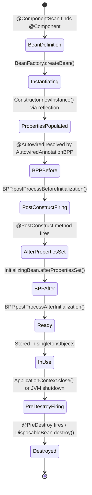

# :material-clipboard-check: Week 2 Summary — Annotations, Internals & Mental Models

---

## :material-table: 1. Complete Annotation Cheat Sheet

| Annotation | Package | What It Does | Internal Mechanism | When to Use | Common Pitfall |
|-----------|---------|-------------|-------------------|-------------|----------------|
| `@Component` | `org.springframework.stereotype` | Marks a POJO as a Spring-managed bean | Detected by `ClassPathBeanDefinitionScanner` via ASM bytecode reading | Generic beans with no specific role | Forget to put class in scanned package — bean not created |
| `@Controller` | `org.springframework.stereotype` | MVC web controller stereotype | Same as @Component + activates `@RequestMapping` processing | Spring MVC request handlers | Returning raw objects without `@ResponseBody` — 404 error |
| `@Service` | `org.springframework.stereotype` | Business layer stereotype | Identical to @Component at runtime (semantic only) | Service/business logic classes | None — but don't use for DAO classes |
| `@Repository` | `org.springframework.stereotype` | Data access layer stereotype | Adds `PersistenceExceptionTranslationAdvisor` proxy | DAO, repository classes | Not using it — lose automatic exception translation |
| `@Autowired` | `org.springframework.beans.factory.annotation` | Injects a dependency | `AutowiredAnnotationBeanPostProcessor` uses reflection | Constructor (recommended), setter, field | Ambiguous beans → `NoUniqueBeanDefinitionException` |
| `@Qualifier("name")` | `org.springframework.beans.factory.annotation` | Specifies which bean to inject by name | Passed to `DefaultListableBeanFactory.resolveDependency()` | Multiple beans of same type | Wrong bean name (case-sensitive!) |
| `@Primary` | `org.springframework.context.annotation` | Default bean when no @Qualifier | Sets `BeanDefinition.isPrimary = true` | One dominant implementation | More than one @Primary per type → exception |
| `@Lazy` | `org.springframework.context.annotation` | Defer bean creation to first use | CGLIB proxy at injection point, real bean created on first method call | Expensive rarely-used beans | Config errors hidden until runtime |
| `@Scope("prototype")` | `org.springframework.context.annotation` | New instance per request | `BeanDefinition.scope = "prototype"`, not cached | Stateful beans needing isolation | @PreDestroy NEVER called for prototype beans |
| `@PostConstruct` | `jakarta.annotation` | Init callback after DI completes | `CommonAnnotationBeanPostProcessor` processes it | DB connection setup, cache warmup | Throws exception → `BeanCreationException`, app fails to start |
| `@PreDestroy` | `jakarta.annotation` | Cleanup callback before bean destruction | Registered in `disposableBeans` map, called on `context.close()` | Connection pool close, file flush | NOT called for prototype beans |
| `@Configuration` | `org.springframework.context.annotation` | Declares a configuration class | CGLIB subclass generated, `@Bean` methods intercepted | Defining beans for 3rd-party classes | Calling `@Bean` method from `@Component` (no CGLIB → new instance) |
| `@Bean` | `org.springframework.context.annotation` | Declares a method that returns a bean | Method name becomes bean id; CGLIB intercepts repeated calls | Wiring 3rd-party, complex construction | Using `@Bean` in `@Component` class (no singleton guarantee) |

---

## :material-compare: 2. DI Style Comparison Table

| Dimension | Constructor Injection | Setter Injection | Field Injection |
|-----------|----------------------|-----------------|-----------------|
| Spring Annotation | `@Autowired` on constructor | `@Autowired` on method | `@Autowired` on field |
| Field can be `final`? | ✅ Yes — guaranteed immutability | ❌ No | ❌ No |
| For mandatory dependencies? | ✅ **Best choice** | ⚠️ Possible | ⚠️ Possible |
| For optional dependencies? | ❌ Complex | ✅ Natural with `required=false` | ✅ Simple |
| Unit testable without Spring? | ✅ `new MyClass(mockDep)` | ✅ Call `setDep(mockDep)` | ❌ Need `ReflectionTestUtils` |
| Detects circular dependency? | ✅ `BeanCurrentlyInCreationException` at startup | ❌ May create partial graph | ❌ May create partial graph |
| Hides dependencies? | ✅ Constructor signature shows them | ⚠️ Somewhat | ❌ Completely hidden |
| Spring team recommends? | ✅ **Yes — for mandatory deps** | ✅ **Yes — for optional deps** | ❌ **No — avoid in prod** |

---

## :material-sitemap: 3. Bean Scope Decision Matrix



---

## :material-state-machine: 4. Complete Bean Lifecycle State Diagram



---

## :material-file-compare: 5. @Configuration + @Bean vs @Component

| Scenario | Use `@Component` | Use `@Configuration + @Bean` |
|----------|-----------------|------------------------------|
| You own the class source code | ✅ Annotate directly | ❌ Unnecessary overhead |
| 3rd-party class (can't annotate) | ❌ Not possible | ✅ Only option |
| Complex construction logic | ❌ Hard with annotations | ✅ Full Java code in @Bean method |
| Multiple beans from same class | ❌ Not straightforward | ✅ Multiple @Bean methods |
| Cross-bean dependencies in config | ❌ May not work correctly | ✅ CGLIB ensures correct singletons |
| Conditional bean creation | Via `@Conditional*` | Via `@Conditional*` + method logic |

---

## :material-chip: 6. Low-Level Internals Deep-Dive

### DefaultListableBeanFactory Data Structures

```java
// Simplified pseudocode of what Spring actually manages:
public class DefaultListableBeanFactory {
    // Registered during @ComponentScan — before ANY bean is created
    private final Map<String, BeanDefinition> beanDefinitionMap
        = new ConcurrentHashMap<>(256);

    // Populated during context refresh — contains actual bean instances
    private final Map<String, Object> singletonObjects
        = new ConcurrentHashMap<>(256);

    // Only singletons with @PreDestroy or DisposableBean interface
    // NOTE: prototype beans NEVER enter this map
    private final Map<String, Object> disposableBeans
        = new LinkedHashMap<>();

    // "Early" singletons for circular dependency resolution
    // Holds partially-constructed beans before @Autowired injection completes
    private final Map<String, Object> earlySingletonObjects
        = new ConcurrentHashMap<>(16);
}
```

### CGLIB in @Configuration — The Bytecode Detail

When Spring sees `@Configuration`, it uses CGLIB (the same bytecode manipulation library approach as Phase 2's ByteBuddy) to generate a subclass:

```
Your class:     SportConfig.class
CGLIB generates: SportConfig$$SpringCGLIB$$0.class

The generated subclass overrides every @Bean method to:
1. Check if beanFactory.containsSingleton("swimCoach")
2. If YES: return beanFactory.getSingleton("swimCoach")  ← cached
3. If NO:  call super.swimCoach()                        ← your code
          then beanFactory.registerSingleton(name, result)
```

This is why calling `@Bean` methods from other `@Bean` methods in a `@Configuration` class correctly returns the singleton — the CGLIB subclass intercepts the call.

!!! note "Phase 2 Connection: CGLIB = ByteBuddy's Older Cousin"
    helix-jvm-engine used **ByteBuddy** (a modern bytecode generation library). Spring uses **CGLIB** (older, but battle-tested). Both:
    - Generate `*.class` bytecode at runtime
    - Create subclasses of your classes
    - Override methods to intercept calls
    - Use the same underlying JVM class-definition mechanism: `ClassLoader.defineClass()`
    
    The difference: ByteBuddy has a fluent Java API; CGLIB has a callback-based API. Under the hood, both produce `ClassFile`-spec-compliant bytecode.

### BeanPostProcessor Chain — Ordered Execution

Spring executes BPPs in this order for every bean:

```
Bean created (Constructor.newInstance)
    ↓
AutowiredAnnotationBeanPostProcessor.postProcessBeforeInitialization()
    → injects @Autowired, @Value fields
    ↓
CommonAnnotationBeanPostProcessor.postProcessBeforeInitialization()
    → fires @PostConstruct
    ↓
[Your bean's @PostConstruct method fires here]
    ↓
AopAutoProxyCreator.postProcessAfterInitialization()  (if @Transactional, @Cacheable, etc.)
    → wraps bean in CGLIB or JDK proxy for AOP
    ↓
Bean stored in singletonObjects (what callers actually receive — may be a proxy)
```

!!! important "You May Never Hold the Real Bean"
    When `@Transactional` or `@Cacheable` is active, the object stored in `singletonObjects` and injected into your fields is **NOT your class instance** — it's a CGLIB proxy that delegates to your instance. This is why:
    - `this` inside a `@Transactional` method doesn't invoke the transaction advice (calling methods on `this` bypasses the proxy)
    - Spring AOP works through **method interception on the proxy**, not on the real object

---

## :material-flask: 7. Lab Verification Checklist

**Lab: Dynamic Athletic Dispatcher & 3rd-Party Adapter Service** *(from blueprint)*

- [ ] Define `Coach` interface with single method `getDailyWorkout()`
- [ ] Implement `CricketCoach`, `TennisCoach`, `TrackCoach` — each with `@Component`
- [ ] Create `SwimCoach` class **without** `@Component` (simulating 3rd-party)
- [ ] Wire `SwimCoach` via `@Configuration + @Bean` in `SportConfig`
- [ ] Create `DemoController` with constructor injection + `@Qualifier("cricketCoach")`
- [ ] Verify: hit `/dailyworkout` → always gets cricket response regardless of @Primary
- [ ] Add `@Primary` to `TrackCoach`
- [ ] Create second endpoint without `@Qualifier` → verify `TrackCoach` is injected
- [ ] Add constructor `System.out.println` to each coach; add `@Lazy` to one
- [ ] Restart → verify lazy coach constructor NOT printed at startup
- [ ] Hit the lazy coach's endpoint → verify constructor now prints
- [ ] Change a coach scope to `@Scope("prototype")`; inject it twice into different fields
- [ ] Create `/check` endpoint: `return "Same? " + (coachA == coachB)` → should be `false`
- [ ] Add `@PostConstruct` and `@PreDestroy` to a coach; stop the app
- [ ] Verify `@PostConstruct` fires after injection, `@PreDestroy` fires on shutdown
- [ ] Change to prototype scope; verify `@PreDestroy` **does not fire** on shutdown

---

## :material-road: 8. Prerequisites to Continue to Week 3 (Hibernate/JPA)

!!! note "Prerequisites to Continue"
    **Before Week 3 (Hibernate/JPA CRUD), make sure you understand:**
    
    - **JDBC basics**: `Connection`, `Statement`, `ResultSet`, `PreparedStatement` — JPA sits above JDBC
    - **SQL fundamentals**: `CREATE TABLE`, `INSERT`, `SELECT`, `UPDATE`, `DELETE`, `JOIN` — JPQL maps to SQL
    - **Java generics**: `JpaRepository<Student, Long>` uses generic type parameters extensively
    - **CGLIB / Bytecode manipulation** (now understood from this week): Hibernate also generates subclasses of your `@Entity` classes for lazy loading
    - **Reflection API** (Phase 1): Hibernate uses `Field.setAccessible(true)` to read/write entity fields to/from `ResultSet`
    - **Transaction concept**: ACID properties — Hibernate's `@Transactional` guarantees these
    - **Maven dependency basics** (Week 1): `spring-boot-starter-data-jpa` brings in Hibernate + Spring Data JPA + Jakarta Persistence API
    
    **New Spring concepts introduced in Week 3:**
    - `@Entity`, `@Table`, `@Id`, `@GeneratedValue` — JPA entity mapping annotations
    - `EntityManager` — the JPA equivalent of Spring's `ApplicationContext` but for persistence
    - `@PersistenceContext` — special injection for `EntityManager` (not `@Autowired`)
    - `@Transactional` — declarative transaction demarcation (one of the most used Spring annotations)
    - Spring Data JPA `JpaRepository` — eliminates all boilerplate DAO code
