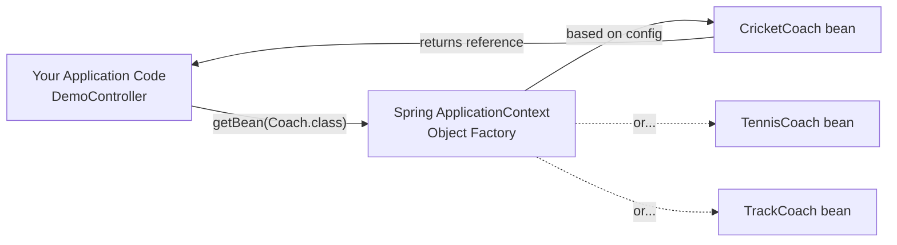
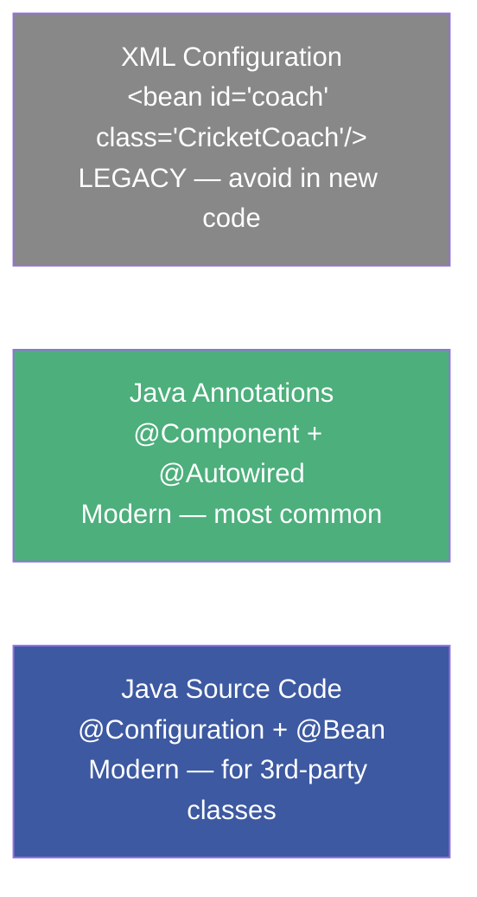
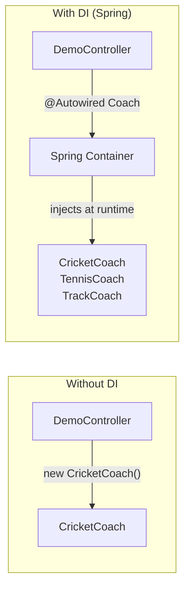
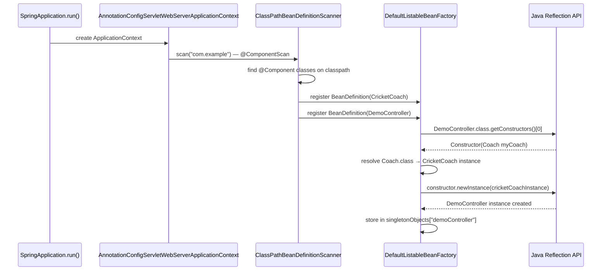
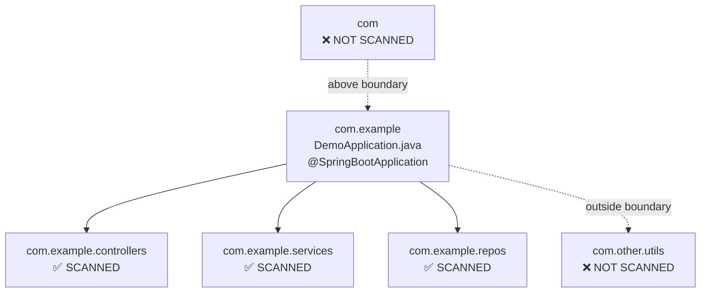

# :material-note-text: Topic Notes — Part 1: IoC, Dependency Injection & Component Scanning

---

## :material-bank: 1. Inversion of Control (IoC) — What It Is

### The Problem Without IoC

Consider a typical tightly-coupled design:

```java
public class DemoController {
    // Hard-coded — can never swap to TennisCoach without changing source code
    private CricketCoach myCoach = new CricketCoach();

    public String getWorkout() {
        return myCoach.getDailyWorkout();
    }
}
```

Problems with this design:
- `DemoController` is **responsible for creating its own dependency** — violates Single Responsibility Principle
- Swapping `CricketCoach` for `TennisCoach` requires **modifying** `DemoController` — violates Open/Closed Principle
- **Cannot be unit-tested** without the real `CricketCoach` running (no mock injection possible)
- Dependencies are **hidden** inside the class, invisible from the outside

### The Textbook Definition

**Inversion of Control (IoC):** The approach of outsourcing the construction and management of objects to a container or framework, rather than having the application code control object creation.

The key word is **inversion** — the control of object creation is *inverted* from the application code to the container.

### The Spring Container as an Object Factory

Spring's `ApplicationContext` acts as a highly advanced **Object Factory**:



The container:
1. Reads your configuration (annotations, XML, or Java `@Configuration`)
2. Creates all bean instances at startup
3. Wires dependencies between beans
4. Manages their entire lifecycle (creation → initialization → usage → destruction)

### Spring Container's Two Primary Functions

| Function | Description | Annotation(s) |
|----------|-------------|----------------|
| **IoC** — Create & manage objects | Container instantiates beans based on config, not application code | `@Component`, `@Bean` |
| **DI** — Inject object dependencies | Container wires beans together by injecting required dependencies | `@Autowired`, `@Inject` |

### Three Ways to Configure the Container



---

## :material-puzzle: 2. Dependency Injection — What, Why, and How

### The Definition

**Dependency Injection (DI)** is the specific implementation of IoC where the container *injects* the dependencies into an object, rather than the object finding or creating its own dependencies.

The **Hollywood Principle** captures this perfectly: *"Don't call us, we'll call you."*  
The object doesn't reach out to find its dependencies — the container delivers them.

### Why DI Matters



| Benefit | How DI Achieves It |
|---------|-------------------|
| **Loose coupling** | `DemoController` depends on the `Coach` *interface*, not a concrete class |
| **Testability** | Inject a mock `Coach` in tests without changing any source code |
| **Configurability** | Swap implementations by changing config, not code |
| **Single Responsibility** | Objects don't manage their own dependencies |

---

## :material-wrench: 3. Constructor Injection — The Recommended Way

### What It Is

The dependencies are declared as **constructor parameters**. Spring reads the constructor at startup, resolves the parameter types from its registry, and calls the constructor with the matching beans.

### Full Code Example

```java
// The contract (interface)
public interface Coach {
    String getDailyWorkout();
}

// The implementation
@Component
public class CricketCoach implements Coach {

    @Override
    public String getDailyWorkout() {
        return "Practice fast bowling for 15 minutes!";
    }
}

// The consumer — uses constructor injection
@RestController
public class DemoController {

    // Declare as final — immutable after construction
    private final Coach myCoach;

    // @Autowired optional in Spring 5+ when only ONE constructor exists
    @Autowired
    public DemoController(Coach myCoach) {
        this.myCoach = myCoach;
    }

    @GetMapping("/dailyworkout")
    public String getDailyWorkout() {
        return myCoach.getDailyWorkout();
    }
}
```

!!! tip "When @Autowired is Optional"
    Since Spring 5, if a class has **exactly one constructor**, `@Autowired` is implied automatically. Spring will inject all constructor parameters. However, it's still good practice to include it for clarity, especially for junior team members reading the code.

### Why `final` Fields?

Declaring `private final Coach myCoach` provides a **compile-time immutability guarantee**:
- The field **cannot** be reassigned after the constructor returns
- Ensures the dependency is always available — no null-pointer surprises
- Works naturally with Java's immutability model

This is **impossible** with field injection — you cannot declare an `@Autowired` field as `final`.

### What Happens Behind the Scenes (Lecture 7)

This is the critical piece that connects Spring to **Phase 2 JVM internals**:



The actual JDK call that creates your bean:
```java
// What Spring does internally (simplified):
Constructor<DemoController> ctor = DemoController.class.getDeclaredConstructors()[0];
Coach resolvedCoach = beanFactory.getBean(Coach.class); // CricketCoach instance
DemoController bean = (DemoController) ctor.newInstance(resolvedCoach);
```

!!! note "Low-Level: Constructor.newInstance() — Phase 1 Reflection Connection"
    This is exactly the Java Reflection API covered in Phase 1. Spring uses `java.lang.reflect.Constructor.newInstance(Object... args)` to create every single bean. The implications:
    
    - The constructor **must be accessible** (public, or `setAccessible(true)` for package-private)
    - Spring resolves each parameter **by type** first (`getBean(Class<T>)`) then by name
    - If the constructor throws a checked exception, Spring wraps it in `BeanCreationException`
    - This reflection call is why there's a small startup cost for large applications with many beans

---

## :material-magnify: 4. Component Scanning — How Spring Finds Your Beans

### What @Component Does

`@Component` is a marker annotation that tells Spring: *"Manage this class as a bean in the container."*

When Spring's `ClassPathBeanDefinitionScanner` encounters a class annotated with `@Component` (or any stereotype that meta-annotates `@Component`), it:
1. Creates a `BeanDefinition` object describing the class
2. Registers it in `DefaultListableBeanFactory`'s `beanDefinitionMap`
3. At context refresh, instantiates the bean and stores it in `singletonObjects`

### Default Bean Naming

The default bean name is the **simple class name with the first letter lowercased**:

| Class Name | Default Bean Id |
|------------|-----------------|
| `CricketCoach` | `"cricketCoach"` |
| `TennisCoach` | `"tennisCoach"` |
| `MySpecialService` | `"mySpecialService"` |

Override with: `@Component("bestCoach")` → bean id is `"bestCoach"`

### The @SpringBootApplication Scanning Boundary

`@SpringBootApplication` is a meta-annotation that includes `@ComponentScan`:

```java
@SpringBootApplication
// Is equivalent to:
@Configuration
@EnableAutoConfiguration
@ComponentScan(basePackages = {"com.example"})  // scans the main class's package + ALL sub-packages
public class DemoApplication { ... }
```



!!! important "Package Boundary Rule"
    If you place a class in a **parent package** of the main class (e.g., your main is in `com.example` but a class is in `com`), it will **NOT** be scanned. Always place all components in the same package or sub-packages as your main class.
    
    To scan an entirely different package explicitly:
    ```java
    @SpringBootApplication(scanBasePackages = {"com.example", "com.acme.shared"})
    ```

### Explicit Component Scanning

```java
@SpringBootApplication
@ComponentScan("com.luv2code")  // scans this specific package + sub-packages
public class DemoApplication { ... }
```

### The Four Stereotype Annotations

All four are `@Component` specializations — they all trigger component scanning identically. The differences are **semantic** (for readability, layer identification) and **technical** (some add extra capabilities):

| Annotation | Semantic Role | Extra Technical Behavior |
|-----------|---------------|--------------------------|
| `@Component` | Generic Spring bean | None — pure marker |
| `@Controller` | Web MVC controller | Enables `@RequestMapping` processing by `DispatcherServlet` |
| `@Service` | Business logic layer | None beyond @Component (semantic only) |
| `@Repository` | Data access layer | **Exception translation**: wraps JDBC/JPA exceptions into Spring's `DataAccessException` hierarchy |

```java
@Repository  // Use for DAO classes — gives you automatic DataAccessException wrapping
public class StudentRepository {
    @PersistenceContext
    private EntityManager em;

    public Student findById(Long id) {
        return em.find(Student.class, id);
    }
}
```

!!! note "Low-Level: @Repository Exception Translation"
    `@Repository` activates `PersistenceExceptionTranslationPostProcessor`, a `BeanPostProcessor` that wraps the bean in a proxy. The proxy catches `PersistenceException` (JPA) or `SQLException` (JDBC) and translates them to the appropriate `DataAccessException` subclass. This is **Spring AOP in action** — an early introduction to the proxy-based AOP covered in Week 10.

---

## :material-swap-horizontal: 5. Setter Injection

### What It Is

`@Autowired` can be placed on **any method** — not just setters. Spring calls that method after bean construction and injects the resolved dependency as the argument.

```java
@RestController
public class DemoController {

    private Coach myCoach;

    // @Autowired on a setter method
    @Autowired
    public void setMyCoach(Coach myCoach) {
        this.myCoach = myCoach;
    }

    @GetMapping("/dailyworkout")
    public String getDailyWorkout() {
        return myCoach.getDailyWorkout();
    }
}
```

### When to Use Setter Injection

Setter injection is appropriate for **optional dependencies** — ones where the bean can still function without them:

```java
@Autowired(required = false)  // Won't fail if no matching bean found
public void setOptionalMonitor(PerformanceMonitor monitor) {
    this.monitor = monitor;
}
```

!!! tip "Constructor vs Setter — The Rule"
    - **Constructor injection**: mandatory dependencies that the bean CANNOT function without
    - **Setter injection**: optional dependencies that the bean CAN function without
    
    Spring team's official recommendation: **prefer constructor injection** for all mandatory deps.

### The Method Name Doesn't Matter

`@Autowired` works on ANY method signature Spring can call after construction:

```java
// All of these work equally — method name is irrelevant to Spring
@Autowired public void setMyCoach(Coach c) { this.coach = c; }
@Autowired public void configureCoach(Coach c) { this.coach = c; }
@Autowired public void doSomeBusinessStuff(Coach c) { this.coach = c; }
```

---

## :material-alert: 6. Field Injection — Why It's Discouraged

### What It Is

Place `@Autowired` directly on the field. Spring uses reflection to bypass access modifiers and inject the value:

```java
@RestController
public class DemoController {

    @Autowired
    private Coach myCoach;  // Spring sets this via Field.setAccessible(true) + field.set()

    @GetMapping("/dailyworkout")
    public String getDailyWorkout() {
        return myCoach.getDailyWorkout();
    }
}
```

### Why It's Discouraged

!!! warning "Field Injection Problems — Know Before You Use"
    
    **1. Not testable without Spring:**
    ```java
    // Unit test WITHOUT Spring context — cannot inject mock!
    DemoController controller = new DemoController();
    // controller.myCoach is NULL — no way to inject without reflection tricks
    controller.getDailyWorkout();  // NullPointerException
    ```
    
    **2. Cannot be `final`:**
    ```java
    @Autowired
    private final Coach myCoach;  // COMPILE ERROR — @Autowired fields cannot be final
    ```
    
    **3. Hides dependencies** — looking at the class signature (constructor), you cannot see what it depends on
    
    **4. Violates encapsulation** — Spring must call `field.setAccessible(true)` to bypass Java's access control
    
    **5. Circular dependency** — field injection silently allows circular dependencies that constructor injection would catch at startup

### The Actual Reflection Call

```java
// What Spring does internally for field injection:
Field field = DemoController.class.getDeclaredField("myCoach");
field.setAccessible(true);  // bypass private access — Phase 1 Reflection
Coach resolvedCoach = beanFactory.getBean(Coach.class);
field.set(demoControllerInstance, resolvedCoach);
```

!!! note "Low-Level: Field.setAccessible(true)"
    This call uses Java's reflection `AccessController` to override the `private` modifier. It works, but it:
    - Bypasses the Java module system's encapsulation (since Java 9, `--add-opens` may be needed)
    - Cannot be used with Java's new `final` field guarantees
    - Is why the Spring team and modern frameworks actively discourage field injection

---

## :material-compare: 7. DI Style Comparison

| Aspect | Constructor Injection | Setter Injection | Field Injection |
|--------|----------------------|-----------------|-----------------|
| Annotation | `@Autowired` on constructor | `@Autowired` on method | `@Autowired` on field |
| Field can be `final`? | ✅ Yes | ❌ No | ❌ No |
| For mandatory deps? | ✅ Best choice | ⚠️ Possible | ⚠️ Possible |
| For optional deps? | ❌ Complex | ✅ Natural | ✅ Simple |
| Unit testable? | ✅ Yes — just call `new` | ✅ Yes — call setter | ❌ Needs reflection |
| Detects circular deps? | ✅ At startup | ❌ May silently succeed | ❌ May silently succeed |
| Spring team recommends? | ✅ **Yes** | ⚠️ Only for optional | ❌ **No** |

---

## :material-note: Prerequisites to Continue

!!! note "Prerequisites to Continue — New Spring Concepts"
    The following concepts from this week are NEW compared to Phase 1 & 2:
    
    - **Spring `ApplicationContext`**: Unlike the raw JVM from Phase 2, the `ApplicationContext` is a managed runtime that owns all your objects. You give control of object creation to the container.
    - **`BeanDefinition`**: The internal descriptor Spring creates from your annotations *before* creating the actual bean — holds class name, scope, constructor args, property values.
    - **`ClassPathBeanDefinitionScanner`**: The component that walks the classpath at startup, reads `.class` bytecode metadata (via ASM, the same library from Phase 2!), and finds `@Component`-annotated classes.
    - **`DefaultListableBeanFactory`**: The actual Java class implementing the container — a `ConcurrentHashMap<String, BeanDefinition>` registry at its core.
    - **Hollywood Principle**: "Don't call us, we'll call you" — the inversion that names IoC.
    - **CGLIB**: Will appear starting next section (@Lazy, @Configuration) — same bytecode subclassing technique as helix's ByteBuddy from Phase 2.
