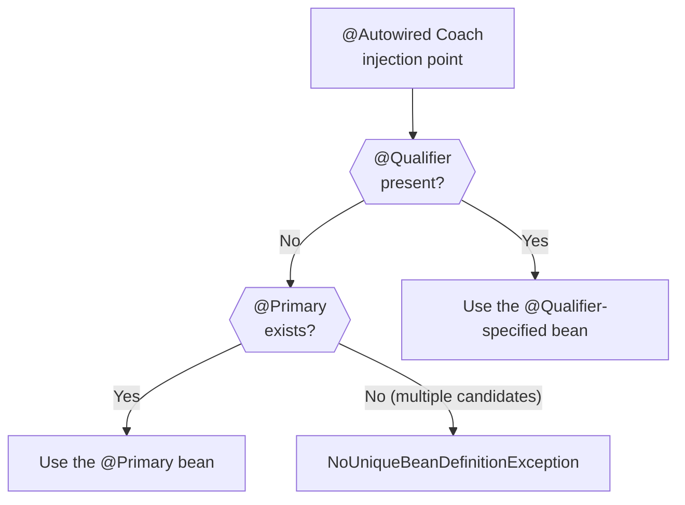
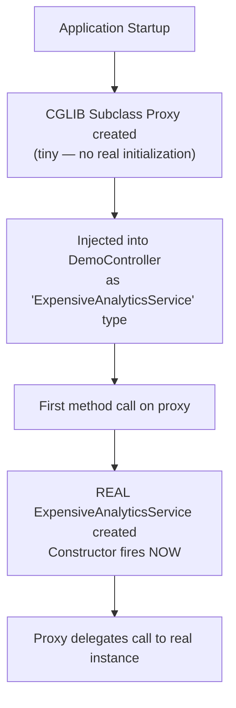
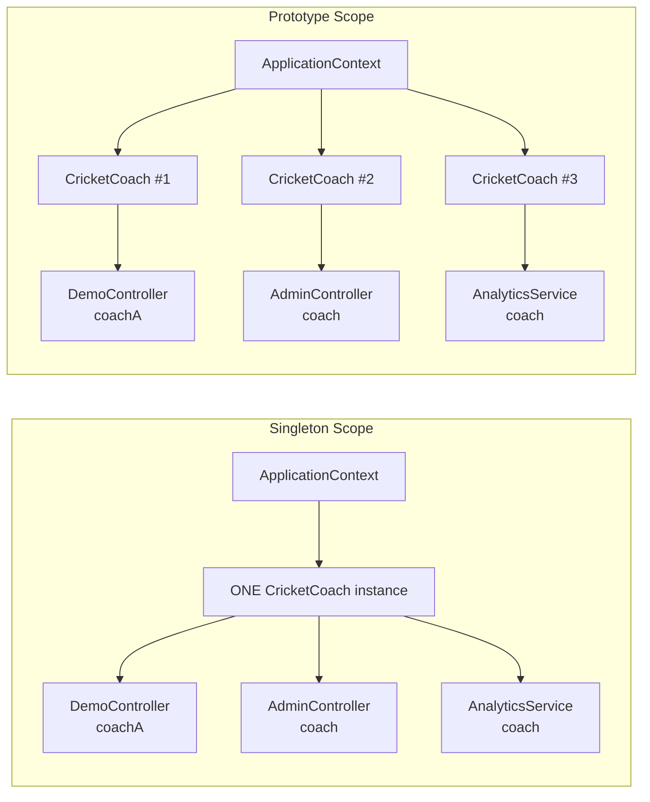
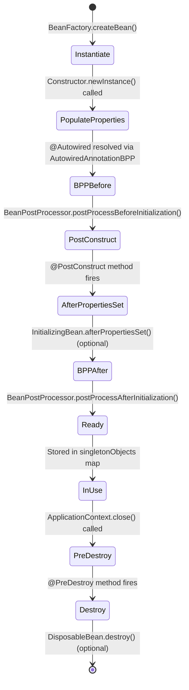
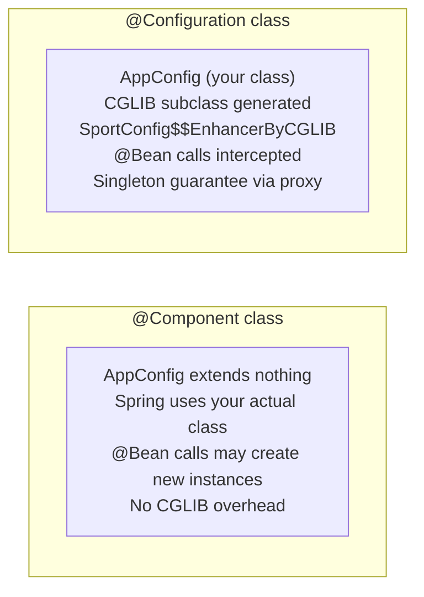
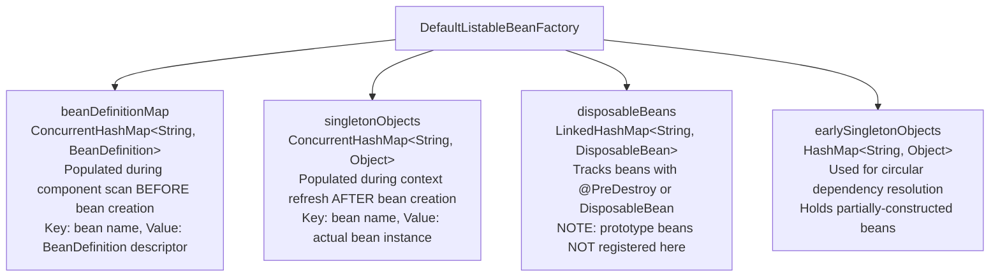

# :material-note-text: Topic Notes — Part 2: Qualifiers, Scopes, Lifecycle & Java Config

---

## :material-filter: 1. Resolving Ambiguity with @Qualifier

### The Problem

When you have multiple beans of the same type, Spring cannot decide which one to inject:

```java
@Component public class CricketCoach implements Coach { ... }
@Component public class TennisCoach  implements Coach { ... }
@Component public class TrackCoach   implements Coach { ... }
```

```java
@RestController
public class DemoController {
    @Autowired
    public DemoController(Coach myCoach) { ... }  // Which Coach??
}
```

Spring throws: `NoUniqueBeanDefinitionException: expected single matching bean but found 3: cricketCoach, tennisCoach, trackCoach`

### Solution: @Qualifier

Specify the exact bean by its id (default: simple class name with lowercase first letter):

```java
@RestController
public class DemoController {

    private final Coach myCoach;

    @Autowired
    public DemoController(@Qualifier("cricketCoach") Coach myCoach) {
        this.myCoach = myCoach;
    }
}
```

@Qualifier works with ALL injection styles:

=== "Constructor Injection"
    ```java
    @Autowired
    public DemoController(@Qualifier("tennisCoach") Coach myCoach) {
        this.myCoach = myCoach;
    }
    ```

=== "Setter Injection"
    ```java
    @Autowired
    public void setMyCoach(@Qualifier("trackCoach") Coach myCoach) {
        this.myCoach = myCoach;
    }
    ```

=== "Field Injection"
    ```java
    @Autowired
    @Qualifier("cricketCoach")
    private Coach myCoach;
    ```

### Custom Bean Names

Override the default auto-generated name:

```java
@Component("bestCoach")  // Custom name — now use @Qualifier("bestCoach")
public class CricketCoach implements Coach { ... }
```

---

## :material-star: 2. @Primary — The Default Bean

Instead of specifying `@Qualifier` at every injection point, mark one implementation as the **primary** (default) choice:

```java
@Component
@Primary  // This bean is chosen when no @Qualifier is specified
public class TrackCoach implements Coach {
    @Override
    public String getDailyWorkout() {
        return "Run a 5K at a fast pace!";
    }
}
```

Now `@Autowired Coach myCoach` — without any `@Qualifier` — gets the `TrackCoach`.

### @Qualifier Always Wins Over @Primary



!!! warning "Only One @Primary Per Type"
    Placing `@Primary` on **two classes** that implement the same interface causes the same `NoUniqueBeanDefinitionException`. You can only have one `@Primary` per type.

!!! tip "@Qualifier vs @Primary — Decision Guide"
    - Use `@Primary` when: one implementation is the "standard" or "most common" choice across the whole app
    - Use `@Qualifier` when: different injection points need different implementations
    - When both are present: `@Qualifier` always overrides `@Primary` at that specific injection point

---

## :material-timer: 3. @Lazy Initialization

### Default Behavior: Eager

By default, Spring creates **ALL singleton beans at application startup**. This means:
- All beans are initialized before the first HTTP request arrives
- Wiring errors are caught immediately at startup (fail-fast)
- Memory is pre-allocated for all beans

### @Lazy: Defer Creation to First Use

```java
@Component
@Lazy
public class ExpensiveAnalyticsService {

    public ExpensiveAnalyticsService() {
        System.out.println(">>> ExpensiveAnalyticsService created!");
        // Heavy initialization: load ML model, open connection pool, etc.
    }

    public Report generateReport() { ... }
}
```

With `@Lazy`:
- The constructor println **does NOT print at startup**
- The bean is created only when `ExpensiveAnalyticsService` is first injected or requested

### Global Lazy Mode

```properties
# application.properties — make ALL beans lazy globally
spring.main.lazy-initialization=true
```

### The Tradeoffs

| Aspect | Eager (Default) | Lazy |
|--------|----------------|------|
| Startup time | Slower (all beans created) | Faster (no beans created up-front) |
| First request | Fast (bean ready) | Slower (bean created on first call) |
| Config errors | **Caught at startup** ✅ | Hidden until first use ❌ |
| Memory footprint | All beans in memory | Beans created on-demand |
| Recommended for prod? | ✅ Yes | ⚠️ Only when startup time is critical |

!!! important "Spring Team Recommendation on @Lazy"
    The Spring team recommends **not enabling global lazy initialization** because it hides wiring errors that would otherwise fail fast at startup. A bean with a missing dependency won't throw at startup — it throws when the endpoint that uses it is first hit in production. Use `@Lazy` selectively on genuinely expensive, rarely-used beans only.

### Behind the Scenes: CGLIB Proxy for @Lazy

When you inject a `@Lazy` bean, Spring does **NOT** give you the real bean. Instead, it gives you a **CGLIB proxy**:



!!! note "Low-Level: @Lazy uses CGLIB — Phase 2 Connection"
    This is the **same bytecode subclassing technique** used by:
    - helix-jvm-engine's `ByteBuddy` rule generation (Phase 2 project)
    - Spring AOP proxies (Week 10)
    - `@Configuration` class enhancement (see section 6 below)
    
    Spring generates a CGLIB subclass of your `@Lazy` bean class at startup. The subclass overrides all methods to check if the real instance exists — if not, it creates it, then delegates. The injection point receives the CGLIB subclass, not the real class.
    
    This is why the injected reference IS-A `ExpensiveAnalyticsService` (subclass relationship) even though the real constructor hasn't fired yet.

---

## :material-layers: 4. Bean Scopes

### What Is a Scope?

A scope determines **how many instances** of a bean Spring creates and how long they live.

### Singleton — The Default

```java
@Component
// @Scope("singleton")  — this is the default, explicitly written for clarity
public class CricketCoach implements Coach { ... }
```

**One instance per `ApplicationContext`.** Every `@Autowired Coach` injection point across the entire application receives the **same object reference**:

```java
// Proof that singleton gives the same reference:
@GetMapping("/check")
public String checkScope() {
    // Inject twice into different fields:
    // @Autowired private Coach coachA;
    // @Autowired private Coach coachB;
    return "Same object? " + (coachA == coachB);  // prints: true
}
```

**Thread safety:** Singleton beans are shared. If a singleton bean has mutable instance state, it will be corrupted under concurrent access. **Singleton beans must be stateless or thread-safe.**

### Prototype — New Instance Every Time

```java
@Component
@Scope(ConfigurableBeanFactory.SCOPE_PROTOTYPE)  // use constant, not magic string
public class CricketCoach implements Coach { ... }
```

**New instance on every `getBean()` call or `@Autowired` resolution:**

```java
// With prototype scope:
// @Autowired private Coach coachA;  → instance A (unique)
// @Autowired private Coach coachB;  → instance B (unique)
return "Same object? " + (coachA == coachB);  // prints: false
```

Use prototype scope for **stateful** beans — where each consumer needs its own isolated state.

### Scope Comparison



### All Available Scopes

| Scope | Annotation | Lifetime | Thread-Safe? |
|-------|-----------|----------|--------------|
| `singleton` | default / `@Scope("singleton")` | ApplicationContext lifetime | Must be stateless |
| `prototype` | `@Scope("prototype")` | Per `getBean()` call | N/A (isolated) |
| `request` | `@RequestScope` | Single HTTP request | Yes (per-thread) |
| `session` | `@SessionScope` | HTTP session | No (shared within session) |
| `application` | `@ApplicationScope` | ServletContext lifetime | Must be stateless |
| `websocket` | `@Scope("websocket")` | WebSocket session | No (per-session) |

!!! warning "Web Scopes Require a Web ApplicationContext"
    `@RequestScope`, `@SessionScope`, etc. are only available in a web `ApplicationContext` (Spring MVC, Spring WebFlux). Using them in a standalone app throws `IllegalStateException: No scope registered for scope name 'request'`.

---

## :material-heart-pulse: 5. Bean Lifecycle Methods

### The Complete Lifecycle



### @PostConstruct

Fires **after** all dependencies are injected and **before** the bean is returned to callers:

```java
@Component
public class DatabaseConnectionPool {

    @Autowired
    private DataSourceConfig config;  // injected BEFORE @PostConstruct fires

    private Connection[] connections;

    @PostConstruct
    public void init() {
        // Safe to use injected dependencies here
        System.out.println("Initializing pool with config: " + config.getUrl());
        this.connections = new Connection[config.getPoolSize()];
        // open connections, warm up cache, start background tasks...
    }
}
```

Use `@PostConstruct` for:
- Validating injected configuration
- Opening connection pools
- Warming up caches
- Registering listeners with external systems

### @PreDestroy

Fires when the `ApplicationContext` is **closing** — triggered by JVM shutdown hook or explicit `context.close()`:

```java
@Component
public class DatabaseConnectionPool {

    @PreDestroy
    public void cleanup() {
        System.out.println("Closing all database connections...");
        // close connections, flush buffers, release resources
        for (Connection conn : connections) {
            conn.close();
        }
    }
}
```

### The Prototype Scope @PreDestroy Exception

!!! warning "Critical: @PreDestroy is NEVER Called for Prototype Beans"
    This is one of the most common Spring gotchas:
    
    - Spring creates prototype beans and hands them to the requester — then **forgets about them**
    - Prototype beans are **NOT** registered in `singletonObjects` (they're not singletons)
    - Prototype beans are **NOT** registered in `disposableBeans` (the map Spring uses to track @PreDestroy)
    - Therefore, `@PreDestroy` is **never invoked** by the container for prototype-scoped beans
    
    If you need cleanup for prototype beans, you must either:
    1. Call the cleanup method manually from the consuming code
    2. Use a `BeanPostProcessor` that tracks prototype beans and calls their destroy method
    3. Use `DisposableBean` interface and manage destruction yourself

From the HTML lecture note (Lecture 26):
> "For 'prototype' scoped beans, Spring does not call the destroy method. In contrast to the other scopes, Spring does not manage the complete lifecycle of a prototype bean: the container instantiates, configures, and otherwise assembles a prototype object, and hands it to the client, with no further record of that prototype instance."

---

## :material-cog: 6. Java Config Beans — @Configuration + @Bean

### When to Use

`@Component` requires you to annotate the class you want to manage. But what if:
- The class is in a **3rd-party library** you don't own (e.g., a legacy `SwimCoach` JAR)
- The class requires **complex construction logic** that can't be expressed with simple annotation-driven injection

Solution: **Java Config** — define beans programmatically in a `@Configuration` class.

### Basic Pattern

```java
// Legacy 3rd-party class — you cannot add @Component to it
public class SwimCoach implements Coach {

    public SwimCoach() {
        System.out.println("SwimCoach created (no @Component annotation)");
    }

    @Override
    public String getDailyWorkout() {
        return "Swim 1000 meters today!";
    }
}

// Your @Configuration class — Spring scans and processes this
@Configuration
public class SportConfig {

    @Bean  // default bean id = method name = "swimCoach"
    public Coach swimCoach() {
        return new SwimCoach();
    }

    @Bean("aquaticCoach")  // custom bean id override
    public Coach aquaticCoachAlternate() {
        return new SwimCoach();
    }
}
```

Inject using the bean id:

```java
@RestController
public class DemoController {

    @Autowired
    @Qualifier("swimCoach")  // matches the @Bean method name
    private Coach myCoach;
}
```

### Injecting Dependencies into @Bean Methods

Spring resolves method parameters as beans automatically:

```java
@Configuration
public class AppConfig {

    @Bean
    public SwimCoachProperties swimCoachProperties() {
        SwimCoachProperties props = new SwimCoachProperties();
        props.setDistanceKm(2.5);
        return props;
    }

    @Bean
    public Coach swimCoach(SwimCoachProperties props) {
        // Spring injects swimCoachProperties() result as the parameter
        return new SwimCoach(props);
    }
}
```

### The CGLIB Interception Secret

!!! note "Low-Level: @Configuration Classes Are CGLIB Subclasses — Phase 2 Connection"
    When Spring processes a `@Configuration` class, it **does not use your class directly**. Instead, it generates a **CGLIB bytecode subclass** of your class at startup. This subclass overrides every `@Bean` method:
    
    ```java
    // What Spring generates (conceptually):
    public class SportConfig$$EnhancerBySpringCGLIB extends SportConfig {
    
        @Override
        public Coach swimCoach() {
            // Check singleton cache FIRST:
            String beanName = "swimCoach";
            if (beanFactory.containsSingleton(beanName)) {
                return (Coach) beanFactory.getSingleton(beanName);  // cached!
            }
            // Create and cache:
            Coach coach = super.swimCoach();  // calls your actual method ONCE
            beanFactory.registerSingleton(beanName, coach);
            return coach;
        }
    }
    ```
    
    This means: if you call `sportConfig.swimCoach()` **three times** in a `@Configuration` class (e.g., from three other `@Bean` methods), the real `SwimCoach` constructor is called **only once**. CGLIB intercepts subsequent calls and returns the cached singleton.
    
    This is exactly the same concept as helix's `ByteBuddy` dynamic subclassing from Phase 2 — just Spring's implementation using CGLIB instead.

### Disabling CGLIB Enhancement

```java
@Configuration(proxyBeanMethods = false)  // "lite" mode — no CGLIB
public class SportConfig {
    @Bean
    public Coach swimCoach() {
        return new SwimCoach();  // new instance every time this method is called!
    }
}
```

Use `proxyBeanMethods = false` when:
- No inter-bean method calls (no `@Bean` method calls another `@Bean` method in the same class)
- You want slightly faster startup (no CGLIB generation)
- Using component-scan friendly `@Component`-based configs

### @Component vs @Configuration



| Feature | `@Component` | `@Configuration` |
|---------|-------------|-----------------|
| CGLIB proxy generated? | ❌ No | ✅ Yes |
| @Bean method calls return singleton? | ❌ No (new instance each call) | ✅ Yes (CGLIB intercepts) |
| Inter-bean method calls work correctly? | ❌ Only if no cross-calls | ✅ Always correct |
| Startup overhead | Minimal | Slight (CGLIB generation) |
| Best for | Simple configs, no cross-bean deps | Standard configuration |

---

## :material-lightbulb: 7. DefaultListableBeanFactory — The Container Internals

Understanding the actual data structures gives you debugging superpowers:



**`BeanDefinition`** holds before the bean is created:
- `beanClassName`: the fully qualified class name
- `scope`: "singleton", "prototype", etc.
- `lazyInit`: `true` / `false`
- `constructorArgumentValues`: resolved constructor args
- `propertyValues`: resolved properties for setter injection
- `initMethodName`: name of `@PostConstruct` method
- `destroyMethodName`: name of `@PreDestroy` method

**Lifecycle of a bean name through the factory:**
1. `beanDefinitionMap.put("cricketCoach", def)` → during scan
2. `createBean("cricketCoach")` → during refresh
3. `singletonObjects.put("cricketCoach", instance)` → after creation
4. `disposableBeans.put("cricketCoach", instance)` → if has @PreDestroy

---

## :material-note: BeanPostProcessor Chain — Spring's Core Extension Point

BeanPostProcessors are the hooks Spring uses to implement most of its features:

| BeanPostProcessor | What It Does |
|------------------|-------------|
| `AutowiredAnnotationBeanPostProcessor` | Processes `@Autowired`, `@Value`, `@Inject` — injects all dependencies |
| `CommonAnnotationBeanPostProcessor` | Processes `@PostConstruct`, `@PreDestroy`, `@Resource` |
| `PersistenceAnnotationBeanPostProcessor` | Processes `@PersistenceContext`, `@PersistenceUnit` |
| `ScheduledAnnotationBeanPostProcessor` | Processes `@Scheduled` methods, registers them with the task scheduler |
| `AsyncAnnotationBeanPostProcessor` | Processes `@Async` methods, wraps bean in a proxy |
| `AbstractAdvisingBeanPostProcessor` (AOP) | Wraps beans in JDK or CGLIB AOP proxies for `@Transactional`, `@Cacheable`, etc. |

Every feature you use in Spring goes through the BPP chain. The chain runs **after construction, before @PostConstruct**.
