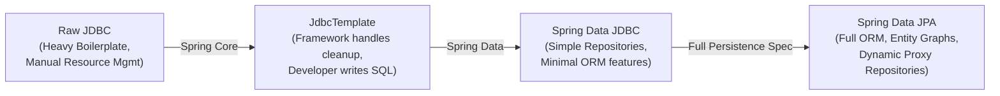
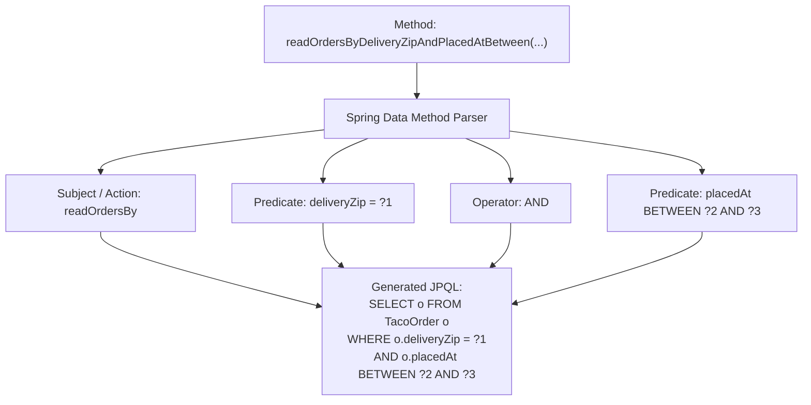

# Book Reading — Spring in Action (6th Ed), Chapter 3: Working with Data

---

## Executive Overview

Chapter 3 of *Spring in Action (6th Edition)* addresses the central persistence challenge in enterprise Java applications: bridging object-oriented domain models with relational databases. Author Craig Walls charts the architectural progression across three paradigms:

1. **Classic Spring JDBC (`JdbcTemplate`)**: Eliminating boilerplate connection handling, statement preparation, and resource cleanup while preserving full control over SQL.
2. **Spring Data JDBC**: An intermediate, lightweight repository abstraction without the full overhead or lifecycle complexity of JPA.
3. **Spring Data JPA**: The comprehensive ORM repository abstraction built atop Jakarta Persistence, eliminating DAO implementations entirely through dynamic proxy generation and derived query methods.



---

## 1. Reading and Writing Data with JDBC

### 1.1 The Inherent Problems with Raw JDBC

Raw JDBC requires significant boilerplate for trivial operations. A simple query requires:
- Opening a `Connection`
- Creating a `PreparedStatement`
- Binding query parameters by index
- Iterating a `ResultSet` with column name/index extraction
- Handling checked `SQLException` instances
- Safe cleanup of `ResultSet`, `Statement`, and `Connection` in `finally` blocks (or `try-with-resources`)

This ceremony clutters business code and introduces risk of resource leaks and inconsistent error translation.

### 1.2 The `JdbcTemplate` Abstraction

Spring solves this via the Template Method pattern with `JdbcTemplate`. It manages all connection acquisition, statement execution, and exception translation, converting vendor-specific checked SQLExceptions into Spring's hierarchy of unchecked `DataAccessException` classes.

#### Querying with `RowMapper`:

```java
@Repository
public class JdbcIngredientRepository implements IngredientRepository {

    private final JdbcTemplate jdbcTemplate;

    @Autowired
    public JdbcIngredientRepository(JdbcTemplate jdbcTemplate) {
        this.jdbcTemplate = jdbcTemplate;
    }

    @Override
    public Iterable<Ingredient> findAll() {
        return jdbcTemplate.query(
            "SELECT id, name, type FROM Ingredient",
            this::mapRowToIngredient
        );
    }

    @Override
    public Optional<Ingredient> findById(String id) {
        List<Ingredient> results = jdbcTemplate.query(
            "SELECT id, name, type FROM Ingredient WHERE id = ?",
            this::mapRowToIngredient,
            id
        );
        return results.isEmpty() ? Optional.empty() : Optional.of(results.get(0));
    }

    private Ingredient mapRowToIngredient(ResultSet row, int rowNum) throws SQLException {
        return new Ingredient(
            row.getString("id"),
            row.getString("name"),
            Ingredient.Type.valueOf(row.getString("type"))
        );
    }
}
```

#### Inserting Data and Managing Keys:

Simple updates use `jdbcTemplate.update()`:

```java
@Override
public Ingredient save(Ingredient ingredient) {
    jdbcTemplate.update(
        "INSERT INTO Ingredient (id, name, type) VALUES (?, ?, ?)",
        ingredient.getId(),
        ingredient.getName(),
        ingredient.getType().toString()
    );
    return ingredient;
}
```

When tables use auto-increment or identity keys, retrieving the generated primary key requires `PreparedStatementCreator` and `GeneratedKeyHolder`:

```java
PreparedStatementCreator psc = connection -> {
    PreparedStatement ps = connection.prepareStatement(
        "INSERT INTO Taco_Order (delivery_name, placed_at) VALUES (?, ?)",
        Statement.RETURN_GENERATED_KEYS
    );
    ps.setString(1, order.getDeliveryName());
    ps.setTimestamp(2, new Timestamp(order.getPlacedAt().getTime()));
    return ps;
};

GeneratedKeyHolder keyHolder = new GeneratedKeyHolder();
jdbcTemplate.update(psc, keyHolder);
long orderId = Objects.requireNonNull(keyHolder.getKey()).longValue();
order.setId(orderId);
```

### 1.3 Evaluating `JdbcTemplate`

- **Advantages**: Complete control over SQL statements; ideal for high-throughput batch operations, complex joins, or stored procedures.
- **Disadvantages**: Still requires manual SQL authoring and explicit mapping logic for each domain object; changes to schema require updating multiple query strings.

---

## 2. Transitioning to Spring Data JDBC

Spring Data JDBC bridges the gap by providing automatic repository implementations while intentionally omitting lazy loading, caching, and dirty checking to maintain a lightweight runtime.

### 2.1 Repository Declaration

Instead of authoring a repository implementation class, you declare an interface extending `CrudRepository`:

```java
import org.springframework.data.repository.CrudRepository;

public interface IngredientRepository extends CrudRepository<Ingredient, String> {
}
```

Spring Data automatically provides implementations for `save()`, `findById()`, `findAll()`, `deleteById()`, and `count()`.

### 2.2 Domain Annotations

```java
import org.springframework.data.annotation.Id;
import org.springframework.data.relational.core.mapping.Table;

@Table("Ingredients")
public class Ingredient {
    @Id
    private String id;
    private String name;
    private Type type;
    // ...
}
```

---

## 3. Persisting Data with Spring Data JPA

For full-featured enterprise persistence, Spring Data JPA leverages the Jakarta Persistence specification, combining rich object-relational mapping with zero-boilerplate repository interfaces.

### 3.1 Mapping Entities for JPA

JPA requires explicit mapping metadata defining table names, primary key generation, and relational associations:

```java
package tacos;

import jakarta.persistence.*;
import lombok.Data;
import lombok.NoArgsConstructor;
import java.io.Serializable;
import java.util.Date;
import java.util.List;

@Data
@Entity
@Table(name = "Taco_Order")
public class TacoOrder implements Serializable {

    private static final long serialVersionUID = 1L;

    @Id
    @GeneratedValue(strategy = GenerationType.AUTO)
    private Long id;

    private Date placedAt = new Date();

    @Column(name = "customer_name")
    private String deliveryName;

    @OneToMany(cascade = CascadeType.ALL)
    private List<Taco> tacos;

    public void addTaco(Taco taco) {
        this.tacos.add(taco);
    }
}
```

```java
@Data
@Entity
public class Taco {

    @Id
    @GeneratedValue(strategy = GenerationType.AUTO)
    private Long id;

    private String name;

    private Date createdAt = new Date();

    @ManyToMany
    private List<Ingredient> ingredients;
}
```

### 3.2 Defining JPA Repositories

Extending `CrudRepository` or `JpaRepository` equips the entity with complete data access operations without writing a single line of SQL or DAO implementation:

```java
import org.springframework.data.repository.CrudRepository;
import java.util.List;

public interface OrderRepository extends CrudRepository<TacoOrder, Long> {
    
    // Custom query method derived from method signature
    List<TacoOrder> findByDeliveryZip(String deliveryZip);
}
```

### 3.3 Derived Query Methods

Spring Data inspects repository method names, parses verbs and predicates according to a defined grammar, and automatically generates the corresponding JPQL query at container startup.



Common supported keyword patterns:

| Keyword Expression | Generated Query Segment |
| :--- | :--- |
| `findByDeliveryZip` | `WHERE o.deliveryZip = ?` |
| `findByDeliveryCityAndDeliveryState` | `WHERE o.deliveryCity = ? AND o.deliveryState = ?` |
| `findByPlacedAtBetween` | `WHERE o.placedAt BETWEEN ? AND ?` |
| `findByDeliveryCityIgnoreCase` | `WHERE UPPER(o.deliveryCity) = UPPER(?)` |
| `findByDeliveryNameOrderByPlacedAtDesc` | `WHERE o.deliveryName = ? ORDER BY o.placedAt DESC` |

### 3.4 Custom JPQL with `@Query`

When queries exceed the clarity threshold of method naming conventions, or require complex joins, the `@Query` annotation provides explicit JPQL definitions:

```java
@Query("SELECT o FROM TacoOrder o WHERE o.deliveryCity = 'Seattle'")
List<TacoOrder> readOrdersDeliveredInSeattle();
```

---

## 4. Architectural Summary and Technical Takeaways

1. **Evolutionary Trajectory**: Development moved from imperative JDBC (`JdbcTemplate`), to declarative table mapping (Spring Data JDBC), to metadata-driven relational graphs (Spring Data JPA).
2. **First-Level Cache and Flushing**: Underneath Spring Data JPA sits the standard JPA `EntityManager`. Understanding transaction boundaries (`@Transactional`) remains critical, as repository save methods execute against the persistence context before flushing to the database.
3. **Repository Selection Rule**:
   - Use `JdbcTemplate` for high-throughput batch writes or strict DB-specific SQL tuning.
   - Use `JpaRepository` for standard CRUD operations, rich entity graphs, and domain-driven design models.
