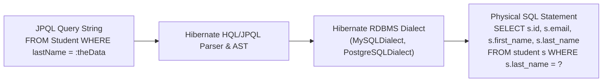
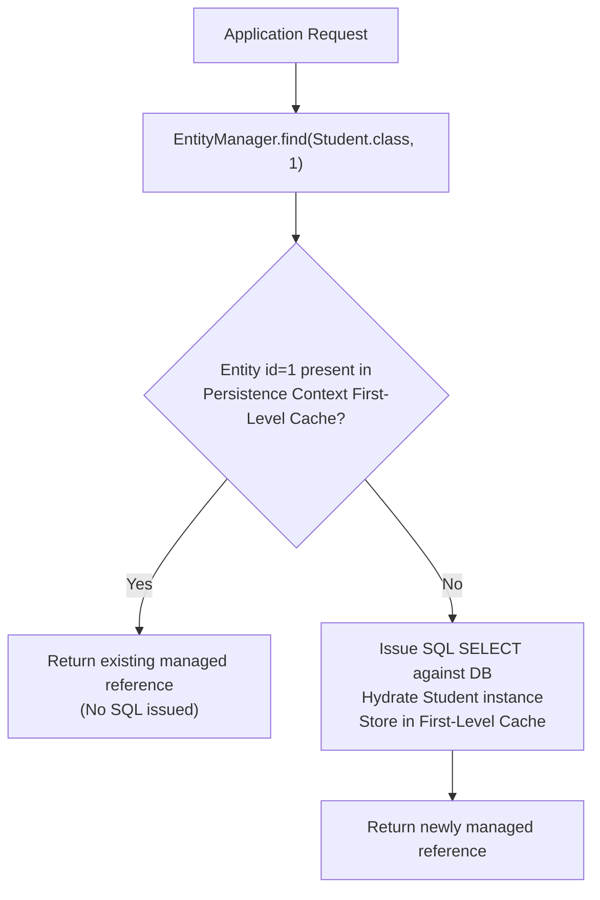
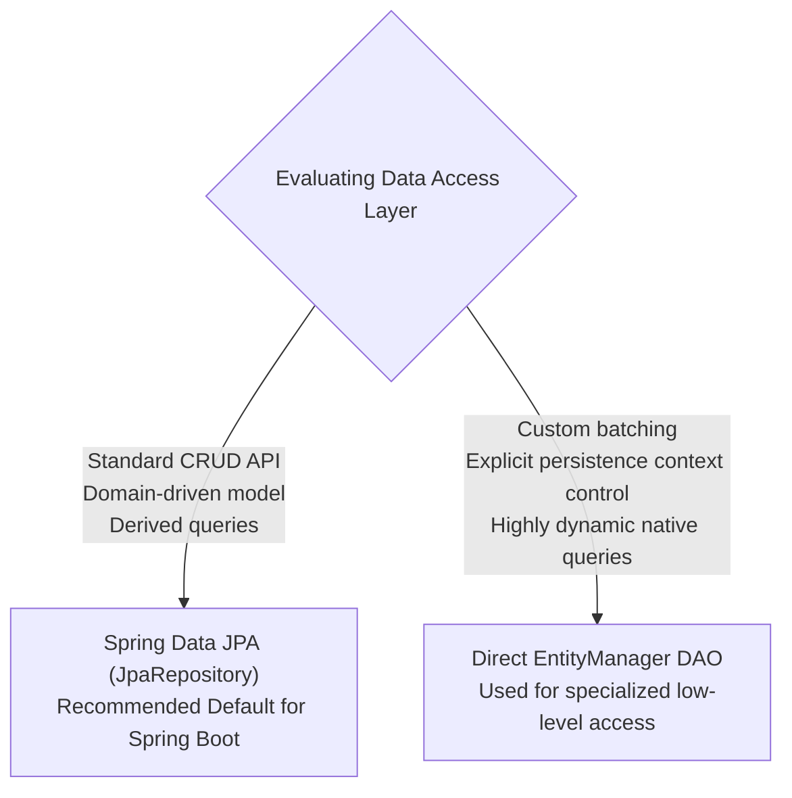

# Summary & Architecture Reference — Week 3: Hibernate / JPA CRUD

---

## 1. Annotation Reference Matrix

| Annotation | Package / Module | Target | Architectural Purpose | Low-Level Mechanism / Lifecycle Impact | Common Pitfall |
| :--- | :--- | :--- | :--- | :--- | :--- |
| `@Entity` | `jakarta.persistence` | Class | Designates a Java class as a persistent entity mapped to a relational table. | Registered in Hibernate's `Metamodel`; requires a public or protected no-argument constructor for reflection instantiation. | Forgetting no-arg constructor when defining convenience parameterized constructors. |
| `@Table` | `jakarta.persistence` | Class | Specifies the database table name and optional schema/catalog constraints. | If omitted, provider defaults table name to the unqualified entity class name. | Using table names in JPQL instead of entity class names. |
| `@Id` | `jakarta.persistence` | Field / Getter | Designates the primary key property representing entity identity. | Forms the identifier key inside the `PersistenceContext` First-Level Cache identity map. | Applying `@Id` without `@GeneratedValue` when database generates auto-increment keys. |
| `@GeneratedValue` | `jakarta.persistence` | Field / Getter | Configures primary key generation strategy (`IDENTITY`, `SEQUENCE`, `TABLE`, `AUTO`). | `IDENTITY` relies on database auto-increment columns; forces an immediate JDBC `INSERT` on `persist()` to acquire the key. | Mismatch between database column definition (`AUTO_INCREMENT`) and strategy (`SEQUENCE`). |
| `@Column` | `jakarta.persistence` | Field / Getter | Maps an entity field to a specific relational column. | Configures column name, nullability, length, uniqueness, and updateability in generated DDL. | Assuming `@Column` renames field in JPQL queries (JPQL strictly uses Java field names). |
| `@Repository` | `org.springframework.stereotype` | Class | Stereotype annotation marking a component as a Data Access Object. | Triggers Spring's `PersistenceExceptionTranslationPostProcessor` to translate vendor SQLExceptions into `DataAccessException`. | Thinking it creates queries automatically (that is `JpaRepository`, not `@Repository`). |
| `@Transactional` | `org.springframework.transaction.annotation` | Class / Method | Defines declarative transaction boundaries around persistence operations. | Spring AOP proxy begins a transaction before method entry, flushes/commits on normal exit, rolls back on `RuntimeException`. | Applying `@Transactional` on internal `private` methods where Spring AOP proxying cannot intercept. |

---

## 2. EntityManager API Reference

| Method | Signature | Entity State Before | Entity State After | Emitted SQL Timing | Notes |
| :--- | :--- | :--- | :--- | :--- | :--- |
| `persist()` | `void persist(Object entity)` | **Transient (New)** | **Managed** | At transaction commit (or immediate if `GenerationType.IDENTITY`) | Makes a transient instance managed. Throws `EntityExistsException` if id already exists. |
| `find()` | `<T> T find(Class<T> entityClass, Object primaryKey)` | N/A | **Managed** (or null) | Immediate `SELECT` (unless entity already present in First-Level Cache) | Primary key lookup. Never throws exception if record missing; returns `null`. |
| `merge()` | `<T> T merge(T entity)` | **Detached** | Original: **Detached**<br/>Returned: **Managed** | At transaction commit (`UPDATE` or `INSERT`) | Copies state onto a managed instance. Always use the returned instance reference. |
| `remove()` | `void remove(Object entity)` | **Managed** | **Removed** | At transaction commit (`DELETE`) | Entity *must* be managed before calling `remove()`. Must invoke `find()` first if detached. |
| `createQuery()`| `TypedQuery<T> createQuery(String qlString, Class<T> resultClass)` | N/A | Returned list: **Managed** | Immediate `SELECT` when `getResultList()` is called | Compiles a type-safe JPQL query referencing entity class and field names. |

---

## 3. JPQL Query Reference

JPQL abstracts SQL by querying against the Java object domain rather than relational schemas.



### 3.1 Common JPQL Query Patterns

```java
// 1. Select all (short form)
entityManager.createQuery("FROM Student", Student.class).getResultList();

// 2. Explicit SELECT with alias and ordering
entityManager.createQuery("SELECT s FROM Student s ORDER BY s.lastName DESC", Student.class)
             .getResultList();

// 3. Filtering with named parameter
entityManager.createQuery("FROM Student s WHERE s.lastName = :theData", Student.class)
             .setParameter("theData", "Doe")
             .getResultList();

// 4. Pattern matching with LIKE
entityManager.createQuery("FROM Student s WHERE s.email LIKE :domain", Student.class)
             .setParameter("domain", "%@luv2code.com")
             .getResultList();

// 5. Bulk DML Delete
entityManager.createQuery("DELETE FROM Student s WHERE s.lastName = :targetName")
             .setParameter("targetName", "Doe")
             .executeUpdate();
```

---

## 4. Low-Level JPA Internals: The Persistence Context

### 4.1 First-Level Cache and Identity Map

The `PersistenceContext` acts as an in-memory identity map during the lifetime of an `EntityManager` (or `@Transactional` boundary).



Consequences:
1. **Repeated Reads**: Calling `findById(1)` multiple times inside the same transaction issues only a single `SELECT` statement.
2. **Instance Identity**: `studentA == studentB` evaluates to `true` if both were retrieved with the same primary key in the same persistence context.

### 4.2 Automatic Dirty Checking Snapshot Algorithm

When an entity is loaded:
1. Hibernate captures an immutable array of its initial property values (the "loaded state snapshot").
2. When the transaction commits, `flush()` is invoked.
3. Hibernate loops over all managed entities, comparing their current field values against the loaded snapshot.
4. If discrepancies are detected, an `UPDATE` SQL statement is automatically queued and executed before commit.

---

## 5. Architectural Decision Matrix: EntityManager vs Spring Data JPA



| Dimension | `EntityManager` DAO Pattern | Spring Data `JpaRepository` |
| :--- | :--- | :--- |
| **Code Footprint** | Interface + Implementation + boilerplate | Single interface declaration |
| **Maintainability** | Higher maintenance; changes require DAO edits | Extremely low; auto-implemented by Spring |
| **Underlying Engine**| Hibernate `Session` / JPA `EntityManager` | Built directly on top of `EntityManager` |
| **Paging & Sorting**| Manual JPQL calculation (`setFirstResult`, `setMaxResults`) | Built-in via `Pageable` and `Sort` arguments |

---

## 6. Prerequisites for Week 4

With the DAO and persistence layer established, the next architectural progression is exposing these entities to clients over HTTP:

1. **REST Protocol Mechanics**: HTTP verbs (`GET`, `POST`, `PUT`, `PATCH`, `DELETE`) mapping cleanly to DAO operations.
2. **Serialization**: Transitioning from Java objects to JSON via Jackson data binding.
3. **Layer Separation**: Placing `@Transactional` boundaries at the **Service Layer** rather than the DAO layer, enabling multiple DAO invocations within a single atomic transaction.
4. **Spring Data REST**: Automating hypermedia REST endpoints directly from JPA repositories.
