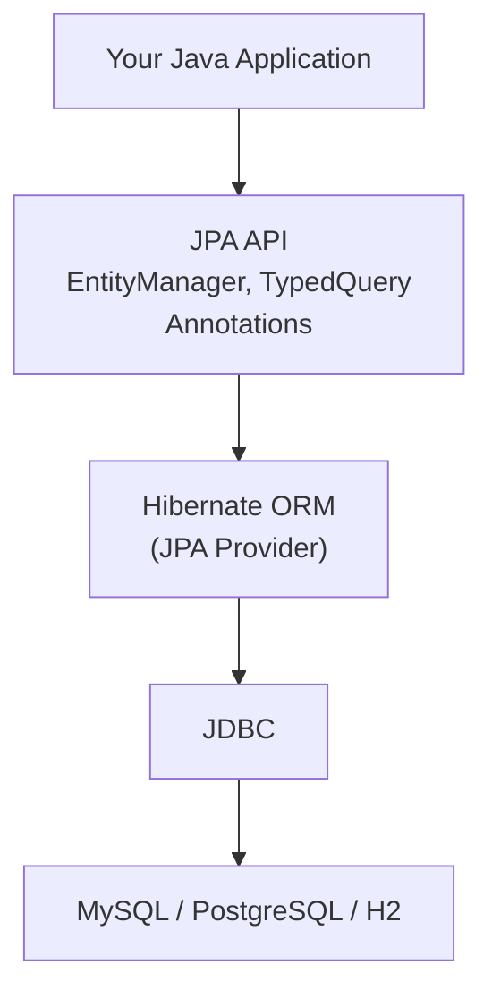
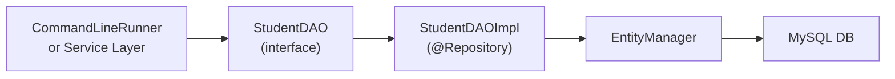
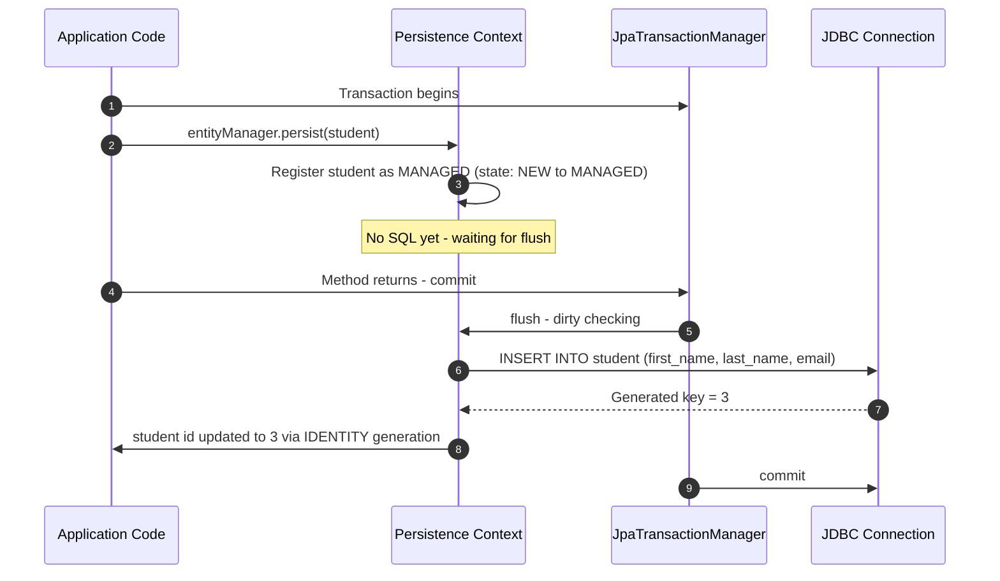

# Topic Notes — Part 1: ORM, Entity Mapping, and the DAO Pattern

---

## 1. Why Hibernate / JPA Exists

Before any ORM framework existed, persisting a Java object meant writing raw JDBC: open a connection, prepare a statement, bind parameters, execute, map the ResultSet row by row, close everything in a finally block, and handle checked exceptions that you cannot meaningfully recover from at the DAO call site. The ceremony dwarfs the business logic.

Hibernate solves this by maintaining a **mapping between Java class fields and database table columns** and generating the appropriate SQL at runtime. You work with plain Java objects and call a small API — the framework translates those calls into SQL and handles the JDBC lifecycle.

JPA (Jakarta Persistence API) is the **standard specification** that codifies this mapping model. It defines annotations, interfaces (`EntityManager`, `TypedQuery`), and lifecycle contracts. Hibernate is the most widely used JPA provider; Spring Boot selects it by default.



The stack is layered: you code against the JPA API, Hibernate implements it, and JDBC remains the actual transport layer. Nothing bypasses JDBC; Hibernate simply eliminates the boilerplate around it.

---

## 2. Spring Boot Auto-Configuration for JPA

When `spring-boot-starter-data-jpa` is on the classpath, Spring Boot auto-configures:

- A `DataSource` bean — based on `spring.datasource.*` properties
- A `LocalContainerEntityManagerFactoryBean` — scans for `@Entity` classes
- A `JpaTransactionManager` — drives `@Transactional` boundaries
- An `EntityManager` proxy — injectable into any Spring bean

`application.properties` minimum configuration:

```properties
spring.datasource.url=jdbc:mysql://localhost:3306/student_tracker
spring.datasource.username=springstudent
spring.datasource.password=springstudent

# Hibernate / JPA settings
spring.jpa.show-sql=true
spring.jpa.hibernate.ddl-auto=none
```

Spring Boot detects the MySQL driver from the JDBC URL; you do not need to set `spring.datasource.driver-class-name` explicitly.

---

## 3. JPA Entity Class

An entity class is a plain Java class that JPA maps to a database table. Two hard requirements:

1. The class must be annotated `@Entity`.
2. The class must have a no-argument constructor (public or protected). If you declare a constructor with arguments, Java does not generate the no-arg constructor automatically — you must add it explicitly.

### 3.1 Core Mapping Annotations

```java
import jakarta.persistence.*;

@Entity
@Table(name = "student")
public class Student {

    @Id
    @GeneratedValue(strategy = GenerationType.IDENTITY)
    @Column(name = "id")
    private int id;

    @Column(name = "first_name")
    private String firstName;

    @Column(name = "last_name")
    private String lastName;

    @Column(name = "email")
    private String email;

    // Required by JPA
    public Student() {}

    // Convenience constructor (id is auto-generated; omit it)
    public Student(String firstName, String lastName, String email) {
        this.firstName = firstName;
        this.lastName  = lastName;
        this.email     = email;
    }

    // getters and setters ...

    @Override
    public String toString() {
        return "Student{id=" + id
             + ", firstName='" + firstName + '\''
             + ", lastName='"  + lastName  + '\''
             + ", email='"     + email     + '\'' + '}';
    }
}
```

| Annotation | Purpose |
|-----------|---------|
| `@Entity` | Marks class as a JPA managed entity |
| `@Table(name="...")` | Overrides the default table name (defaults to class name) |
| `@Id` | Declares the primary key field |
| `@GeneratedValue(strategy=...)` | Specifies how the PK is generated |
| `@Column(name="...")` | Maps field to a specific column; optional but strongly recommended |

### 3.2 GenerationType Strategies

| Strategy | Mechanism |
|---------|-----------|
| `IDENTITY` | Delegates to database `AUTO_INCREMENT` / `SERIAL`; most common for MySQL |
| `SEQUENCE` | Uses a database sequence object; common for PostgreSQL, Oracle |
| `TABLE` | Uses a dedicated pk-tracking table; portable but slow |
| `AUTO` | Provider picks the strategy for the target database |
| `UUID` | Generates RFC-4122 UUID strings as the PK |

**Why `@Column` is not optional in practice:** if you rename a Java field (e.g., `firstName` to `givenName`) without `@Column`, Hibernate will look for a column called `given_name`, which does not exist. The annotation decouples the Java field name from the column name, making refactoring safe.

---

## 4. The DAO Pattern

DAO (Data Access Object) is a structural pattern that places all database interaction behind an interface. The REST controller or service layer calls the DAO interface; the implementation holds the persistence code. This decouples business logic from the storage mechanism.



### 4.1 DAO Interface

```java
package com.luv2code.cruddemo.dao;

import com.luv2code.cruddemo.entity.Student;
import java.util.List;

public interface StudentDAO {
    void save(Student theStudent);
    Student findById(Integer id);
    List<Student> findAll();
    List<Student> findByLastName(String theLastName);
    void update(Student theStudent);
    void delete(Integer id);
    int deleteAll();
}
```

### 4.2 DAO Implementation — Save

```java
package com.luv2code.cruddemo.dao;

import com.luv2code.cruddemo.entity.Student;
import jakarta.persistence.EntityManager;
import org.springframework.beans.factory.annotation.Autowired;
import org.springframework.stereotype.Repository;
import org.springframework.transaction.annotation.Transactional;

@Repository
public class StudentDAOImpl implements StudentDAO {

    private EntityManager entityManager;

    // Spring auto-wires EntityManager (created by Spring Boot auto-config)
    @Autowired
    public StudentDAOImpl(EntityManager entityManager) {
        this.entityManager = entityManager;
    }

    @Override
    @Transactional
    public void save(Student theStudent) {
        // INSERT into student table; auto-generated id is written back
        // into theStudent.id via Hibernate's identity generation
        entityManager.persist(theStudent);
    }
}
```

**Why `@Transactional` is required for writes:**

`EntityManager.persist()` is a unit-of-work operation — it registers the object with the persistence context but does not flush SQL to the database immediately. The flush and commit happen at transaction boundary. Without an active transaction, Hibernate throws `TransactionRequiredException`. The `@Transactional` annotation on the method instructs Spring's `JpaTransactionManager` to begin a transaction before the method executes and commit (or roll back on exception) after it returns.

**`@Repository` does two things:**

1. Acts as a `@Component` stereotype — the class is detected by component scanning and registered as a Spring bean.
2. Enables Spring's exception translation: raw `PersistenceException` / `JdbcException` are translated into Spring's `DataAccessException` hierarchy, giving consistent exception types regardless of the JPA provider.

---

## 5. Reading: findById

`EntityManager.find()` performs a primary-key lookup. It returns `null` if no row with that key exists. Read operations do not require a transaction (though they operate within one if the calling context already has one active).

```java
@Override
public Student findById(Integer id) {
    // No @Transactional — reads do not need an explicit transaction
    // Returns null if not found
    return entityManager.find(Student.class, id);
}
```

Usage in the main application:

```java
@Bean
public CommandLineRunner commandLineRunner(StudentDAO studentDAO) {
    return runner -> {
        // persist
        Student s = new Student("Paul", "Doe", "paul@luv2code.com");
        studentDAO.save(s);
        System.out.println("Saved id: " + s.getId());

        // retrieve
        Student found = studentDAO.findById(s.getId());
        System.out.println("Found: " + found);
    };
}
```

---

## 6. Internal: What Happens Inside `persist()`



The persistence context is a first-level cache. Within a transaction, if you call `find()` for the same entity twice, the second call returns the cached managed instance — no second SQL is issued.

---

## 7. Reading: findAll with JPQL

`TypedQuery` executes JPQL — a query language that references entity class names and field names, not table/column names. Hibernate translates JPQL into vendor-specific SQL.

```java
@Override
public List<Student> findAll() {
    // "Student" = the JPA entity class name (not the table name)
    TypedQuery<Student> theQuery =
        entityManager.createQuery("FROM Student", Student.class);
    return theQuery.getResultList();
}
```

For strict JPQL compliance (as opposed to Hibernate's more lenient HQL):

```java
TypedQuery<Student> theQuery =
    entityManager.createQuery("SELECT s FROM Student s", Student.class);
```

The alias `s` is an identification variable. It becomes necessary when you add `WHERE`, `ORDER BY`, or `JOIN` clauses:

```java
// ORDER BY a field on the entity, not a column name
TypedQuery<Student> theQuery = entityManager.createQuery(
    "FROM Student ORDER BY lastName", Student.class);

// Filter by email domain
TypedQuery<Student> emailQuery = entityManager.createQuery(
    "FROM Student WHERE email LIKE '%luv2code.com'", Student.class);
```

---

## 8. Parameterized JPQL

String concatenation in queries creates SQL injection risk and is not type-safe. JPA named parameters (prefixed with `:`) solve this:

```java
@Override
public List<Student> findByLastName(String theLastName) {
    TypedQuery<Student> theQuery = entityManager.createQuery(
        "FROM Student WHERE lastName = :theData", Student.class);

    // Bind the parameter — :theData is the placeholder
    theQuery.setParameter("theData", theLastName);

    return theQuery.getResultList();
}
```

The `:theData` placeholder is filled by Hibernate using a prepared statement at the JDBC level, making it inherently safe from injection.

Usage:

```java
List<Student> doeStudents = studentDAO.findByLastName("Doe");
doeStudents.forEach(System.out::println);
```
