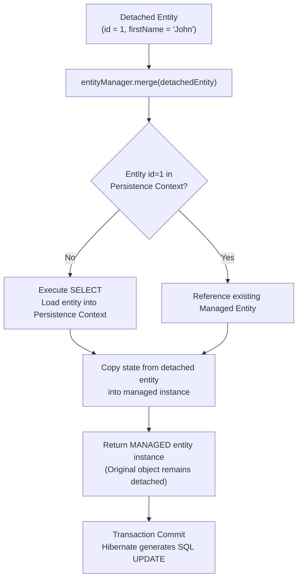
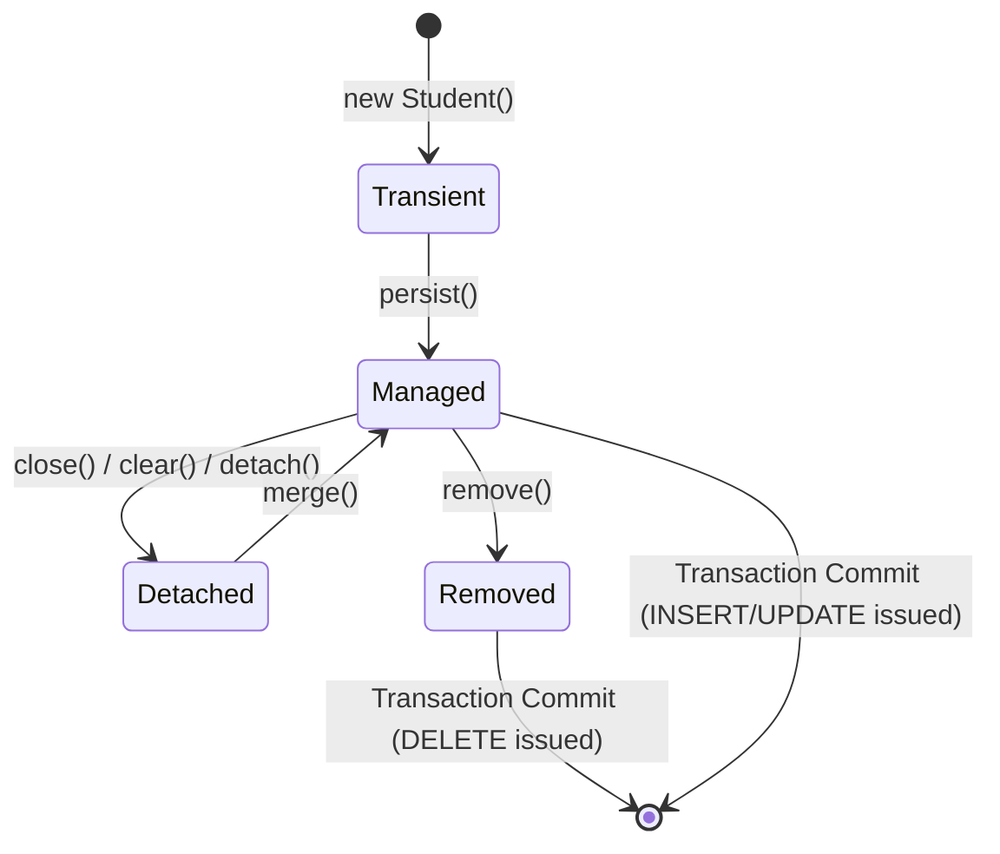
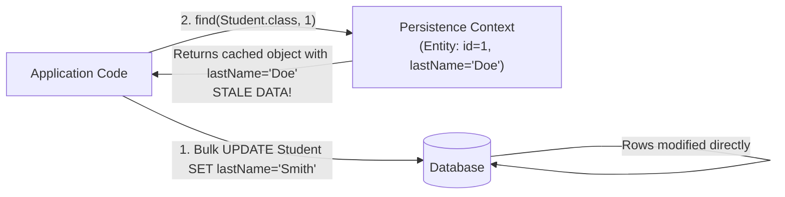
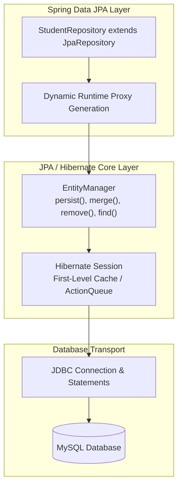

# Topic Notes — Part 2: Updating, Deleting, Bulk JPQL, and Schema Generation

---

## 1. Updating Entities with EntityManager

In JPA, updates take place through two distinct mechanisms: explicit synchronization of detached entities via `merge()`, and automatic dirty checking on managed entities within an active transaction.

### 1.1 The DAO Update Method: `merge()`

When an entity is modified outside an active persistence context (for example, received from a web request or deserialized from storage), it is in a **detached** state. To save those modifications back to the database, invoke `entityManager.merge()`.

```java
package com.luv2code.cruddemo.dao;

import com.luv2code.cruddemo.entity.Student;
import jakarta.persistence.EntityManager;
import org.springframework.beans.factory.annotation.Autowired;
import org.springframework.stereotype.Repository;
import org.springframework.transaction.annotation.Transactional;

@Repository
public class StudentDAOImpl implements StudentDAO {

    private final EntityManager entityManager;

    @Autowired
    public StudentDAOImpl(EntityManager entityManager) {
        this.entityManager = entityManager;
    }

    @Override
    @Transactional
    public void update(Student theStudent) {
        entityManager.merge(theStudent);
    }
}
```

Usage in application execution:

```java
private void updateStudent(StudentDAO studentDAO) {
    int studentId = 1;
    System.out.println("Getting student with id: " + studentId);
    Student myStudent = studentDAO.findById(studentId);

    System.out.println("Updating student ...");
    myStudent.setFirstName("John");

    studentDAO.update(myStudent);

    System.out.println("Updated student: " + myStudent);
}
```

### 1.2 Critical Internal Mechanics of `merge()`

A common misconception among junior engineers is that `merge(entity)` attaches the passed entity instance to the persistence context. It does not.

When `entityManager.merge(detachedEntity)` is invoked:

1. JPA checks whether an entity with the same identifier already exists in the persistence context (First-Level Cache).
2. If not found, it queries the database (`SELECT`) to load the current state into a new managed entity instance.
3. Hibernate copies the field values from `detachedEntity` onto that managed instance.
4. `merge()` **returns the managed instance**. The original `detachedEntity` passed into the method remains detached.
5. On transaction commit, dirty checking detects the modified state on the managed instance and issues the `UPDATE` SQL statement.



!!! warning "Always Use the Returned Instance from `merge()`"
    If further modifications or operations are needed after merging, you must capture and reference the returned instance:
    ```java
    Student managedStudent = entityManager.merge(detachedStudent);
    // managedStudent is managed; detachedStudent is still detached!
    ```

### 1.3 Automatic Dirty Checking (In-Memory Updates)

When an entity is already managed within the boundary of an active `@Transactional` method, an explicit call to `update()` or `merge()` is not required.

```java
@Transactional
public void updateStudentEmail(int studentId, String newEmail) {
    // 1. Entity loaded into Persistence Context -> state = MANAGED
    Student student = entityManager.find(Student.class, studentId);

    // 2. Modify field on the managed instance
    student.setEmail(newEmail);

    // 3. No call to entityManager.merge() needed!
    // When the method exits, @Transactional commits.
    // Hibernate compares current state against snapshot taken on load.
    // Generates: UPDATE student SET email = ? WHERE id = ?
}
```

Hibernate keeps a copy of the original database state in a snapshot map upon loading. At transaction commit (during `flush()`), Hibernate traverses every managed entity, compares its current state with the initial snapshot, and emits targeted `UPDATE` SQL statements for modified entities.

---

## 2. Deleting Entities with EntityManager

### 2.1 Single Entity Deletion: `find()` then `remove()`

In JPA, `entityManager.remove()` requires that the entity argument be in the **MANAGED** state. Passing a detached entity directly throws an `IllegalArgumentException`.

Therefore, the canonical pattern for deleting an entity by primary key involves two steps:

```java
@Override
@Transactional
public void delete(Integer id) {
    // Step 1: Retrieve the managed entity instance
    Student theStudent = entityManager.find(Student.class, id);

    // Step 2: Remove the managed entity from the database and persistence context
    if (theStudent != null) {
        entityManager.remove(theStudent);
    }
}
```

Usage in the runner:

```java
private void deleteStudent(StudentDAO studentDAO) {
    int studentId = 3;
    System.out.println("Deleting student id: " + studentId);
    studentDAO.delete(studentId);
}
```

SQL generated during execution:

```sql
Hibernate: 
    select
        s1_0.id,
        s1_0.email,
        s1_0.first_name,
        s1_0.last_name 
    from
        student s1_0 
    where
        s1_0.id=?
Hibernate: 
    delete 
    from
        student 
    where
        id=?
```

### 2.2 Lifecycle State Transitions

Understanding the four JPA entity states is foundational to diagnosing ORM issues:



| State | In Persistence Context? | Has Database Identity? | Tracked by Dirty Checking? |
| :--- | :--- | :--- | :--- |
| **Transient (New)** | No | No (id is null/0) | No |
| **Managed** | Yes | Yes | Yes |
| **Detached** | No | Yes | No |
| **Removed** | Yes (scheduled for delete) | Yes | Yes (pending SQL DELETE) |

---

## 3. Bulk Operations via JPQL

When modifying or removing multiple records simultaneously, loading hundreds or thousands of individual entity instances into memory to call `remove()` or `merge()` is computationally inefficient and wastes database bandwidth.

Bulk operations execute direct DML statements (`UPDATE` or `DELETE`) against the database engine via `TypedQuery.executeUpdate()`.

### 3.1 Bulk Delete: `deleteAll()`

```java
@Override
@Transactional
public int deleteAll() {
    int numRowsDeleted = entityManager.createQuery("DELETE FROM Student").executeUpdate();
    return numRowsDeleted;
}
```

Calling `executeUpdate()` returns the number of rows affected by the DML operation.

Usage:

```java
private void deleteAllStudents(StudentDAO studentDAO) {
    System.out.println("Deleting all students");
    int numRowsDeleted = studentDAO.deleteAll();
    System.out.println("Deleted row count: " + numRowsDeleted);
}
```

Generated SQL:

```sql
Hibernate: 
    delete 
    from
        student
```

### 3.2 Parameterized Bulk Update and Delete

Bulk updates and deletes support `WHERE` clauses and named parameters:

```java
@Transactional
public int updateLastNameForDomain(String domain, String newLastName) {
    return entityManager.createQuery(
            "UPDATE Student SET lastName = :newLastName WHERE email LIKE :domain")
            .setParameter("newLastName", newLastName)
            .setParameter("domain", "%" + domain)
            .executeUpdate();
}

@Transactional
public int deleteByLastName(String lastName) {
    return entityManager.createQuery(
            "DELETE FROM Student WHERE lastName = :theData")
            .setParameter("theData", lastName)
            .executeUpdate();
}
```

### 3.3 The Bulk Operation Cache Synchronization Pitfall

!!! caution "Direct Database Modification vs First-Level Cache"
    JPQL bulk `UPDATE` and `DELETE` queries translate directly to SQL and execute on the database without updating the entities currently held in the `EntityManager`'s First-Level Cache.



If your business transaction loads entities into the persistence context *before* executing a bulk update query, those in-memory entities will contain **stale data**. 

Remedies:
1. Execute bulk queries before loading entities into the current transaction.
2. Call `entityManager.clear()` immediately after `executeUpdate()` to flush and evict the First-Level Cache, forcing subsequent reads to re-fetch from the database.

---

## 4. Automatic Schema Generation (`ddl-auto`)

Hibernate can inspect JPA annotations on `@Entity` classes and generate, alter, or validate the relational schema upon application startup.

### 4.1 Configuration Property

In `application.properties`:

```properties
spring.jpa.hibernate.ddl-auto=update
```

### 4.2 Available Options

| Option | Behavior | Recommended Environment |
| :--- | :--- | :--- |
| `none` | No DDL generation or validation occurs. The application relies entirely on existing database schema. | **Production**, Staging |
| `validate` | Validates that existing tables and columns match the `@Entity` mappings. Fails startup if discrepancies exist. Makes no changes. | Production, Staging |
| `update` | Analyzes entity mappings against existing tables. Adds missing tables and columns. **Never drops** columns or constraints. | Development, Local Prototyping |
| `create` | Drops existing tables on startup and recreates all tables from scratch based on entity mappings. Destroys existing data. | Local Testing |
| `create-drop` | Creates schema on startup and drops all tables when the `SessionFactory` / `ApplicationContext` closes. | Automated Integration Tests |

### 4.3 DDL Generation Mechanics

When `spring.jpa.hibernate.ddl-auto=update` is active and you define:

```java
@Entity
@Table(name = "student")
public class Student {
    @Id
    @GeneratedValue(strategy = GenerationType.IDENTITY)
    @Column(name = "id")
    private int id;

    @Column(name = "first_name")
    private String firstName;
    
    // ...
}
```

Hibernate evaluates the database metadata. If the table `student` does not exist, it issues:

```sql
create table student (
    id integer not null auto_increment,
    email varchar(255),
    first_name varchar(255),
    last_name varchar(255),
    primary key (id)
) engine=InnoDB;
```

### 4.4 Enterprise Production Best Practice

In production systems, `ddl-auto=update` is strictly prohibited:

1. **Destructive Failure Modes**: It will never drop unused columns or alter column types, leading to schema drift.
2. **Locking**: Hibernate DDL generation can lock tables during rolling deployments across multiple application instances.
3. **Reproducibility**: There is no audit trail or rollback capability.

**Industry Standard Solution**: Set `spring.jpa.hibernate.ddl-auto=validate` (or `none`), and use dedicated schema migration frameworks such as **Flyway** or **Liquibase** with versioned SQL migration scripts.

---

## 5. Architectural Comparison: EntityManager vs Spring Data JPA

Throughout this module, data access is implemented via explicit DAOs using `EntityManager`. In modern Spring development, **Spring Data JPA** builds on top of this foundation.



| Dimension | Low-Level `EntityManager` DAO | Spring Data `JpaRepository` |
| :--- | :--- | :--- |
| **Boilerplate Code** | High (must write interface, implementation, injection, and query logic) | Minimal (zero implementation code; interface declaration only) |
| **Query Definition** | Explicit JPQL strings with `TypedQuery` | Derived query methods (`findByLastName`), `@Query`, or Specifications |
| **Control & Flexibility**| Complete low-level control over flush modes, entity states, and custom batching | High, but customized queries require `@Query` or default method overrides |
| **Maintenance** | Every new entity requires a custom DAO class | Reusable generic CRUD methods inherited directly |
| **When to Use** | Complex reporting, highly dynamic query assembly, legacy migrations | Standard microservice persistence, rapid CRUD API development |

### Preview of Spring Data JPA:

```java
public interface StudentRepository extends JpaRepository<Student, Integer> {
    // Spring Data automatically generates the implementation at startup!
    List<Student> findByLastName(String lastName);
}
```

Understanding `EntityManager` first is essential: `JpaRepository` is simply an abstraction executing those exact `EntityManager` calls underneath. Without understanding the persistence context, lifecycle states, and dirty checking, debugging Spring Data JPA performance and transaction issues is impossible.
