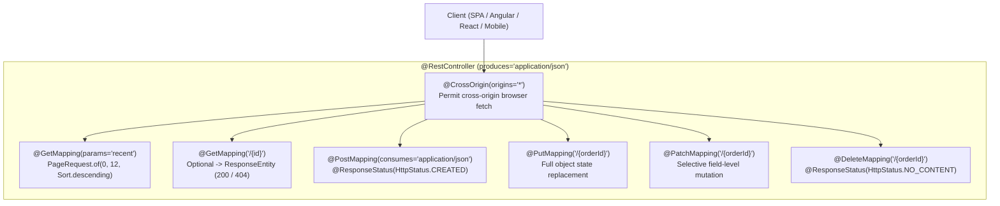

# Book Reading — Spring in Action (6th Ed), Chapter 7: Creating REST Services (pp. 190–201)

---

## Executive Overview

Pages 190 through 201 of *Spring in Action (6th Edition)* explore the foundational patterns of exposing Spring MVC components as machine-to-machine RESTful services. Craig Walls examines endpoint design, content negotiation, cross-origin communication, pagination, status code management, and the crucial distinction between full entity replacement (`PUT`) and selective modification (`PATCH`).



---

## 1. RESTful Controller Architecture

### 1.1 The `@RestController` Component

In a traditional Spring MVC web application, controller handler methods return view names (`String`) resolved to HTML templates. For REST APIs, the response payload itself is the data representation.

`@RestController` acts as a stereotypic meta-annotation combining `@Controller` and `@ResponseBody`. Every handler method in the class automatically writes its return value directly into the HTTP response body via Spring's `HttpMessageConverter` mechanism.

```java
@RestController
@RequestMapping(path = "/api/tacos", produces = "application/json")
@CrossOrigin(origins = "http://tacocloud:8080")
public class TacoController {

    private final TacoRepository tacoRepo;

    public TacoController(TacoRepository tacoRepo) {
        this.tacoRepo = tacoRepo;
    }
    // ...
}
```

### 1.2 Content Negotiation with `produces` and `consumes`

- **`produces = "application/json"`**: Restricts endpoint matching to incoming requests whose `Accept` HTTP header includes `application/json`. It also signals Spring to set the outbound `Content-Type: application/json` response header.
- **`consumes = "application/json"`**: Restricts request handling to incoming HTTP requests carrying a `Content-Type: application/json` payload header.

### 1.3 Cross-Origin Resource Sharing (`@CrossOrigin`)

Modern single-page applications (SPAs) frequently execute in web browsers on a different host or port than the backend API (e.g., frontend on `localhost:3000`, Spring Boot on `localhost:8080`).

By default, browser security restricts cross-origin XMLHttpRequest and Fetch calls via the **Same-Origin Policy**. Applying `@CrossOrigin(origins = "http://tacocloud:8080")` instructs Spring Boot to emit the necessary HTTP response headers (`Access-Control-Allow-Origin`), enabling browser clients to communicate with the API without CORS violations.

---

## 2. Retrieving Data: Pagination & `ResponseEntity`

### 2.1 Paged Data Retrieval with `PageRequest`

Loading entire database tables into memory degrades performance. Spring Data provides `PageRequest` to specify slice boundaries and sorting:

```java
@GetMapping(params = "recent")
public Iterable<Taco> recentTacos() {
    PageRequest page = PageRequest.of(
        0, 12, Sort.by("createdAt").descending()
    );
    return tacoRepo.findAll(page).getContent();
}
```

When a request arrives at `GET /api/tacos?recent`, Spring evaluates the `params = "recent"` predicate and returns the 12 most recent records sorted by timestamp descending.

### 2.2 Fine-Grained Status Management: `ResponseEntity<T>`

When fetching single entities by primary key, returning the entity directly is problematic if the entity does not exist: returning `null` produces an HTTP `200 OK` with an empty response body, violating RESTful expectations.

`ResponseEntity<T>` allows explicit control over the HTTP status code:

```java
@GetMapping("/{id}")
public ResponseEntity<Taco> tacoById(@PathVariable("id") Long id) {
    Optional<Taco> optTaco = tacoRepo.findById(id);
    if (optTaco.isPresent()) {
        return new ResponseEntity<>(optTaco.get(), HttpStatus.OK);
    }
    return new ResponseEntity<>(null, HttpStatus.NOT_FOUND);
}
```

- If present: Returns HTTP `200 OK` with the serialized entity payload.
- If absent: Returns HTTP `404 NOT FOUND` with an empty body.

---

## 3. Creating Resources: `POST` and `@ResponseStatus`

When creating a new resource, the HTTP protocol specifies returning status `201 Created` rather than generic `200 OK`.

```java
@PostMapping(consumes = "application/json")
@ResponseStatus(HttpStatus.CREATED)
public Taco postTaco(@RequestBody Taco taco) {
    return tacoRepo.save(taco);
}
```

- `@RequestBody`: Instructs Jackson to deserialize the incoming JSON payload into a `Taco` instance.
- `@ResponseStatus(HttpStatus.CREATED)`: Ensures that successful execution sets the HTTP response status to `201`.

---

## 4. Modifying Resources: `PUT` vs `PATCH`

The distinction between `PUT` and `PATCH` is a central theme in Chapter 7:

| Aspect | `PUT` | `PATCH` |
| :--- | :--- | :--- |
| **HTTP Semantic** | Full resource replacement | Partial resource modification |
| **Missing Fields in Body** | Overwritten to `null` or default values | Left unchanged in database |
| **Idempotence** | Strictly idempotent | Not inherently idempotent |

### 4.1 Full Update with `PUT`

```java
@PutMapping(path = "/{orderId}", consumes = "application/json")
public TacoOrder putOrder(@PathVariable("orderId") Long orderId,
                          @RequestBody TacoOrder order) {
    order.setId(orderId);
    return repo.save(order);
}
```

If the client submits a `PUT` payload containing only `deliveryZip`, all other fields (`deliveryName`, `deliveryStreet`) will be overwritten with nulls.

### 4.2 Partial Modification with `PATCH`

`PATCH` modifies only specified fields, preserving existing database values for omitted properties:

```java
@PatchMapping(path = "/{orderId}", consumes = "application/json")
public TacoOrder patchOrder(@PathVariable("orderId") Long orderId,
                            @RequestBody TacoOrder patch) {

    TacoOrder order = repo.findById(orderId).get();

    if (patch.getDeliveryName() != null) {
        order.setDeliveryName(patch.getDeliveryName());
    }
    if (patch.getDeliveryStreet() != null) {
        order.setDeliveryStreet(patch.getDeliveryStreet());
    }
    if (patch.getDeliveryCity() != null) {
        order.setDeliveryCity(patch.getDeliveryCity());
    }
    if (patch.getDeliveryState() != null) {
        order.setDeliveryState(patch.getDeliveryState());
    }
    if (patch.getDeliveryZip() != null) {
        order.setDeliveryZip(patch.getDeliveryZip());
    }
    if (patch.getCcNumber() != null) {
        order.setCcNumber(patch.getCcNumber());
    }
    if (patch.getCcExpiration() != null) {
        order.setCcExpiration(patch.getCcExpiration());
    }
    if (patch.getCcCVV() != null) {
        order.setCcCVV(patch.getCcCVV());
    }

    return repo.save(order);
}
```

---

## 5. Deleting Resources: `DELETE`

```java
@DeleteMapping("/{orderId}")
@ResponseStatus(HttpStatus.NO_CONTENT)
public void deleteOrder(@PathVariable("orderId") Long orderId) {
    try {
        repo.deleteById(orderId);
    } catch (EmptyResultDataAccessException e) {
        // Idempotent deletion: if record already gone, ignore
    }
}
```

- `@ResponseStatus(HttpStatus.NO_CONTENT)`: Sets status `204 No Content` indicating the action succeeded and no content is returned.
- Catching `EmptyResultDataAccessException`: Ensures idempotence — attempting to delete an already-deleted resource returns success without crashing.

---

## 6. HTTP Methods Reference Matrix (Table 7.1)

| HTTP Method | CRUD Operation | Idempotent? | Typical Status Code | Purpose |
| :--- | :--- | :--- | :--- | :--- |
| `GET` | Read | Yes | `200 OK` | Retrieves resource representation |
| `POST` | Create | No | `201 Created` | Creates a new resource |
| `PUT` | Update | Yes | `200 OK` | Replaces existing resource entirely |
| `PATCH` | Update | No | `200 OK` | Modifies resource properties selectively |
| `DELETE` | Delete | Yes | `204 No Content` | Removes resource from persistence |
