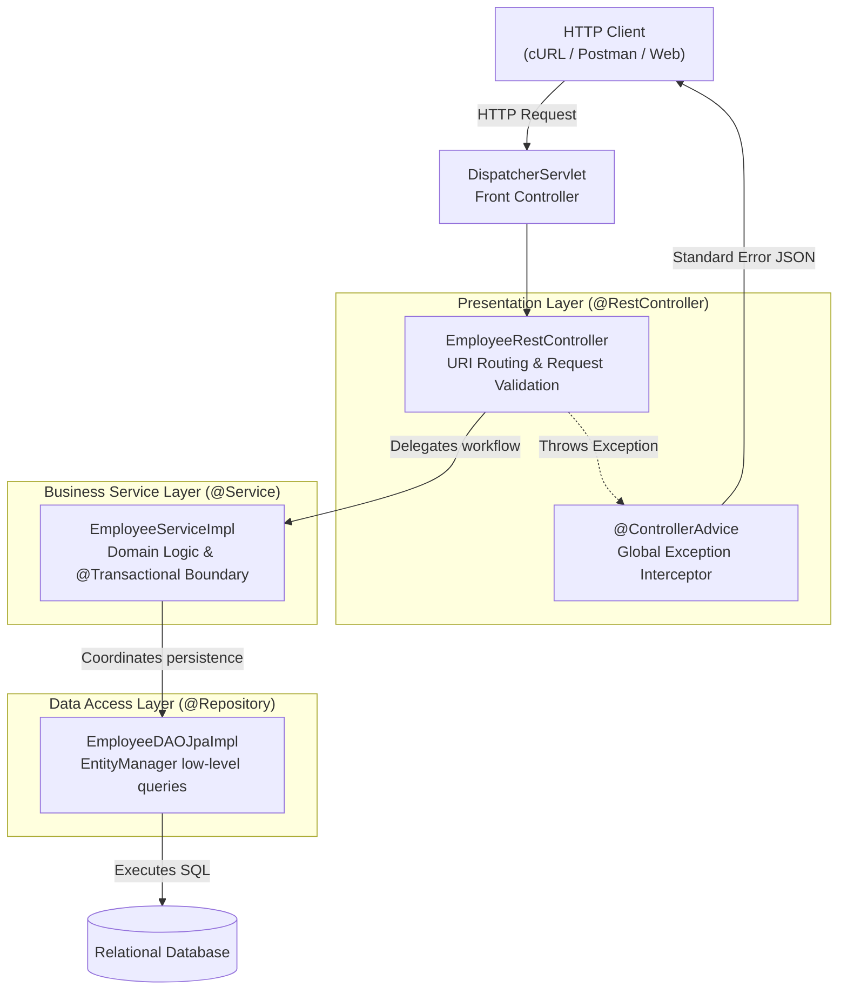

# Week 4 — RESTful Web Services Architecture & Error Handling Pipelines

## Goal

Design clean, production-grade REST APIs using Spring Web MVC. Master request parameter extraction, URI routing via `@PathVariable`, JSON serialization mechanics with Jackson, centralized exception handling pipelines via `@ControllerAdvice`, and robust 3-tier enterprise layering (Controller → Service → DAO) with declarative transaction demarcation.

---

## :material-calendar: Week 4 Schedule

| Topic | Modules / Sections | Key Annotations / Concepts |
| :--- | :--- | :--- |
| **REST Fundamentals & Routing** | Modules 01–04 | `@RestController`, `@GetMapping`, `@PathVariable`, `@RequestParam`, Jackson binding |
| **Local & Global Error Handling** | Modules 05–06 | `@ExceptionHandler`, `@ControllerAdvice`, `ResponseEntity<T>`, standardized error JSON |
| **Enterprise 3-Tier Architecture** | Modules 07–10 | Presentation vs Business vs Persistence tiers, `@Service`, `@Repository`, transaction demarcation |
| **Complete CRUD & State Modifications** | Modules 11–13 | `@PostMapping`, `@RequestBody`, defensive ID reset (`setId(0)`), `@PutMapping` idempotency |
| **Partial Updates & Deletions** | Modules 14–15 | `@PatchMapping`, delta modification with Jackson `JsonMapper`, `@DeleteMapping` |

---

## :material-sitemap: Architectural Progression

---

## :material-folder-open: Week 4 Content

-   :material-note-text:{ .lg .middle } **Topic Notes — Part 1**

    ---

    REST architectural principles, HTTP verbs, JSON structure, Jackson data binding mechanics, `@RestController`, `@PathVariable`, in-memory testing with `@PostConstruct`, and controller-level exception handling with `ResponseEntity`.

    [:octicons-arrow-right-24: Topic Notes Part 1](topic-notes-part1.md)

-   :material-note-text:{ .lg .middle } **Topic Notes — Part 2**

    ---

    Global exception handling via `@ControllerAdvice`, 3-tier enterprise layering, service-tier transaction demarcation, full Employee CRUD endpoints, defensive `POST` ID protection, and partial resource modifications via `PATCH`.

    [:octicons-arrow-right-24: Topic Notes Part 2](topic-notes-part2.md)

-   :material-book-open-variant:{ .lg .middle } **Book Reading — Spring in Action Ch 7**

    ---

    Craig Walls on creating REST services: writing RESTful controllers, content negotiation via `produces`/`consumes`, CORS with `@CrossOrigin`, pagination via `PageRequest`, status codes, and `PUT` vs `PATCH` semantics.

    [:octicons-arrow-right-24: Book Reading](book-reading.md)

-   :material-flask:{ .lg .middle } **Lab Guide — Corporate Enterprise Employee REST Gateway**

    ---

    Build the enterprise Employee Directory REST API: 3-tier architecture (Controller, Service, DAO), full CRUD operations, in-memory `PATCH` delta merging, and centralized `@ControllerAdvice` error mapping.

    [:octicons-arrow-right-24: Lab Guide](lab-guide.md)

-   :material-clipboard-check:{ .lg .middle } **Summary & Architecture Reference**

    ---

    Consolidated annotation matrix, Jackson serialization internals, HTTP status code decision tree, 3-tier responsibility matrix, and prerequisites for Week 5.

    [:octicons-arrow-right-24: Summary](summary.md)

---

## :material-progress-check: Progress Tracker

- [ ] **Part 1:** REST fundamentals, Jackson binding, `@PathVariable`, and local `@ExceptionHandler`
- [ ] **Part 2:** Global `@ControllerAdvice`, 3-tier layering, service `@Transactional`, full CRUD, and `PATCH` partial updates
- [ ] **Book Reading:** Spring in Action Ch 7 (Section 7.1, pp. 163–174)
- [ ] **Lab Guide:** Corporate Enterprise Employee REST Gateway implementation and verification
- [ ] **Summary:** Annotation reference, HTTP verbs, Jackson rules, and architectural matrices reviewed
