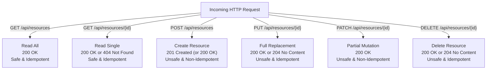
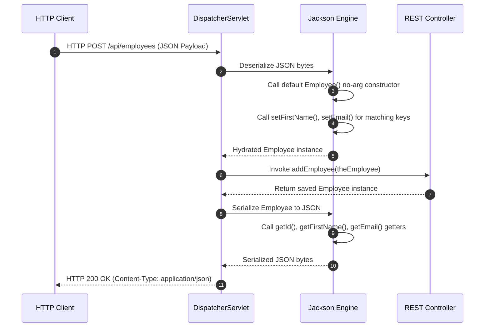
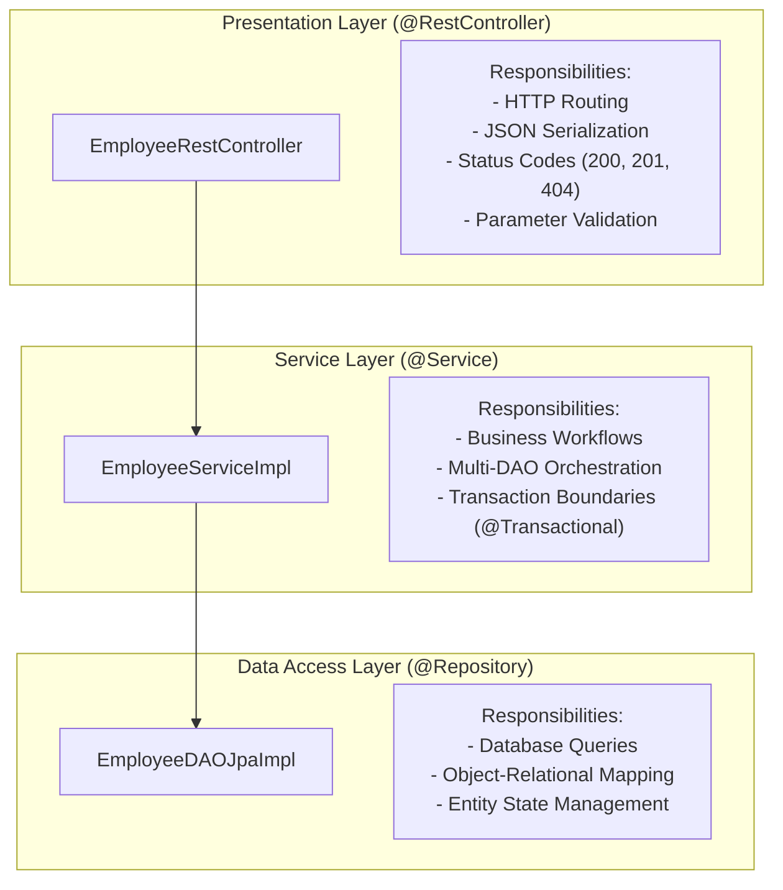

# Summary & Architecture Reference — Week 4: RESTful Web Services & Error Handling

---

## 1. Annotation Reference Matrix

| Annotation | Package / Module | Target | Architectural Purpose | Low-Level Mechanism / Lifecycle Impact | Common Pitfall |
| :--- | :--- | :--- | :--- | :--- | :--- |
| `@RestController` | `org.springframework.web.bind.annotation` | Class | Marks class as a REST endpoint handler component. | Meta-annotated with `@Controller` and `@ResponseBody`. Bypasses MVC `ViewResolver` to serialize return values directly via `HttpMessageConverter`. | Returning raw Strings and expecting view template rendering instead of raw text bodies. |
| `@RequestMapping` | `org.springframework.web.bind.annotation` | Class / Method | Declares base URI routing path and content negotiation constraints. | Configures `RequestMappingHandlerMapping` routing table. Can restrict by `produces`, `consumes`, and HTTP method. | Omitting leading `/` or using verbs in URI paths (violates REST style). |
| `@PathVariable` | `org.springframework.web.bind.annotation` | Parameter | Binds URI template variable into method parameter. | Extracted from URI tokens by `HandlerMethodArgumentResolver` and coerced via `ConversionService`. | Mismatch between URI path token `{id}` and method parameter name without specifying `@PathVariable("id")`. |
| `@RequestBody` | `org.springframework.web.bind.annotation` | Parameter | Deserializes incoming HTTP request body into Java object. | Reads byte stream via `HttpMessageConverter` and invokes Jackson to instantiate and populate POJO. | Target POJO missing a default no-argument constructor, causing Jackson reflection failure. |
| `@ExceptionHandler`| `org.springframework.web.bind.annotation` | Method | Defines a method to intercept exceptions thrown during request execution. | Registered in `ExceptionHandlerExceptionResolver`. Matches most-specific exception type first. | Declaring handlers locally in controllers and forgetting they do not intercept exceptions globally. |
| `@ControllerAdvice`| `org.springframework.web.bind.annotation` | Class | Centralizes global exception handling, model attributes, and init binders across all controllers. | Applied as an interceptor around all `@RequestMapping` methods across the entire Spring container. | Swallowing exceptions without logging or returning appropriate HTTP status codes. |
| `@ResponseStatus` | `org.springframework.web.bind.annotation` | Method / Class | Sets default HTTP response status code for handler methods. | Overrides the default `200 OK` status when method completes without throwing exceptions. | Using `@ResponseStatus` on methods returning `ResponseEntity<T>`, where the `ResponseEntity` status takes precedence. |
| `@CrossOrigin` | `org.springframework.web.bind.annotation` | Class / Method | Configures Cross-Origin Resource Sharing (CORS) headers. | Injects `Access-Control-Allow-Origin` and related security headers into HTTP responses. | Using `origins = "*"` in production authenticated microservices. |
| `@Service` | `org.springframework.stereotype` | Class | Stereotype annotation marking a component as part of the business service layer. | Registered as a Spring singleton bean; acts as target for declarative AOP transaction boundaries. | Putting business algorithms directly into controllers instead of encapsulating them in `@Service`. |
| `@Repository` | `org.springframework.stereotype` | Class | Stereotype annotation marking a component as a Data Access Object. | Triggers automatic exception translation from JDBC/SQL errors into Spring `DataAccessException`. | Declaring `@Transactional` directly on DAO methods rather than managing transactions at the service tier. |

---

## 2. HTTP Verbs & REST Protocol Action Matrix

| HTTP Method | CRUD Action | Safe? | Idempotent? | Typical Success Status | Request Body? | Response Body? |
| :--- | :--- | :--- | :--- | :--- | :--- | :--- |
| `GET` | Read | **Yes** | **Yes** | `200 OK` | No | Yes (Resource representation) |
| `POST` | Create | No | No | `201 Created` / `200 OK` | Yes (New entity state) | Yes (Created entity with ID) |
| `PUT` | Full Replace | No | **Yes** | `200 OK` / `204 No Content`| Yes (Complete state) | Optional (Updated entity) |
| `PATCH` | Partial Update| No | No | `200 OK` | Yes (Subset of fields) | Yes (Updated entity) |
| `DELETE` | Delete | No | **Yes** | `204 No Content` / `200 OK`| No | Optional (Status confirmation) |

---

## 3. Jackson Serialization & Deserialization Engine

Underneath Spring Boot, the Jackson JSON processor (`ObjectMapper` / `JsonMapper`) manages wire data transformations:

### Essential Jackson Rules:
1. **Public Default Constructor**: Mandatory for reflection-based instantiation during deserialization.
2. **Getter-Based Serialization**: Output property names match getter methods (`getLastName()` → `"lastName"`).
3. **Setter-Based Deserialization**: Incoming keys match setter methods (`setLastName(...)` ← `"lastName"`).
4. **Field Customization**: Use `@JsonProperty("custom_name")` to remap wire names, or `@JsonIgnore` to redact sensitive fields.

---

## 4. Architectural Comparison: Error Handling Strategies

| Dimension | Controller-Local `@ExceptionHandler` | Global `@ControllerAdvice` |
| :--- | :--- | :--- |
| **Scope** | Restricted to the single declaring controller class | Intercepts requests across **all** controllers in the application |
| **Code Redundancy**| High (must be copied across every controller) | Zero (single centralized error handling class) |
| **Separation of Concerns**| Pollutes HTTP routing classes with error mapping | Decouples business endpoint logic from error translation |
| **Standardization**| High risk of diverging status codes or JSON schemas | Enforces consistent RFC-7807 problem structures application-wide |

---

## 5. Enterprise 3-Tier Layering & Transaction Boundaries

### The Transaction Demarcation Rule:
- `@Transactional` **must reside on the Service Layer**.
- If transactions are placed on DAOs, complex multi-step workflows cannot participate in a shared atomic transaction, leading to data inconsistency during partial failures.
- Read-only operations can omit `@Transactional` or declare `@Transactional(readOnly = true)` for query optimization.

---

## 6. Defensive REST API Design Patterns

### 6.1 Defensive `POST` Primary Key Reset

When exposing `POST /api/employees`:
- A client can intentionally or accidentally provide an `"id"` in the request payload (`{"id": 1, ...}`).
- If passed directly to `entityManager.merge()`, Hibernate will issue an `UPDATE` on existing record #1 instead of creating a new record.
- **Rule**: Always enforce `theEntity.setId(0)` in `@PostMapping` methods before delegating to the service tier.

### 6.2 Partial Modifications via HTTP `PATCH`

- **PUT vs PATCH**: `PUT` requires replacing the entire resource representation (missing fields become null). `PATCH` updates only the submitted fields.
- **Implementation**: Accept `@RequestBody Map<String, Object> patchPayload`, verify `!patchPayload.containsKey("id")` to prevent primary key mutation, merge delta into the managed entity via `jsonMapper.updateValue()`, and save.

---

## 7. Prerequisites for Week 5

With REST API design and 3-tier layering established, Week 5 transitions into eliminating persistence boilerplate:

1. **Spring Data JPA (`JpaRepository`)**: Eliminating custom DAO implementations entirely via dynamically generated runtime proxies.
2. **Spring Data REST**: Auto-generating hypermedia (HATEOAS HAL) endpoints with built-in pagination and sorting directly from repositories.
3. **OpenAPI & Swagger UI**: Automated interactive documentation and API testing tools via `springdoc-openapi`.
