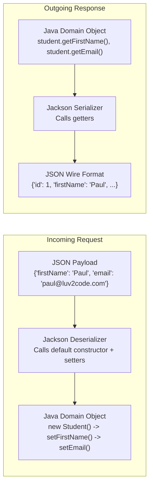
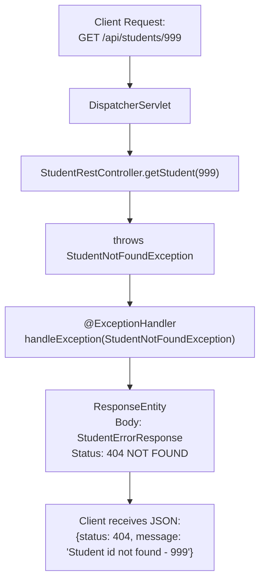

# Topic Notes — Part 1: REST Fundamentals, Jackson Data Binding, and Controller Exception Handling

---

## 1. REST Architecture & HTTP Protocol Semantics

**REST (Representational State Transfer)** is an architectural style designed by Roy Fielding for distributed hypermedia systems. In modern backend engineering, REST over HTTP serves as the standard protocol for microservices and web APIs.

### 1.1 Core Architectural Constraints

1. **Client-Server Separation**: Concerns of user interface and state storage are decoupled.
2. **Statelessness**: Every client request must contain all context required for processing. The server does not store conversational session state between requests.
3. **Cacheability**: Responses must declare whether they are cacheable to prevent redundant network Round-Trip Times (RTT).
4. **Uniform Interface**: Resources are identified by URIs, manipulated through standard representations (typically JSON), and self-descriptive.

### 1.2 HTTP Verbs & Action Mapping

A fundamental design tenet of RESTful systems is that **HTTP methods define the action**, while **URIs define the resource**.

| HTTP Method | Operation | Idempotent? | Safe? | Typical Success Status |
| :--- | :--- | :--- | :--- | :--- |
| `GET` | Read resource representation | Yes | Yes | `200 OK` |
| `POST` | Create a new subordinate resource | No | No | `201 Created` |
| `PUT` | Full replacement / update of resource | Yes | No | `200 OK` / `204 No Content` |
| `PATCH` | Partial modification of resource | No | No | `200 OK` |
| `DELETE` | Remove targeted resource | Yes | No | `204 No Content` / `200 OK` |

!!! warning "API Design Anti-Pattern: Verbs in URIs"
    Never include verbs or operational descriptions in endpoint paths:
    
    - **Incorrect**: `GET /api/getAllStudents`, `POST /api/saveStudent`, `POST /api/deleteEmployee?id=5`
    - **RESTful**: `GET /api/students`, `POST /api/students`, `DELETE /api/employees/5`

---

## 2. JSON & Jackson Data Binding Internals

Spring Boot web starters automatically include **Jackson**, the de facto standard JSON parsing engine for the JVM.



### 2.1 Serialization Mechanics (Java to JSON)

When a controller method returns a Java object or collection:
1. Spring delegates to `MappingJackson2HttpMessageConverter`.
2. Jackson inspects the class via reflection to identify **public getter methods**.
3. The getter name determines the resulting JSON property name (e.g., `getFirstName()` maps to `"firstName"`).
4. Properties without accessible getters are ignored by default.

### 2.2 Deserialization Mechanics (JSON to Java)

When a client submits JSON in an HTTP request body:
1. Jackson instantiates the target POJO using its **public no-argument constructor**.
2. For each key in the JSON payload, Jackson resolves the matching **setter method** (e.g., `"email"` maps to `setEmail(String email)`).
3. If property names in the JSON payload do not correspond to bean properties or setters, Jackson throws an `UnrecognizedPropertyException` unless configured otherwise.

```java
public class Student {
    private int id;
    private String firstName;
    private String lastName;

    // Required by Jackson for reflection-based instantiation
    public Student() {}

    public Student(String firstName, String lastName) {
        this.firstName = firstName;
        this.lastName = lastName;
    }

    // Jackson invokes getters to serialize
    public String getFirstName() { return firstName; }
    // Jackson invokes setters to deserialize
    public void setFirstName(String firstName) { this.firstName = firstName; }

    public String getLastName() { return lastName; }
    public void setLastName(String lastName) { this.lastName = lastName; }
}
```

---

## 3. Spring REST Controllers

### 3.1 `@RestController` vs `@Controller`

In standard Spring MVC, `@Controller` returns a view name (such as a Thymeleaf or JSP template) resolved by a `ViewResolver`.

`@RestController` is a convenience meta-annotation combining:
- `@Controller`: Registers the class as a Spring component handling web requests.
- `@ResponseBody`: Signals Spring that method return values must be bound directly to the web response body via `HttpMessageConverter`, bypassing view resolution.

```java
@Target(ElementType.TYPE)
@Retention(RetentionPolicy.RUNTIME)
@Documented
@Controller
@ResponseBody
public @interface RestController {
    // ...
}
```

### 3.2 Endpoint Mapping with `@GetMapping`

```java
package com.luv2code.demo.rest;

import com.luv2code.demo.entity.Student;
import jakarta.annotation.PostConstruct;
import org.springframework.web.bind.annotation.GetMapping;
import org.springframework.web.bind.annotation.RequestMapping;
import org.springframework.web.bind.annotation.RestController;
import java.util.ArrayList;
import java.util.List;

@RestController
@RequestMapping("/api")
public class StudentRestController {

    private List<Student> theStudents;

    // @PostConstruct executes once after dependency injection completes
    @PostConstruct
    public void loadData() {
        theStudents = new ArrayList<>();
        theStudents.add(new Student("Poornima", "Patel"));
        theStudents.add(new Student("Mario", "Rossi"));
        theStudents.add(new Student("Mary", "Smith"));
    }

    // Expose "/api/students" to return list of all students
    @GetMapping("/students")
    public List<Student> getStudents() {
        return theStudents;
    }
}
```

When an HTTP `GET /api/students` request arrives:
1. Spring MVC's `DispatcherServlet` identifies `StudentRestController.getStudents()`.
2. The method returns `List<Student>`.
3. Jackson serializes the list into a JSON array `[{"firstName":"Poornima",...}, ...]`.
4. Spring sets the HTTP `Content-Type: application/json` header and writes the byte payload.

---

## 4. Path Variables (`@PathVariable`)

To retrieve a specific entity representation, REST APIs embed the identifier directly in the URI path:

```
GET /api/students/{studentId}
```

### 4.1 Binding Path Tokens

`@PathVariable` binds URI template variables into controller method parameters:

```java
@GetMapping("/students/{studentId}")
public Student getStudent(@PathVariable int studentId) {

    // Validate index boundaries against list
    if ((studentId >= theStudents.size()) || (studentId < 0)) {
        throw new StudentNotFoundException("Student id not found - " + studentId);
    }

    return theStudents.get(studentId);
}
```

### 4.2 Type Conversion Mechanics

The URI parameter arrives as raw text (e.g., `"1"`). Spring's `ConversionService` automatically converts the string into the method parameter's target type (`int`). 

If a client passes a non-numeric token (such as `/api/students/abc`), Spring throws a `MethodArgumentTypeMismatchException`, resulting in an HTTP `400 Bad Request`.

---

## 5. Exception Handling at the Controller Level

When an error condition occurs during request execution, an enterprise API must return structured, machine-readable JSON rather than generic HTML error pages or raw Java stack traces.

### 5.1 Defining Custom Domain Exceptions

```java
package com.luv2code.demo.rest;

public class StudentNotFoundException extends RuntimeException {

    public StudentNotFoundException(String message) {
        super(message);
    }

    public StudentNotFoundException(String message, Throwable cause) {
        super(message, cause);
    }

    public StudentNotFoundException(Throwable cause) {
        super(cause);
    }
}
```

### 5.2 Structuring the Error Response Payload

```java
package com.luv2code.demo.rest;

public class StudentErrorResponse {

    private int status;
    private String message;
    private long timeStamp;

    public StudentErrorResponse() {}

    public StudentErrorResponse(int status, String message, long timeStamp) {
        this.status = status;
        this.message = message;
        this.timeStamp = timeStamp;
    }

    public int getStatus() { return status; }
    public void setStatus(int status) { this.status = status; }

    public String getMessage() { return message; }
    public void setMessage(String message) { this.message = message; }

    public long getTimeStamp() { return timeStamp; }
    public void setTimeStamp(long timeStamp) { this.timeStamp = timeStamp; }
}
```

### 5.3 Local `@ExceptionHandler` Methods

Spring's `@ExceptionHandler` annotation marks a method within a controller to intercept exceptions thrown during that controller's request execution:

```java
// Handle specific domain exception: 404 NOT FOUND
@ExceptionHandler
public ResponseEntity<StudentErrorResponse> handleException(StudentNotFoundException exc) {

    StudentErrorResponse error = new StudentErrorResponse();
    error.setStatus(HttpStatus.NOT_FOUND.value());
    error.setMessage(exc.getMessage());
    error.setTimeStamp(System.currentTimeMillis());

    return new ResponseEntity<>(error, HttpStatus.NOT_FOUND);
}

// Catch-all exception handler: 400 BAD REQUEST (e.g. invalid type input)
@ExceptionHandler
public ResponseEntity<StudentErrorResponse> handleException(Exception exc) {

    StudentErrorResponse error = new StudentErrorResponse();
    error.setStatus(HttpStatus.BAD_REQUEST.value());
    error.setMessage(exc.getMessage());
    error.setTimeStamp(System.currentTimeMillis());

    return new ResponseEntity<>(error, HttpStatus.BAD_REQUEST);
}
```

### 5.4 The `ResponseEntity<T>` Container

`ResponseEntity<T>` represents the complete HTTP response, encapsulating:
- **Status Code**: `HttpStatus.NOT_FOUND`, `HttpStatus.OK`, `HttpStatus.CREATED`
- **Headers**: Custom HTTP headers (e.g., `Location`, caching directives)
- **Body (`<T>`)**: The serialized payload object (`StudentErrorResponse`, `Student`, etc.)



### 5.5 Limitations of Local Exception Handlers

While `@ExceptionHandler` within a controller effectively intercepts exceptions thrown in that class, it has architectural shortcomings:
1. **Code Duplication**: If multiple controllers exist (`StudentRestController`, `CourseRestController`, `EmployeeRestController`), each would require duplicated `@ExceptionHandler` methods.
2. **Scoping**: It cannot intercept exceptions originating from other controllers or filters.

Centralizing error handling requires **Global Exception Handling** via `@ControllerAdvice`, covered in Part 2.
