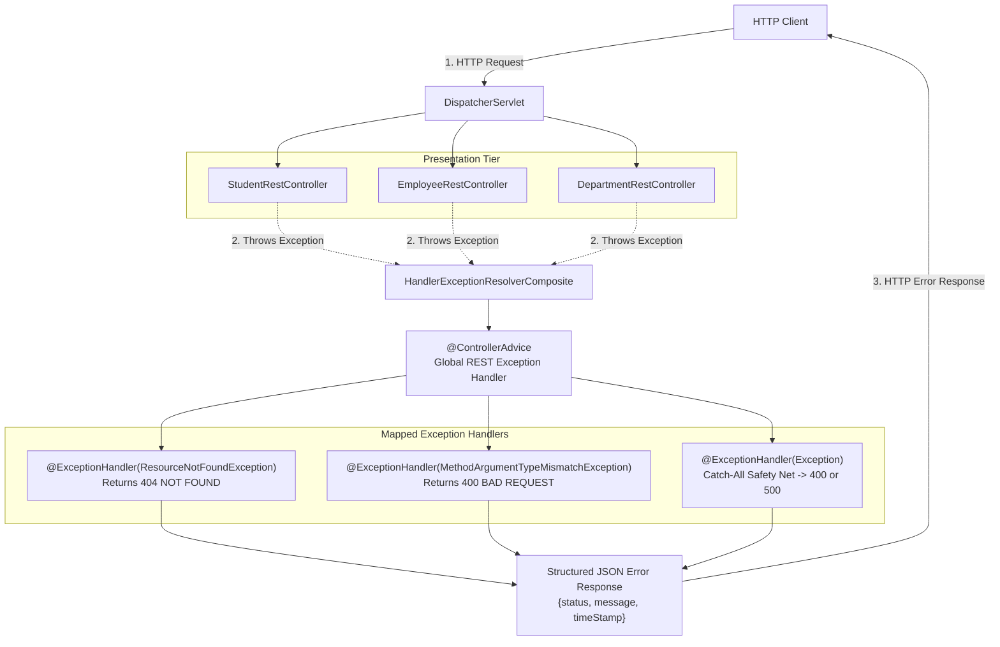
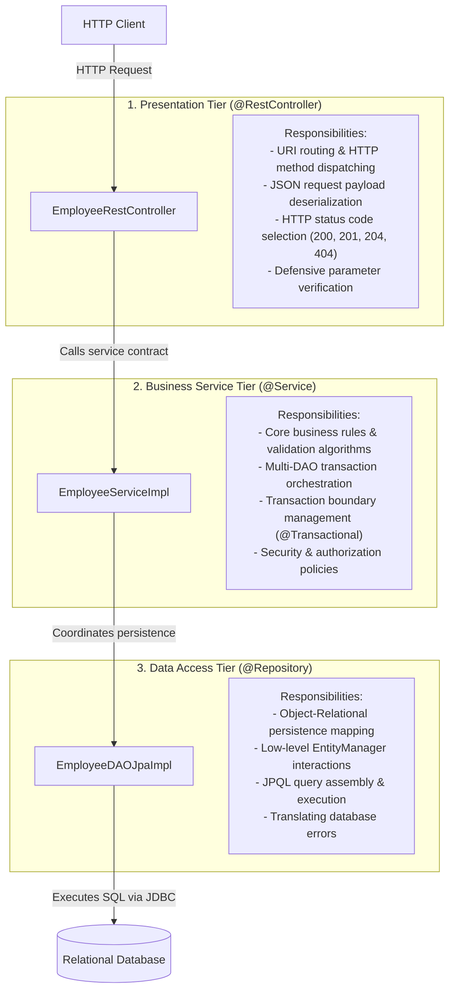
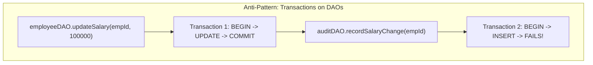
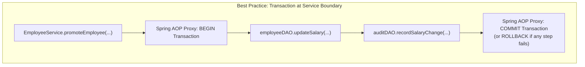
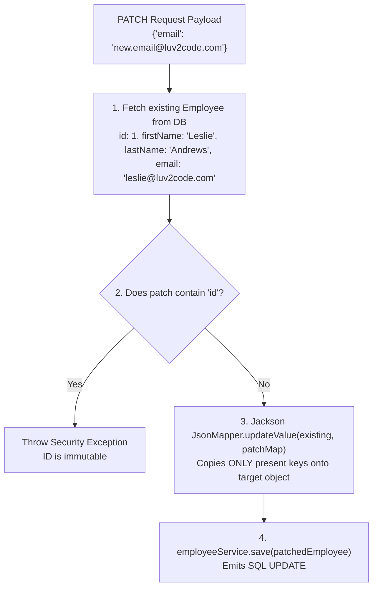

# Topic Notes — Part 2: Global Exception Handling, 3-Tier Enterprise Layering, and Full CRUD Operations

---

## 1. Centralized Error Handling via `@ControllerAdvice`

In Part 1, we implemented `@ExceptionHandler` methods directly inside the controller class. While effective for localized scenarios, this approach becomes an architectural anti-pattern in enterprise codebases as the number of controllers expands.

### 1.1 The Pitfalls of Controller-Local Exception Handling

1. **Violation of the Single Responsibility Principle (SRP)**: Controllers are designed to handle HTTP routing, request deserialization, validation, and status code dispatching. Embedding error translation logic directly in every controller clutters presentation code.
2. **Code Duplication**: If your application maintains multiple controllers (e.g., `StudentRestController`, `EmployeeRestController`, `DepartmentRestController`), you are forced to copy and paste identical `@ExceptionHandler` methods across all of them.
3. **Inconsistent Error Contracts**: When separate teams develop different controllers, local handlers inevitably diverge in status codes, JSON schema fields, and error message structures.

### 1.2 The `@ControllerAdvice` Architectural Interceptor

Spring MVC resolves these issues through `@ControllerAdvice`. Introduced in Spring 3.2, `@ControllerAdvice` is an interceptor specialized for exception handling, model attribute binding, and request pre-processing across all controllers in the application context.



Under the hood, `@ControllerAdvice` is registered with Spring's `ExceptionHandlerExceptionResolver`. When any controller method throws an unhandled exception, `DispatcherServlet` delegates to this resolver, which scans `@ControllerAdvice` beans for matching `@ExceptionHandler` methods.

### 1.3 Implementation: Production-Grade Global Exception Handler

```java
package com.luv2code.demo.rest;

import org.springframework.http.HttpStatus;
import org.springframework.http.ResponseEntity;
import org.springframework.web.bind.annotation.ControllerAdvice;
import org.springframework.web.bind.annotation.ExceptionHandler;

@ControllerAdvice
public class StudentRestExceptionHandler {

    // Target specific domain exception: 404 NOT FOUND
    @ExceptionHandler
    public ResponseEntity<StudentErrorResponse> handleException(StudentNotFoundException exc) {

        StudentErrorResponse error = new StudentErrorResponse();
        error.setStatus(HttpStatus.NOT_FOUND.value());
        error.setMessage(exc.getMessage());
        error.setTimeStamp(System.currentTimeMillis());

        return new ResponseEntity<>(error, HttpStatus.NOT_FOUND);
    }

    // Catch-all exception handler: 400 BAD REQUEST (e.g., malformed URL params)
    @ExceptionHandler
    public ResponseEntity<StudentErrorResponse> handleException(Exception exc) {

        StudentErrorResponse error = new StudentErrorResponse();
        error.setStatus(HttpStatus.BAD_REQUEST.value());
        error.setMessage(exc.getMessage());
        error.setTimeStamp(System.currentTimeMillis());

        return new ResponseEntity<>(error, HttpStatus.BAD_REQUEST);
    }
}
```

!!! note "Exception Resolution Order"
    Spring evaluates exception handlers using a **most-specific-type-first** algorithm. If a method throws `StudentNotFoundException`, Spring inspects the handler hierarchy and matches `handleException(StudentNotFoundException)` rather than the generic `handleException(Exception)` fallback. The generic handler acts exclusively as a safety net.

!!! tip "Security Warning: Stack Trace Leakage"
    In enterprise production systems, never pass `exc.printStackTrace()` or raw SQL error details directly into `error.setMessage()`. Exposing internal database column names, table schemas, or class hierarchies in the error response creates substantial attack surfaces. Keep client messages descriptive yet abstract.

---

## 2. Enterprise 3-Tier Layering Architecture

A production Spring application must enforce strict separation of concerns. Mixing database queries inside web controllers or writing HTTP response logic inside data access objects creates fragile, untestable architectures.

The industry standard pattern organizes backend systems into **Three Distinct Tiers**:



### 2.1 The presentation Tier: `@RestController`

The controller acts strictly as an HTTP protocol gateway:
- Extracts URL path variables (`@PathVariable`), query parameters (`@RequestParam`), and body payloads (`@RequestBody`).
- Validates structural completeness of incoming payloads.
- Delegates business execution directly to the Service tier.
- Returns `ResponseEntity` or POJOs with suitable HTTP status codes.
- **Rule**: Controllers must never contain database queries, `@Transactional` annotations, or business workflow logic.

### 2.2 The Business Service Tier: `@Service`

The service tier is the heart of the application:
- Implements application business logic and domain workflows.
- Orchestrates multiple DAOs (for example, debiting an account, crediting another, and creating an audit record).
- **Owns transaction demarcation via `@Transactional`**.
- Decouples controllers from the physical persistence implementation. If the persistence engine shifts from JPA to an external REST microservice or NoSQL store, the controller layer remains untouched.

### 2.3 The Data Access Tier (DAO): `@Repository`

The DAO layer encapsulates database mechanics:
- Manages low-level `EntityManager` interactions (`find()`, `merge()`, `remove()`).
- Authors JPQL and Criteria queries.
- Marked with `@Repository`, which enables Spring's `PersistenceExceptionTranslationPostProcessor` to convert vendor-specific exceptions (such as MySQL `SQLException`) into Spring's unified `DataAccessException` hierarchy.

---

## 3. Transaction Demarcation: The Service Layer Rule

One of the most consequential architectural questions in Spring development is: **Where should `@Transactional` be placed?**

### 3.1 The Flawed Approach: `@Transactional` at the DAO Tier

In beginner tutorials, `@Transactional` is often placed directly on DAO methods (`save()`, `delete()`). In real-world enterprise applications, this pattern leads to data corruption:



In the scenario above:
1. `employeeDAO.updateSalary()` begins Transaction 1, writes to the database, and commits.
2. `auditDAO.recordSalaryChange()` begins Transaction 2, encounters a database error, and rolls back.
3. **Result**: The employee's salary has been updated, but the audit trail was lost. Data integrity is broken because the two operations executed in isolated transactions.

### 3.2 The Enterprise Solution: `@Transactional` at the Service Tier

By placing `@Transactional` at the Service layer, Spring creates a single atomic transaction spanning all DAO calls made within that service method:



```java
@Service
public class EmployeeServiceImpl implements EmployeeService {

    private final EmployeeDAO employeeDAO;
    private final AuditDAO auditDAO;

    @Autowired
    public EmployeeServiceImpl(EmployeeDAO employeeDAO, AuditDAO auditDAO) {
        this.employeeDAO = employeeDAO;
        this.auditDAO = auditDAO;
    }

    @Override
    @Transactional // A single atomic boundary encompasses all operations
    public void promoteEmployee(int empId, BigDecimal newSalary) {
        employeeDAO.updateSalary(empId, newSalary);
        auditDAO.recordSalaryChange(empId, newSalary);
        // If auditDAO throws an exception, the salary update rolls back automatically!
    }
}
```

!!! important "Transaction Demarcation Guidelines"
    - **Service methods that mutate data** (`save`, `update`, `delete`) must be annotated with `@Transactional`.
    - **Read-only service methods** (`findAll`, `findById`) can either omit `@Transactional` or use `@Transactional(readOnly = true)` to enable database read optimizations and disable dirty checking snapshots.
    - **DAO implementations should never declare `@Transactional`**. They should always participate in the calling service's transaction context.

---

## 4. Complete Employee CRUD Implementation

Let us construct a production-grade Employee Directory API demonstrating the 3-tier pattern.

### 4.1 The `Employee` Entity

```java
package com.luv2code.springboot.cruddemo.entity;

import jakarta.persistence.*;

@Entity
@Table(name = "employee")
public class Employee {

    @Id
    @GeneratedValue(strategy = GenerationType.IDENTITY)
    @Column(name = "id")
    private int id;

    @Column(name = "first_name")
    private String firstName;

    @Column(name = "last_name")
    private String lastName;

    @Column(name = "email")
    private String email;

    // Required by JPA and Jackson
    public Employee() {}

    public Employee(String firstName, String lastName, String email) {
        this.firstName = firstName;
        this.lastName  = lastName;
        this.email     = email;
    }

    public int getId() { return id; }
    public void setId(int id) { this.id = id; }

    public String getFirstName() { return firstName; }
    public void setFirstName(String firstName) { this.firstName = firstName; }

    public String getLastName() { return lastName; }
    public void setLastName(String lastName) { this.lastName = lastName; }

    public String getEmail() { return email; }
    public void setEmail(String email) { this.email = email; }

    @Override
    public String toString() {
        return "Employee{id=" + id + ", firstName='" + firstName + '\'' +
               ", lastName='" + lastName + '\'' + ", email='" + email + "'}";
    }
}
```

### 4.2 The DAO Tier: `EmployeeDAO` & `EmployeeDAOJpaImpl`

```java
package com.luv2code.springboot.cruddemo.dao;

import com.luv2code.springboot.cruddemo.entity.Employee;
import java.util.List;

public interface EmployeeDAO {
    List<Employee> findAll();
    Employee findById(int theId);
    Employee save(Employee theEmployee);
    void deleteById(int theId);
}
```

Implementation with `EntityManager`:

```java
package com.luv2code.springboot.cruddemo.dao;

import com.luv2code.springboot.cruddemo.entity.Employee;
import jakarta.persistence.EntityManager;
import jakarta.persistence.TypedQuery;
import org.springframework.beans.factory.annotation.Autowired;
import org.springframework.stereotype.Repository;
import java.util.List;

@Repository
public class EmployeeDAOJpaImpl implements EmployeeDAO {

    private final EntityManager entityManager;

    @Autowired
    public EmployeeDAOJpaImpl(EntityManager entityManager) {
        this.entityManager = entityManager;
    }

    @Override
    public List<Employee> findAll() {
        TypedQuery<Employee> theQuery = entityManager.createQuery("FROM Employee", Employee.class);
        return theQuery.getResultList();
    }

    @Override
    public Employee findById(int theId) {
        return entityManager.find(Employee.class, theId);
    }

    @Override
    public Employee save(Employee theEmployee) {
        // entityManager.merge() handles both insert and update:
        // If id == 0, it executes an INSERT statement.
        // If id > 0, it executes an UPDATE statement.
        return entityManager.merge(theEmployee);
    }

    @Override
    public void deleteById(int theId) {
        Employee theEmployee = entityManager.find(Employee.class, theId);
        if (theEmployee != null) {
            entityManager.remove(theEmployee);
        }
    }
}
```

!!! note "The Dual Nature of `merge()` in Save Operations"
    Notice that the DAO does not maintain separate `insert()` and `update()` methods. Because `entityManager.merge()` evaluates entity identity, passing an entity with `id = 0` signals Hibernate that no database record exists, triggering an `INSERT`. Passing an entity with an existing ID loads the current record and emits an `UPDATE`.

### 4.3 The Business Service Tier: `EmployeeService` & `EmployeeServiceImpl`

```java
package com.luv2code.springboot.cruddemo.service;

import com.luv2code.springboot.cruddemo.dao.EmployeeDAO;
import com.luv2code.springboot.cruddemo.entity.Employee;
import org.springframework.beans.factory.annotation.Autowired;
import org.springframework.stereotype.Service;
import org.springframework.transaction.annotation.Transactional;
import java.util.List;

@Service
public class EmployeeServiceImpl implements EmployeeService {

    private final EmployeeDAO employeeDAO;

    @Autowired
    public EmployeeServiceImpl(EmployeeDAO theEmployeeDAO) {
        this.employeeDAO = theEmployeeDAO;
    }

    @Override
    public List<Employee> findAll() {
        return employeeDAO.findAll();
    }

    @Override
    public Employee findById(int theId) {
        return employeeDAO.findById(theId);
    }

    @Override
    @Transactional // Manages transaction boundary for writes
    public Employee save(Employee theEmployee) {
        return employeeDAO.save(theEmployee);
    }

    @Override
    @Transactional // Manages transaction boundary for deletes
    public void deleteById(int theId) {
        employeeDAO.deleteById(theId);
    }
}
```

### 4.4 The Presentation Tier: Full CRUD `EmployeeRestController`

The controller exposes endpoints adhering to REST conventions:

```java
package com.luv2code.springboot.cruddemo.rest;

import tools.jackson.databind.json.JsonMapper;
import com.luv2code.springboot.cruddemo.entity.Employee;
import com.luv2code.springboot.cruddemo.service.EmployeeService;
import org.springframework.beans.factory.annotation.Autowired;
import org.springframework.web.bind.annotation.*;
import java.util.List;
import java.util.Map;

@RestController
@RequestMapping("/api")
public class EmployeeRestController {

    private final EmployeeService employeeService;
    private final JsonMapper jsonMapper;

    @Autowired
    public EmployeeRestController(EmployeeService theEmployeeService, JsonMapper theJsonMapper) {
        this.employeeService = theEmployeeService;
        this.jsonMapper = theJsonMapper;
    }

    // 1. GET ALL: /api/employees
    @GetMapping("/employees")
    public List<Employee> findAll() {
        return employeeService.findAll();
    }

    // 2. GET BY ID: /api/employees/{employeeId}
    @GetMapping("/employees/{employeeId}")
    public Employee getEmployee(@PathVariable int employeeId) {
        Employee theEmployee = employeeService.findById(employeeId);
        if (theEmployee == null) {
            throw new RuntimeException("Employee id not found - " + employeeId);
        }
        return theEmployee;
    }

    // 3. POST: /api/employees (Create new employee)
    @PostMapping("/employees")
    public Employee addEmployee(@RequestBody Employee theEmployee) {
        // Defensive reset: Force ID to 0
        theEmployee.setId(0);
        return employeeService.save(theEmployee);
    }

    // 4. PUT: /api/employees (Full update)
    @PutMapping("/employees")
    public Employee updateEmployee(@RequestBody Employee theEmployee) {
        return employeeService.save(theEmployee);
    }

    // 5. DELETE: /api/employees/{employeeId}
    @DeleteMapping("/employees/{employeeId}")
    public String deleteEmployee(@PathVariable int employeeId) {
        Employee tempEmployee = employeeService.findById(employeeId);
        if (tempEmployee == null) {
            throw new RuntimeException("Employee id not found - " + employeeId);
        }
        employeeService.deleteById(employeeId);
        return "Deleted employee id - " + employeeId;
    }

    // 6. PATCH: /api/employees/{employeeId} (Partial update)
    @PatchMapping("/employees/{employeeId}")
    public Employee patchEmployee(@PathVariable int employeeId,
                                  @RequestBody Map<String, Object> patchPayload) {
        Employee tempEmployee = employeeService.findById(employeeId);
        if (tempEmployee == null) {
            throw new RuntimeException("Employee id not found - " + employeeId);
        }

        // Security validation: Prevent primary key alteration
        if (patchPayload.containsKey("id")) {
            throw new RuntimeException("Employee id cannot be modified. Remove 'id' from request body.");
        }

        // Apply in-memory patch using Jackson
        Employee patchedEmployee = jsonMapper.updateValue(tempEmployee, patchPayload);

        return employeeService.save(patchedEmployee);
    }
}
```

---

## 5. Deep-Dive: Defensive POST and Partial Updates (PATCH)

Two specific handler mechanisms in `EmployeeRestController` require detailed architectural analysis:

### 5.1 Defensive ID Reset in `POST`: Why `theEmployee.setId(0)` is Critical

In REST architecture, `POST` is strictly intended to **create a new subordinate resource**. The primary key must be assigned by the server (via database identity generation).

However, an external client might send:

```json
POST /api/employees
{
  "id": 1,
  "firstName": "Hacker",
  "lastName": "Malicious",
  "email": "hacker@evil.com"
}
```

If we pass this object directly into `employeeService.save(theEmployee)`:
- `save()` calls `entityManager.merge(theEmployee)`.
- Because `id = 1`, Hibernate does not insert a new record. Instead, it **overwrites and updates existing employee #1** (Leslie Andrews)!
- A client intended to create a record, but maliciously or accidentally destroyed an existing user's data.

By enforcing:

```java
theEmployee.setId(0);
```

We guarantee that even if the client supplies an `id` property in the JSON payload, Hibernate treats it as `0`, forcing an `INSERT` with a new auto-generated sequence key.

### 5.2 Partial Updates: `PUT` vs `PATCH` Mechanics

In HTTP semantics:
- **`PUT` is a full replacement**: The client sends the entire representation. If an entity has five fields and the client submits only two, the missing three fields are deserialized as `null` and written to the database, overwriting existing data with nulls.
- **`PATCH` is a partial modification**: The client submits only the specific key-value pairs that need to change. All unmentioned fields must retain their existing values in the database.



#### How Jackson's `updateValue()` Works:

1. `@RequestBody Map<String, Object> patchPayload`: Accepts any partial JSON key-value pairs dynamically without forcing a full POJO structure.
2. `guard`: Checks `patchPayload.containsKey("id")` to ensure clients cannot tamper with the primary key.
3. `jsonMapper.updateValue(tempEmployee, patchPayload)`: Jackson inspects the map keys and invokes only the corresponding setter methods on the existing `tempEmployee` object. If `firstName` is not in the map, `tempEmployee.getFirstName()` remains untouched.
4. `employeeService.save(patchedEmployee)`: Writes the updated entity back to the database.

---

## 6. Architectural Summary & Best Practices

| Concern | Anti-Pattern | Enterprise Best Practice |
| :--- | :--- | :--- |
| **Error Handling** | Writing `@ExceptionHandler` methods inside every individual controller class | Centralize error translation using `@ControllerAdvice` returning standard JSON bodies |
| **Layer Coupling** | Calling DAOs directly from `@RestController` classes | Route all controller interactions through a dedicated `@Service` tier |
| **Transactions** | Annotating DAO methods with `@Transactional` | Demarcate transactions on `@Service` methods to ensure atomic multi-step operations |
| **ID Safeguard** | Trusting the client's payload in `POST /api/resources` | Always force `theEntity.setId(0)` in `POST` methods to prevent accidental `UPDATE` overwrites |
| **Partial Updates** | Requiring clients to submit entire entity graphs via `PUT` for single-field edits | Expose a dedicated `PATCH` endpoint utilizing Jackson delta merging |
