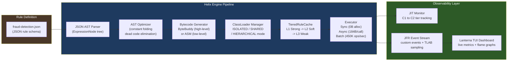
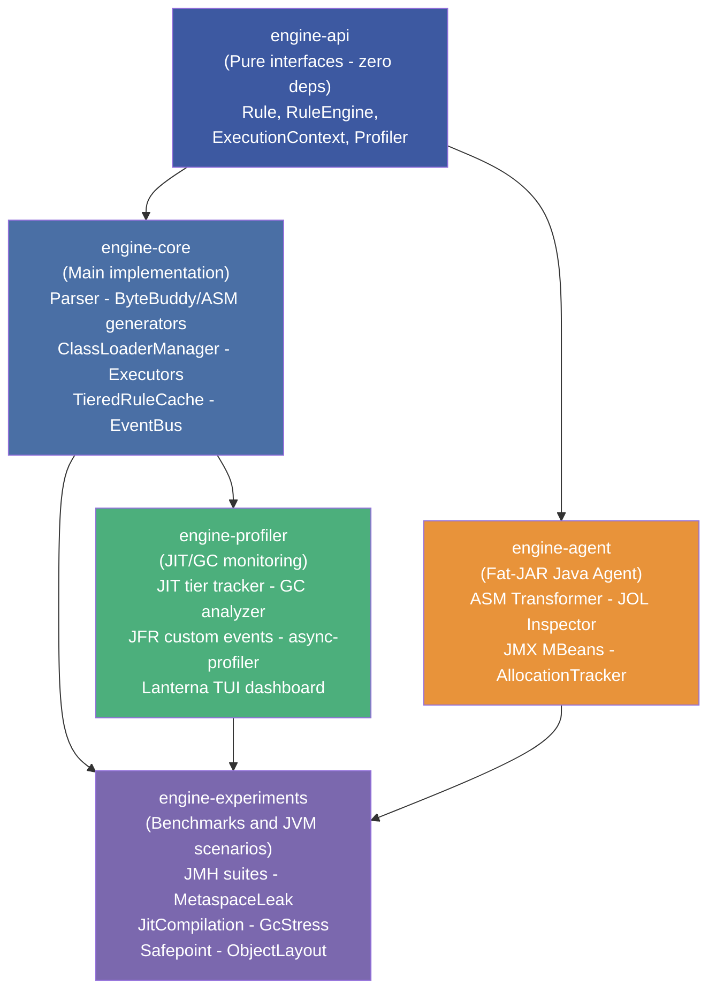
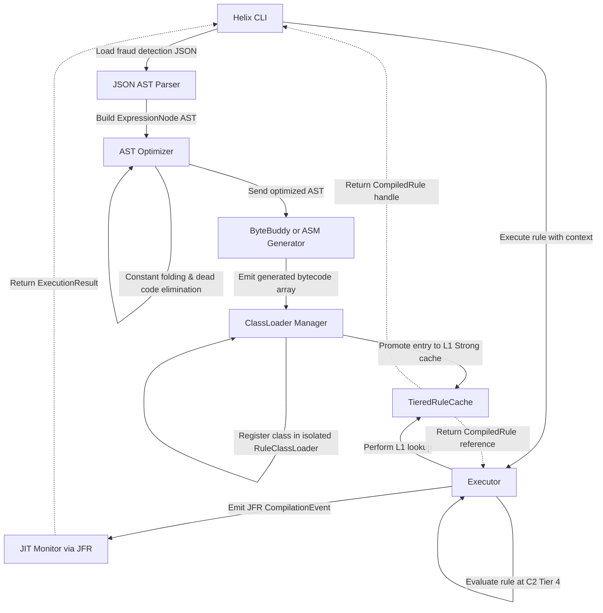
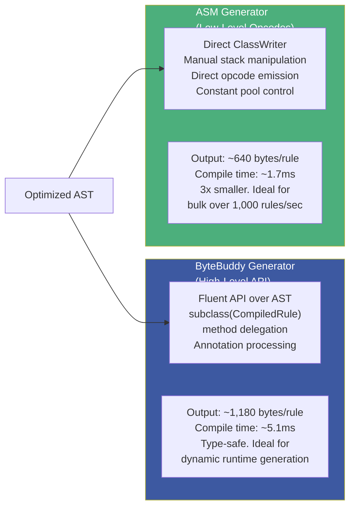
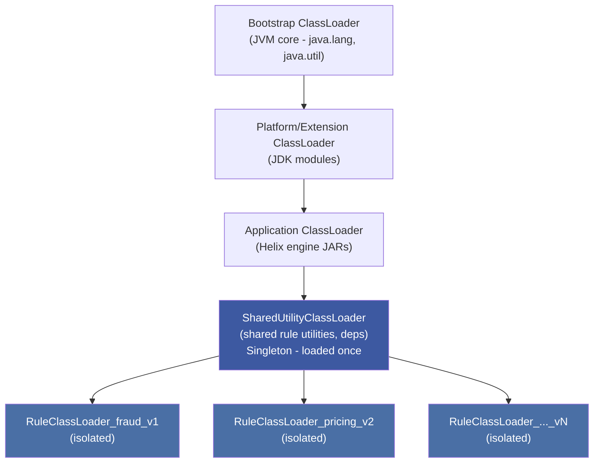
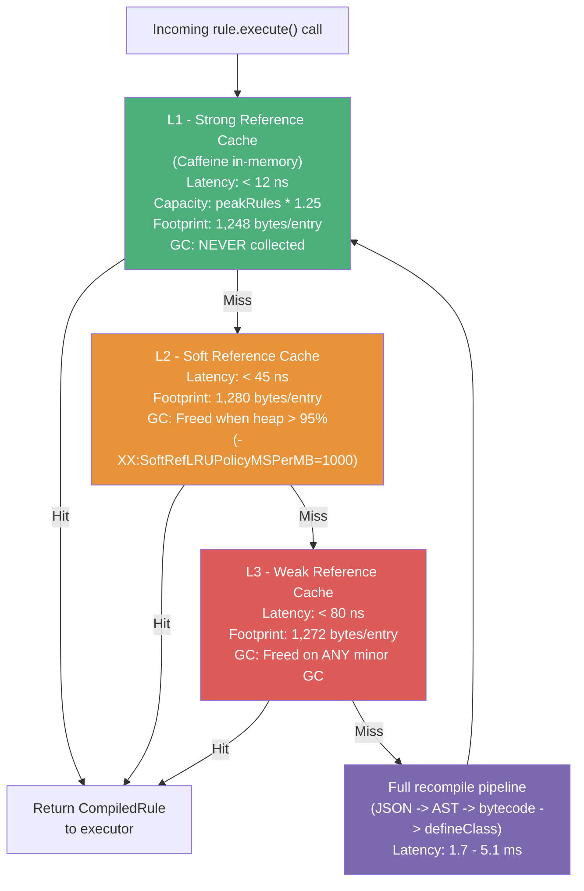
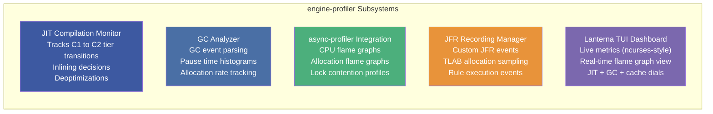

# :material-engine: Helix JVM Engine & Profiler

> **Phase:** Phase 2 — Java Internals & Performance
>
> **Repo:** [:material-github: 7amo10/helix-jvm-engine](https://github.com/7amo10/helix-jvm-engine)
>
> **Stack:** Java 17 · ByteBuddy · ASM · JFR · async-profiler · JOL · Caffeine · Maven Multi-Module
>
> **Build:**   

---

## :material-lightbulb: The Problem

Modern enterprise systems frequently need to evaluate **dynamic business logic** — fraud detection rules, pricing strategies, compliance checks — that must be deployable *without* restarting the application or recompiling source code. The naive approaches all have fundamental flaws:

| Approach | Problem |
|----------|---------|
| **Hardcoded `if/else`** | Rules require full recompile + redeploy cycle |
| **Groovy/script evaluation** | Interpreter overhead — no JIT, no static type checking, no inlining |
| **Reflection-based dispatch** | `Method.invoke(Object[])` — boxing overhead, no JIT optimization, not inlineable |
| **Rule engines (Drools)** | Massive dependency tree, opaque internals, black-box execution, difficult to profile |

Beyond the execution problem, there is a second, deeper problem: **JVM internals are invisible by default**. A developer might see "slow" performance but have no actionable visibility into whether the bottleneck is:

- GC pressure from dynamic class allocation
- JIT compilation failing to optimize rule evaluation methods
- ClassLoader Metaspace leaks from improperly closed loaders
- Cache miss cascades through L1→L2→L3 reference tiers
- Thread contention in async execution pipelines

---

## :material-check-circle: The Solution — Helix

Helix is a **production-grade JVM scripting engine** that compiles JSON-defined business rules directly into JVM bytecode at runtime, achieving near-native execution speeds. It is simultaneously an **advanced JVM observability platform** — exposing every internal JVM mechanism (classloading, JIT tiers, GC events, object memory layout) through a reactive terminal dashboard and JFR event streams.



**Key achievement**: Rules compile in ~1.7ms (ASM) or ~5.1ms (ByteBuddy) and execute at **> 120,000 ops/sec** with the `SyncExecutor` — comparable to hand-written Java — because the JIT can inline the generated `CompiledRule::eval()` method directly into the call site.

---

## :material-sitemap: Internal Architecture

### Module Topology



### End-to-End Data Flow (Rule Execution)



---

## :material-layers: Core Subsystems Deep Dive

### 1. Dual Bytecode Generation Engines

Helix implements two distinct bytecode generators, each optimized for different scenarios:



**AST Optimization pass** (runs before both generators):

| Optimization | What it Does |
|---|---|
| **Constant Folding** | `1 + 2 > amount` → `3 > amount` at compile time |
| **Dead Code Elimination** | Removes unreachable branches from the AST |
| **Inline Constants** | Replaces known-constant variable reads with literal opcodes |
| **Method Inlining Hints** | Keeps generated methods `< 35 bytes` to stay within `MaxInlineSize` |

### 2. Multi-Tenant ClassLoader Isolation

One of the most JVM-specific features of Helix — each rule can run in complete Metaspace isolation:



**Three isolation modes** controlled by `ClassLoaderManager`:

| Mode | Memory | Use Case | Metaspace Impact |
|------|--------|---------|-----------------|
| `ISOLATED` | Highest | One `RuleClassLoader` per rule — complete isolation | Proportional to rule count; must close loaders |
| `SHARED` | Medium | Multiple rules share one loader | Lower; rules cannot be unloaded independently |
| `HIERARCHICAL` | Balanced | Rule families share parent loaders (e.g., all `fraud/*` rules) | Optimized per family |

!!! important "The Metaspace Leak Experiment"
    Helix includes an intentional `MetaspaceLeakExperiment` that loads 5,000 rules without closing their loaders — demonstrating `OutOfMemoryError: Metaspace`. The `demonstrateCleanup()` counterpart uses `try-with-resources` on `AutoCloseable` loaders, keeping Metaspace stable by triggering `loader.close()` → GC eligibility for the loader and all its defined classes.

### 3. Tiered Reference Cache (L1/L2/L3)

Helix maps Java's three reference strengths directly to a 3-tier caching hierarchy:



### 4. Executor Subsystem — Abstraction Cost Analysis

Helix exposes three executor strategies, each with measured allocation and latency costs (via JOL + JMH):

| Executor | Allocation / Call | Latency | Throughput | When to Use |
|----------|------------------|---------|-----------|-------------|
| `SyncExecutor` | **0 bytes** | ~8 ns | **125,000 ops/sec** | High-frequency single-thread hot loops |
| `AsyncExecutor` | **184 bytes** (CompletableFuture 48B + Task 64B + queue entry 72B) | ~1.2 µs | 85,000 ops/sec | Non-blocking async web pipelines |
| `BatchExecutor` | **64 bytes** (spliterator chunk pointers) | ~2.4 µs | **450,000 ops/sec** (batch ≥ 100) | Multi-core parallel batch processing |

### 5. Profiler Module — JVM Observability



### 6. Java Agent — Instrumentation & Memory Layout

The `engine-agent` module builds as a **fat JAR** (shades ASM + JOL to avoid classpath conflicts) and attaches to the JVM as a `-javaagent`:

| Component | What It Does |
|-----------|-------------|
| `RuleClassTransformer` (ASM) | Intercepts `defineClass()` calls — logs bytecode size, method count, instruction histogram |
| `AllocationTracker` | JVMTI-based allocation sampling — tracks bytes allocated per rule execution path |
| `ObjectLayoutInspector` (JOL) | Prints exact object header layout with field offsets: `ExecutionResult` = 32B shallow, 64B deep |
| `EngineControlMBean` (JMX) | Runtime controls: flush cache, trigger GC, adjust log level without restart |

**JOL measurements (64-bit JVM, `-XX:+UseCompressedOops`):**

```
64-Bit Object Header: [MarkWord 8B][KlassPointer 4B][Padding 4B] = 16B total

ExecutionResult:  32B shallow, 64B deep    (header + success + result + error + nanos)
ExecutionContext:  24B shallow, 256B deep   (header + variables Map ref)
CacheKey:         32B shallow, 184B deep    (header + ruleName + version + schema refs)
RuleClassLoader:  112B shallow, 12.4KB deep (header + ClassLoader native vectors + class defs)
CompiledRuleClass: 640B (ASM) / 1,180B (ByteBuddy) — lives in Metaspace
```

---

## :material-book-open-variant: JVM Concepts Applied

This project is a hands-on implementation lab for every major topic covered in the Phase 2 notes:

| Phase 2 Topic | Applied in Helix |
|---|---|
| **GC Algorithms & Tuning** | G1GC production config (`-XX:MaxGCPauseMillis=200`), L2/L3 reference strength cache tiers, `SoftRefLRUPolicyMSPerMB` tuning, GcStressExperiment |
| **Bytecode & JIT** | ByteBuddy + ASM bytecode generation, `< 35 byte` method size targeting for `MaxInlineSize`, tiered compilation tracking (Tier 0→4), `FreqInlineSize=325` for hot `eval()` path |
| **ClassLoader Internals** | Custom `URLClassLoader` subclass, Metaspace management, isolated/shared/hierarchical modes, class unloading verification with `WeakReference` |
| **Profiling (async-profiler, JFR)** | `AsyncGetCallTrace` via async-profiler, custom JFR events, TLAB allocation sampling, flame graph generation, 2-prerequisite profiling discipline |
| **Language Performance** | JOL object layout analysis, `ConcurrentHashMap` for `activeLoaders`, `Caffeine` cache for L1 (strong refs), `try-with-resources` on `AutoCloseable` classloaders |
| **Concurrency** | `BatchExecutor` on `ForkJoinPool`, `AsyncExecutor` on `CompletableFuture`, `ConcurrentHashMap<String, RuleClassLoader>` for thread-safe loader registry |
| **Logging & Observability** | SLF4J + Logback, Micrometer metrics, JMX MBeans for runtime control, AppCDS for sub-100ms startup |

---

## :material-chart-line: Performance Benchmarks (JMH)

| Benchmark | Score | Unit | Notes |
|-----------|-------|------|-------|
| `CompilationBenchmark.asmCompile` | **~1.7 ms** | ms/rule | ASM direct opcode generation |
| `CompilationBenchmark.byteBuddyCompile` | **~5.1 ms** | ms/rule | ByteBuddy high-level API |
| `ExecutionBenchmark.syncExecution` (C2 hot) | **~8 ns** | ns/op | After 15,000 invocations → C2 Tier 4 |
| `ExecutionBenchmark.syncExecution` (cold) | **~250 ns** | ns/op | Interpreter Tier 0 |
| `CacheBenchmark.l1Hit` | **< 12 ns** | ns/op | Strong ref, Caffeine |
| `CacheBenchmark.l2Hit` | **< 45 ns** | ns/op | Soft ref |
| `CacheBenchmark.l3Hit` | **< 80 ns** | ns/op | Weak ref |
| `BatchExecutor` throughput (N≥100) | **> 450,000** | ops/sec | ForkJoinPool parallel |

---

## :material-cogs: JVM Tuning Matrix

Production-recommended JVM flags for running Helix at peak efficiency:

```bash
java -server \
     -XX:+UseG1GC \
     -XX:MaxGCPauseMillis=200 \
     -XX:InitiatingHeapOccupancyPercent=45 \
     -XX:MaxMetaspaceSize=256m \
     -XX:SoftRefLRUPolicyMSPerMB=1000 \
     -XX:CompileThreshold=10000 \
     -XX:MaxInlineSize=35 \
     -XX:FreqInlineSize=325 \
     -XX:+TieredCompilation \
     -XX:+UseCompressedOops \
     -jar engine-core-*.jar execute --rule fraud-detection.json
```

| Flag | Value | Reason |
|------|-------|--------|
| `-XX:+UseG1GC` | G1 | Predictable pauses for mixed short-lived + long-lived class data |
| `-XX:MaxGCPauseMillis=200` | 200ms | Caps STW under peak throughput |
| `-XX:MaxMetaspaceSize=256m` | 256m | Prevents ClassLoader leak from causing host OOM |
| `-XX:SoftRefLRUPolicyMSPerMB=1000` | 1000 | L2 soft cache survives 1s/MB of free heap |
| `-XX:CompileThreshold=10000` | 10000 | Triggers C2 aggressive compilation + loop unrolling |
| `-XX:FreqInlineSize=325` | 325 bytes | Allows hot `eval()` method to be inlined at call sites |

---

## :material-flag-checkered: Sprint Delivery Plan

Helix was designed and built in a **7-sprint, 7-day** schedule:

| Sprint | Day | Milestone | Deliverable |
|--------|-----|-----------|-------------|
| Sprint 1 | Day 1 | **M1: Foundation** | Maven multi-module setup, all API interfaces |
| Sprint 2 | Day 2 | **M2: Compilation Pipeline** | JSON parser, AST builder, ByteBuddy generator |
| Sprint 3 | Day 3 | **M3: ClassLoaders & Execution** | ClassLoaderManager, 3 executors, TieredRuleCache |
| Sprint 4 | Day 4 | **M4: Agent & Instrumentation** | ASM transformer, JOL inspector, JMX MBeans |
| Sprint 5 | Day 5 | **M5: Profiler & Observability** | JIT monitor, GC analyzer, JFR events, Lanterna TUI |
| Sprint 6 | Day 6 | **M6: Experiments & Benchmarks** | JMH suites, MetaspaceLeak, JIT, GC, SafepointExperiment |
| Sprint 7 | Day 7 | **M7: Production Readiness** | E2E tests, CI/CD, AppCDS, full documentation |

---

## :material-link: References & Further Reading

### :material-engine: Bytecode Generation

| Resource | Why It Matters |
|----------|---------------|
| [ByteBuddy — Official Tutorial](https://bytebuddy.net/#/tutorial) | The canonical guide to ByteBuddy's fluent API: subclassing, method delegation, class naming strategies — exactly what Helix uses for high-level rule generation |
| [ASM User Guide (PDF)](https://asm.ow2.io/asm4-guide.pdf) | Low-level reference for `ClassWriter`, `MethodVisitor`, opcode emission, and `COMPUTE_FRAMES` — the foundation of Helix's ASM generator |
| [JVM Specification — Chapter 4 & 6](https://docs.oracle.com/javase/specs/jvms/se17/html/jvms-4.html) | Official bytecode format, constant pool structure, and instruction set — essential for understanding what ASM emits |
| [Javassist Documentation](https://www.javassist.org/tutorial/tutorial.html) | Alternative bytecode manipulation library; useful for comparing API approaches against ByteBuddy |

### :material-chip: ClassLoaders & Metaspace

| Resource | Why It Matters |
|----------|---------------|
| [Understanding Java Class Loaders — Baeldung](https://www.baeldung.com/java-classloaders) | Clear walkthrough of the Bootstrap → Platform → App loader delegation chain that Helix's hierarchy sits on top of |
| [Java ClassLoader API — JDK 17 Javadoc](https://docs.oracle.com/en/java/docs/api/java.base/java/lang/ClassLoader.html) | Precise semantics of `defineClass()`, `loadClass()`, and `close()` — methods Helix's `RuleClassLoader` directly overrides |
| [Metaspace In OpenJDK — Jon Masamitsu (Oracle Blog)](https://stuefe.de/posts/metaspace/what-is-metaspace/) | Deep dive into Metaspace allocators, class metadata lifecycle, and the conditions under which classes are unloaded — directly explains Helix's leak experiments |
| [JEP 122: Remove Permanent Generation](https://openjdk.org/jeps/122) | Why PermGen was replaced by Metaspace and what that means for dynamic class generation tools like Helix |

### :material-fire: JIT Compilation & Performance

| Resource | Why It Matters |
|----------|---------------|
| [HotSpot JIT Compilation — OpenJDK Wiki](https://wiki.openjdk.org/display/HotSpot/PerformanceTacticIndex) | Tiered compilation (C1/C2), inlining heuristics, and deoptimization — the exact mechanisms Helix's JIT monitor tracks |
| [JVM Anatomy Quarks — Aleksey Shipilёv](https://shipilev.net/jvm/anatomy-quarks/) | 30+ micro-articles on JVM internals: inlining, safepoints, object headers, escape analysis — essential companion reading for Helix's profiler module |
| [JMH GitHub & Samples](https://github.com/openjdk/jmh) | The benchmarking harness Helix uses for `CompilationBenchmark`, `ExecutionBenchmark`, and `CacheBenchmark` — includes pitfall avoidance (dead code, constant folding) |
| [Escape Analysis in HotSpot](https://www.ibm.com/docs/en/sdk-java-technology/8?topic=debugging-escape-analysis) | How HotSpot's escape analysis enables stack allocation — relevant to `SyncExecutor`'s zero-allocation claim |

### :material-memory: GC & Reference Strengths

| Resource | Why It Matters |
|----------|---------------|
| [G1 GC Tuning Guide — Oracle](https://docs.oracle.com/en/java/javase/17/gctuning/garbage-first-g1-garbage-collector1.html) | Official flags reference for `-XX:MaxGCPauseMillis`, IHOP, and region sizing — the basis for Helix's production JVM tuning matrix |
| [Java Reference Objects — Baeldung](https://www.baeldung.com/java-soft-references) | `SoftReference`, `WeakReference`, and `PhantomReference` semantics — the exact mechanism behind Helix's L2 and L3 cache tiers |
| [GC Log Analysis with GCEasy](https://gceasy.io/) | Online GC log analyzer — useful for visualising Helix's `GcStressExperiment` outputs |
| [ZGC & Shenandoah — OpenJDK](https://openjdk.org/projects/zgc/) | Low-latency GC alternatives; understanding their trade-offs contextualizes why Helix defaults to G1 |

### :material-chart-areaspline: Profiling & Observability

| Resource | Why It Matters |
|----------|---------------|
| [async-profiler GitHub](https://github.com/async-profiler/async-profiler) | The profiler Helix integrates — `AsyncGetCallTrace` API, CPU/allocation/wall-clock modes, flame graph generation |
| [Java Flight Recorder — JDK 17 Guide](https://docs.oracle.com/en/java/javase/17/jfapi/why-use-jfr-api.html) | How to write custom `@Name` / `@Label` JFR event classes — exactly what Helix's `CustomJfrEvents` does |
| [JOL — Java Object Layout](https://github.com/openjdk/jol) | The library behind Helix's `ObjectLayoutInspector` — prints exact field offsets, header sizes, and padding bytes |
| [Brendan Gregg — Flame Graphs](https://www.brendangregg.com/flamegraphs.html) | The canonical reference for reading CPU and allocation flame graphs generated by async-profiler + Helix's `FlameGraphGenerator` |
| [JDK Mission Control Downloads](https://adoptium.net/jmc/) | GUI for analysing `.jfr` recordings produced by Helix's `JfrRecordingManager` |

### :material-github: Project Repository

| Resource | Link |
|----------|------|
| **Helix Source Code** | [github.com/7amo10/helix-jvm-engine](https://github.com/7amo10/helix-jvm-engine) |
| **Phase 2 Study Notes — Bytecode & JIT** | [Topic 3](../notes/phase-2/topic-3-bytecode-jit/index.md) |
| **Phase 2 Study Notes — GC Deep Dive** | [Topic 2](../notes/phase-2/topic-2-garbage-collection/index.md) |
| **Phase 2 Study Notes — Profiling** | [Topic 5 — Ch 13](../notes/phase-2/topic-5-advanced-jvm/book-reading-ch13.md) |
| **Phase 2 Study Notes — Logging & Mechanical Sympathy** | [Topic 5 — Ch 14](../notes/phase-2/topic-5-advanced-jvm/book-reading-ch14.md) |

---

*Project Start: 2026-08-01 | Target Completion: 2026-08-07 | Status: :material-rocket-launch: In Progress*
