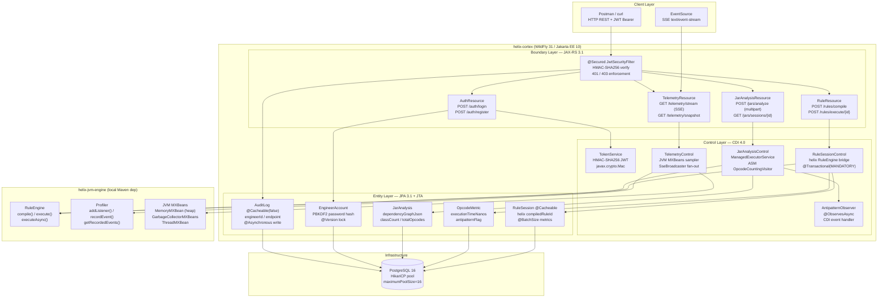
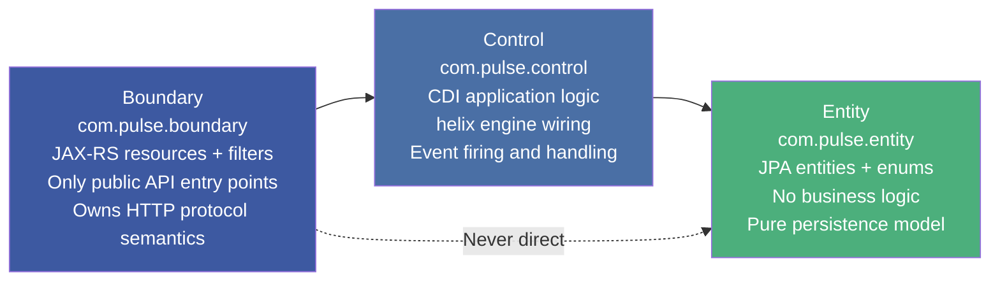
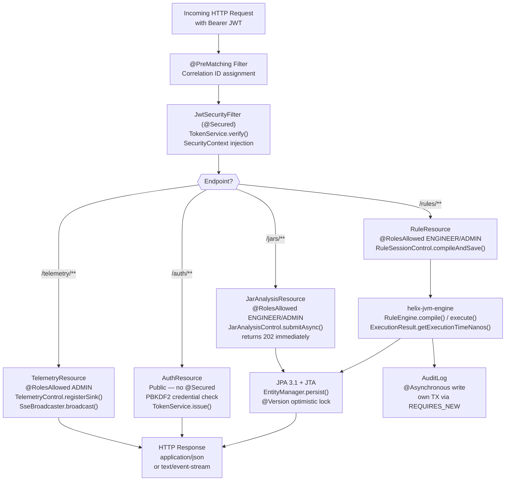
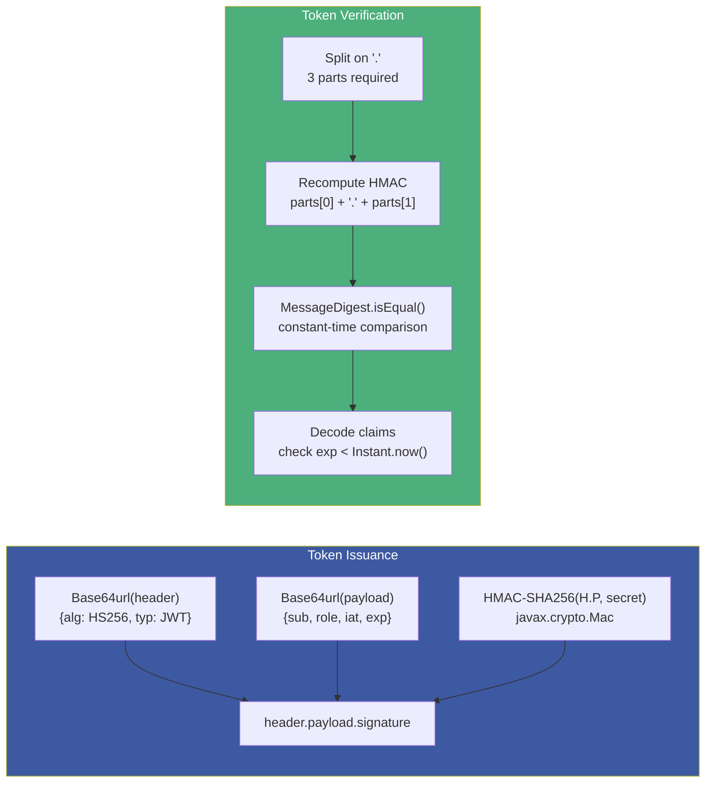
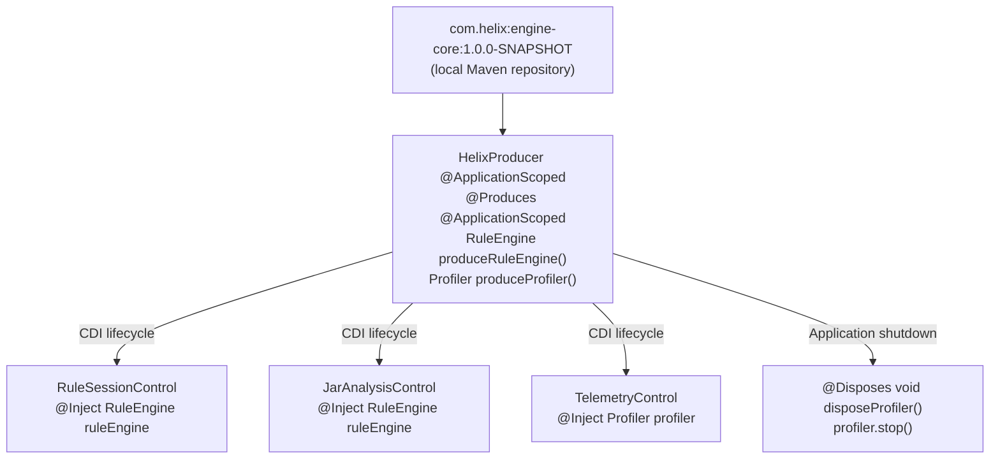
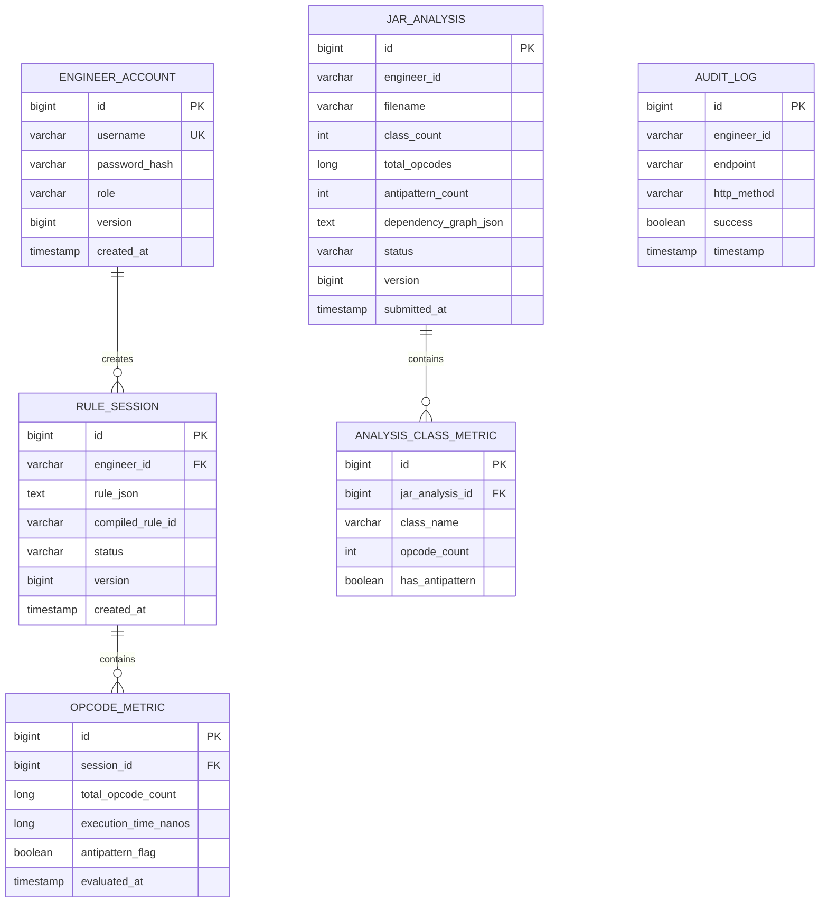
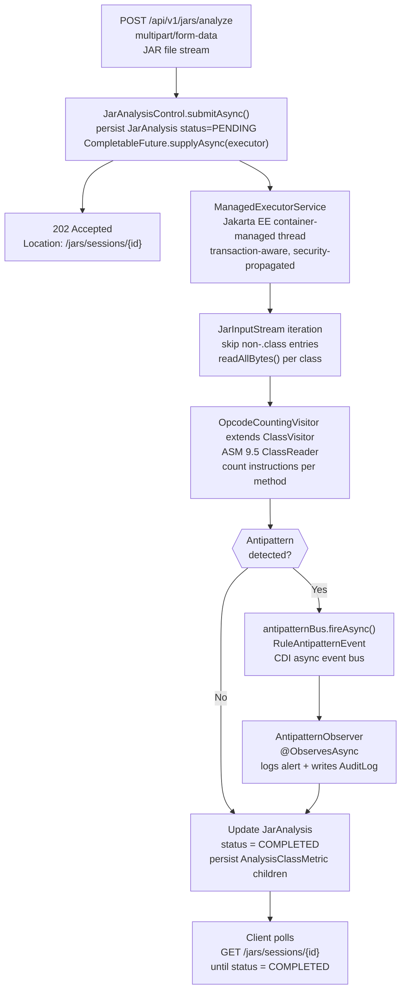
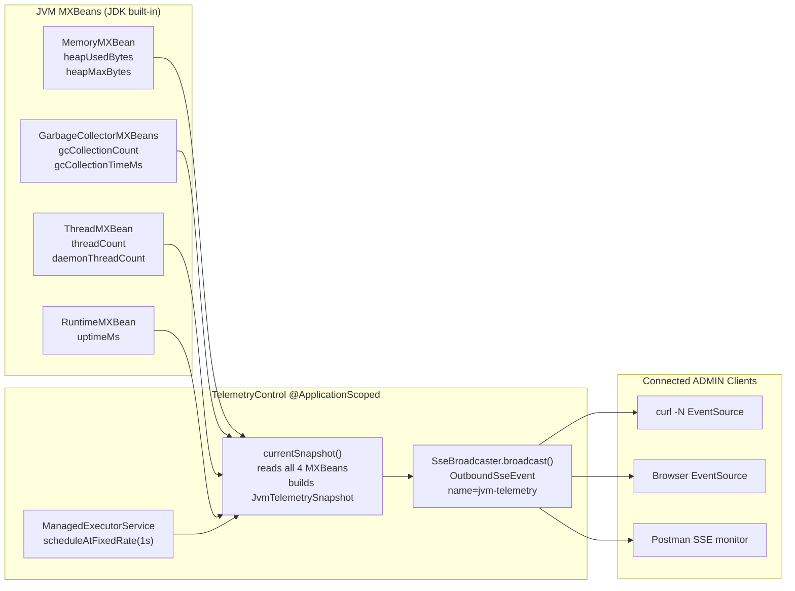
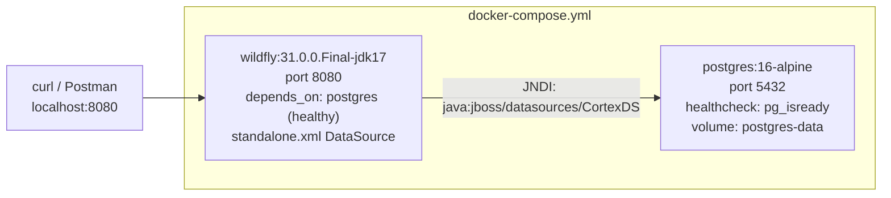

# :material-brain: helix-cortex — Enterprise Jakarta EE Platform

> **Phase:** Phase 3 — Enterprise Java (Jakarta EE 10)
>
> **Repo:** [:material-github: 7amo10/helix-cortex](https://github.com/7amo10/helix-cortex)
>
> **Docs:** [:material-book-open-variant: helix-jvm-engine.io/docs/helix-cortex](https://7amo10.github.io/helix-jvm-engine/docs/helix-cortex/overview)
>
> **Stack:** Jakarta EE 10 · WildFly 31 · PostgreSQL 16 · HikariCP · helix-jvm-engine · OW2 ASM · Docker Compose
>
> **Build:**    

---

## :material-lightbulb: The Problem

The [helix-jvm-engine](phase-2-helix-jvm-engine.md) solved the problem of dynamic rule execution at near-native JVM speeds. But it remained a **local, embedded library** — powerful, but inaccessible to distributed teams, cloud clients, or any system that could not embed a JVM agent directly. The gap was clear:

| Missing Capability | Impact Without It |
|---|---|
| **No REST API** | Clients must embed helix as a Maven dependency and manage class isolation themselves |
| **No authentication layer** | Any process on the same host can invoke rule execution with zero identity enforcement |
| **No persistence** | Every rule compilation is ephemeral — no audit trail, no opcode analytics, no session history |
| **No async bytecode inspection** | JAR analysis blocks the calling thread, making it unusable for large archives over HTTP |
| **No live telemetry** | JVM metrics are locked inside MXBeans — no streaming interface for remote observers |
| **No multi-role access control** | A single developer identity for all operations — no separation between ENGINEER and ADMIN concerns |

Beyond the integration gap, there was a second problem: **how to validate that seven weeks of Jakarta EE 10 study actually translate into production-quality software**. A comprehensive capstone project was needed — one that exercises every major Jakarta EE API across CDI, JAX-RS, JPA, JTA, Jakarta Security, SSE, and managed concurrency in a single coherent system.

---

## :material-check-circle: The Solution — helix-cortex

helix-cortex is a **cloud-native enterprise microservice** that wraps `helix-jvm-engine` as a compiled Maven dependency and exposes its capabilities through a fully secured, persistence-backed, real-time REST API. It is simultaneously the **capstone project for Phase 3** — a system where every class demonstrates a Jakarta EE 10 concept learned in the roadmap.



The name `helix-cortex` reflects the relationship precisely: the **cerebral cortex** is the brain's outer intelligent processing layer — it wraps the inner core structures and makes their raw signals accessible to the outside world. `helix-jvm-engine` is the inner core; `helix-cortex` is the enterprise cortex that exposes it.

---

## :material-sitemap: Internal Architecture

### BCE Package Structure

helix-cortex applies the **Boundary-Control-Entity** pattern from Adam Bien's *Real World Java EE Patterns*. Every class belongs to exactly one layer with strict dependency rules:



**Dependency rule:** Boundary calls Control. Control reads Entity. Boundary never accesses Entity directly. This enforces testability — every control bean is injected, not instantiated.

### End-to-End Request Flow



---

## :material-layers: Core Subsystems Deep Dive

### 1. JWT Authentication — Manual HMAC-SHA256

Rather than adding a JWT library dependency, helix-cortex implements JWT issuance and verification using only the JDK's built-in `javax.crypto.Mac` — exactly the approach taught in Week 2 Day 12-14 labs:



**`MessageDigest.isEqual()` is critical**: a naive `String.equals()` comparison leaks timing information — an attacker can forge a valid signature bit by bit by measuring response time. `isEqual()` takes constant time regardless of how many bytes match.

### 2. helix-jvm-engine Integration via CDI Producer

The `HelixProducer` class bridges the SE-world helix API into the EE container lifecycle using `@Produces`:



This means zero Spring-style XML wiring and zero reflection-based factory calls. The container manages the singleton lifecycle, and `@Disposes` guarantees the profiler's background thread is stopped cleanly on application undeploy.

**helix API surface used by helix-cortex:**

| helix Class | Used In | Purpose |
|---|---|---|
| `RuleEngine.compile(Rule)` | `RuleSessionControl.compileAndSave()` | Compile JSON rule → bytecode via ByteBuddy/ASM |
| `RuleEngine.execute(CompiledRule, ExecutionContext)` | `RuleSessionControl.executeAndSave()` | Execute rule, get `ExecutionResult` |
| `RuleEngine.executeAsync()` | `JarAnalysisControl` | Parallel per-class analysis |
| `ExecutionResult.getExecutionTimeNanos()` | `OpcodeMetric.executionTimeNanos` | Store nanosecond execution cost |
| `ExecutionContext.setVariable()` | Maps from `ExecutionRequest.variables` | Feed runtime inputs to rule |
| `Profiler.addListener(ProfileEventListener)` | `TelemetryControl` | Subscribe to profiler events for SSE fan-out |
| `ProfileEvent.timestamp()` | SSE event `id:` field | Correlate SSE events to profiler timeline |

### 3. JPA Entity Model with Optimistic Locking



**Key JPA design decisions:**

| Decision | Annotation | Reason |
|---|---|---|
| Optimistic locking on `RuleSession` | `@Version Long version` | Prevents two concurrent executions from corrupting session status |
| L2 cache on `RuleSession` | `@Cacheable(true)` | Sessions are read-heavy for ADMIN dashboard analytics |
| No L2 cache on `AuditLog` | `@Cacheable(false)` | Write-heavy, must always reflect real state |
| N+1 prevention on session list | `JOIN FETCH s.metrics` + `EntityGraph` | Hibernate statistics verify single SQL per list call |
| `@BatchSize(size=10)` on metrics | `@BatchSize` | Fallback batching when EntityGraph is not applied |

### 4. Async JAR Analysis — ManagedExecutorService + ASM

Uploading a JAR file triggers a non-blocking 202 Accepted immediately. The real work happens on a Jakarta EE managed thread:



**Three antipattern detectors (OW2 ASM):**

| Antipattern | Detection Heuristic | Performance Impact |
|---|---|---|
| `STRING_CONCAT_LOOP` | > 20 `INVOKEVIRTUAL StringBuilder.append` per class | Excessive heap allocation from implicit `new StringBuilder()` per iteration |
| `EXCESSIVE_OBJECT_CREATION` | > 50 `NEW` opcodes per class | GC pressure from short-lived object storms |
| `REDUNDANT_INSTANCEOF` | > 10 consecutive `INSTANCEOF` opcodes | Type-check overhead; pattern-matching or sealed types preferred |

### 5. Live JVM Telemetry via Server-Sent Events



**SSE event format (delivered every ~1 second):**

```
event: jvm-telemetry
id: 1727257183000
data: {
  "heapUsedBytes": 134217728,
  "heapMaxBytes": 536870912,
  "heapUsedPercent": 25.0,
  "gcCollectionCount": 14,
  "gcCollectionTimeMs": 87,
  "threadCount": 42,
  "daemonThreadCount": 38,
  "uptimeMs": 153600,
  "sampledAt": "2026-09-25T10:49:43Z"
}
```

The `SseBroadcaster` handles all clients simultaneously and automatically removes disconnected sinks via the `onClose` handler — no polling, no connection tracking needed.

---

## :material-api: REST API Reference

| Method | Path | Auth | Role | Description |
|--------|------|------|------|-------------|
| `POST` | `/api/v1/auth/login` | None | Public | Issue JWT (HMAC-SHA256) |
| `POST` | `/api/v1/auth/register` | None | Public | Register ENGINEER account (PBKDF2) |
| `POST` | `/api/v1/rules/compile` | JWT | ENGINEER, ADMIN | Compile JSON rule via helix ByteBuddy/ASM |
| `POST` | `/api/v1/rules/execute/{id}` | JWT | ENGINEER, ADMIN | Execute compiled rule with variable map |
| `GET` | `/api/v1/rules/sessions` | JWT | ADMIN only | All sessions (JOIN FETCH, 1 SQL) |
| `GET` | `/api/v1/rules/sessions/mine` | JWT | ENGINEER, ADMIN | Own sessions by engineer id |
| `GET` | `/api/v1/rules/sessions/high-density` | JWT | ADMIN only | Criteria API: sessions with `totalOpcodeCount > ?threshold` |
| `POST` | `/api/v1/jars/analyze` | JWT | ENGINEER, ADMIN | Upload JAR → async analysis (202 + Location) |
| `GET` | `/api/v1/jars/sessions/{id}` | JWT | ENGINEER, ADMIN | Poll analysis status (PENDING / COMPLETED / FAILED) |
| `GET` | `/api/v1/jars/sessions` | JWT | ADMIN only | All JAR analyses |
| `GET` | `/api/v1/telemetry/stream` | JWT | ADMIN only | Live SSE — JVM MXBeans every 1 second |
| `GET` | `/api/v1/telemetry/snapshot` | JWT | ADMIN only | One-shot JVM metrics snapshot |
| `DELETE` | `/api/v1/admin/cache/flush` | JWT | ADMIN only | Evict all L2 cache entries |

**Error format:** All 4xx/5xx responses use `application/problem+json` (RFC 7807):

```json
{
  "status": 403,
  "title": "Forbidden",
  "detail": "Role ENGINEER is not permitted to access GET /api/v1/rules/sessions"
}
```

---

## :material-book-open-variant: Jakarta EE Concepts Applied

This project is the applied capstone for all three weeks of Phase 3 study:

| Phase 3 Topic | Applied in helix-cortex |
|---|---|
| **CDI 4.0 Scopes & Lifecycle** | `@ApplicationScoped` for `TelemetryControl`, `RuleSessionControl`, `HelixProducer`; `@Dependent` for DTOs |
| **CDI Qualifiers & Producers** | `@Produces @ApplicationScoped RuleEngine` in `HelixProducer`; `@Disposes` on Profiler shutdown |
| **CDI Interceptors** | `@Monitored` interceptor on critical control methods for timing |
| **CDI Events & @ObservesAsync** | `antipatternBus.fireAsync(RuleAntipatternEvent)` in `JarAnalysisControl`; `@ObservesAsync` in `AntipatternObserver` |
| **JAX-RS 3.1 Resources** | All 4 resource classes; `@PathParam`, `@QueryParam`, `@FormDataParam`, `@Context SecurityContext` |
| **JAX-RS Filters & @NameBinding** | `@Secured` custom `@NameBinding`; `JwtSecurityFilter @Priority(AUTHENTICATION)` |
| **JAX-RS SSE** | `@Produces(SERVER_SENT_EVENTS)`, `SseEventSink`, `SseBroadcaster`, `OutboundSseEvent` |
| **JSON-B** | `JvmTelemetrySnapshot` record serialized to SSE data; `LoginResponse`, `ProblemDetail` |
| **ExceptionMapper & RFC 7807** | `GlobalExceptionMapper` maps `RuleCompilationException`, `OptimisticLockException`, `EntityNotFoundException` |
| **JPA 3.1 Entity Mapping** | 6 entities; `@OneToMany`, `@ManyToOne`, `@Enumerated`, `@Index`, `@Cacheable` |
| **JPA Optimistic Locking** | `@Version Long version` on `RuleSession`, `JarAnalysis`, `EngineerAccount` |
| **JPA Criteria API** | `findHighOpcodeDensitySessions(threshold)` — type-safe join + predicate + order |
| **JPA EntityGraph & N+1** | `jakarta.persistence.fetchgraph` hint on `findAll()` — verified via Hibernate statistics |
| **JPA L2 Cache** | `shared-cache-mode=ENABLE_SELECTIVE`; `@Cacheable(true)` on `RuleSession` |
| **JTA Transactions** | `@Transactional(TxType.MANDATORY)` on `RuleSessionControl`; `REQUIRES_NEW` on audit writes |
| **Jakarta Security 3.0** | `Pbkdf2PasswordHash` for `EngineerAccount.passwordHash`; `@RolesAllowed` on resources |
| **ManagedExecutorService** | JAR analysis offloaded via `executor.supplyAsync()`; SSE sampler via `scheduleAtFixedRate` |
| **HikariCP Connection Pool** | `maximumPoolSize=16`; `connectionTimeout=3000`; `poolName=CortexPool` |

---

## :material-docker: Docker Compose — One-Command Stack

The full stack (WildFly 31 + PostgreSQL 16) starts with a single command:

```bash
cp .env.example .env    # Fill in JWT_SECRET and DB_PASSWORD
docker compose up --build
```



**Multi-stage Dockerfile:**
- **Stage 1 (`maven:3.9-eclipse-temurin-17`):** `mvn dependency:go-offline` then `mvn package -DskipTests`
- **Stage 2 (`wildfly:31.0.0.Final-jdk17`):** Copy `helix-cortex.war` to `deployments/`

The `standalone.xml` is patched to define the `CortexDS` PostgreSQL datasource using environment variables injected by Docker Compose.

---

## :material-flag-checkered: Sprint Delivery Plan

helix-cortex was designed and built in a **4-sprint schedule**:

| Sprint | Days | Milestone | Deliverable |
|--------|------|-----------|-------------|
| Sprint 1 | Days 1-2 | **M1: Security Foundation** | Maven WAR, helix `mvn install`, JWT auth, `@Secured` filter, login/register endpoints |
| Sprint 2 | Days 3-4 | **M2: Rule Engine Pipeline** | `HelixProducer` CDI, rule compile/execute REST, JPA entities, Criteria API analytics |
| Sprint 3 | Days 5-6 | **M3: Async Analysis & SSE** | JAR analysis with ASM opcode counting, `@ObservesAsync` events, live SSE MXBeans telemetry |
| Sprint 4 | Day 7 | **M4: Production Readiness** | N+1 elimination verified, HikariCP load-tested, Docker Compose, Postman collection, README |

---

## :material-link: References & Further Reading

### :material-web: Jakarta EE Specifications

| Resource | Why It Matters |
|---|---|
| [Jakarta EE 10 Platform Spec](https://jakarta.ee/specifications/platform/10/) | The normative specification for every API used in helix-cortex — CDI 4.0, JAX-RS 3.1, JPA 3.1, Jakarta Security 3.0 |
| [JAX-RS 3.1 Spec — ServerSentEvents](https://jakarta.ee/specifications/restful-ws/3.1/jakarta-restful-ws-spec-3.1.html#server_sent_events) | The normative definition of `SseEventSink`, `SseBroadcaster`, and `OutboundSseEvent` — the exact types used in `TelemetryResource` |
| [RFC 7807 — Problem Details for HTTP APIs](https://datatracker.ietf.org/doc/html/rfc7807) | The IETF standard that defines `application/problem+json` — implemented by `GlobalExceptionMapper` |

### :material-security: Security

| Resource | Why It Matters |
|---|---|
| [HMAC — RFC 2104](https://datatracker.ietf.org/doc/html/rfc2104) | The specification for HMAC construction — basis for `TokenService`'s manual `javax.crypto.Mac` JWT implementation |
| [JWT — RFC 7519](https://datatracker.ietf.org/doc/html/rfc7519) | The standard that defines JWT structure (`header.payload.signature`), claim names (`sub`, `exp`, `iat`), and validation rules |
| [PBKDF2 — NIST SP 800-132](https://csrc.nist.gov/publications/detail/sp/800-132/final) | Why PBKDF2 with 100,000 iterations is the recommended password hashing standard — what `Pbkdf2PasswordHash` implements |
| [Timing Attacks on String Comparison](https://codahale.com/a-lesson-in-timing-attacks/) | Why `MessageDigest.isEqual()` is required instead of `String.equals()` for HMAC verification |

### :material-database: JPA & Persistence

| Resource | Why It Matters |
|---|---|
| [Hibernate ORM — Statistics Guide](https://docs.jboss.org/hibernate/orm/6.4/userguide/html_single/Hibernate_User_Guide.html#statistics) | How to enable `hibernate.generate_statistics=true` and read `getPrepareStatementCount()` — the technique used to verify N+1 elimination |
| [Pro Jakarta Persistence in Jakarta EE 10 — Chapters 4-9, 12, 14](https://link.springer.com/book/10.1007/978-1-4842-7327-9) | The textbook that covers `@OneToMany`, `@Version`, Criteria API, EntityGraph, `shared-cache-mode`, and HikariCP deployment — directly applied in every entity |
| [HikariCP Connection Pool Sizing](https://github.com/brettwooldridge/HikariCP/wiki/About-Pool-Sizing) | The formula `(CPU_cores × 2) + effective_spindle_count` used to derive `maximumPoolSize=16` |

### :material-chip: Bytecode & ASM

| Resource | Why It Matters |
|---|---|
| [OW2 ASM User Guide](https://asm.ow2.io/asm4-guide.pdf) | The reference for `ClassVisitor`, `MethodVisitor`, and opcode constants — the foundation of `OpcodeCountingVisitor` |
| [JVM Instruction Set — Chapter 6](https://docs.oracle.com/javase/specs/jvms/se17/html/jvms-6.html) | Official reference for `NEW`, `INVOKEVIRTUAL`, `INSTANCEOF` opcodes — the instructions detected by helix-cortex's three antipattern rules |

### :material-github: Project Resources

| Resource | Link |
|---|---|
| **helix-cortex Source Code** | [github.com/7amo10/helix-cortex](https://github.com/7amo10/helix-cortex) |
| **helix-cortex Official Docs** | [7amo10.github.io/helix-jvm-engine/docs/helix-cortex/overview](https://7amo10.github.io/helix-jvm-engine/docs/helix-cortex/overview) |
| **helix-jvm-engine (Core Dep)** | [github.com/7amo10/helix-jvm-engine](https://github.com/7amo10/helix-jvm-engine) · [Project Write-Up](phase-2-helix-jvm-engine.md) |
| **Phase 3 Notes — CDI & JAX-RS** | [Week 1](../notes/phase-3/week-1-cdi-jaxrs/index.md) |
| **Phase 3 Notes — JPA & Security** | [Week 2](../notes/phase-3/week-2-jpa-transactions-security/index.md) |
| **Phase 3 Notes — Async & SSE** | [Week 3](../notes/phase-3/week-3-bce-async-performance/index.md) |
| **Implementation Plan (4 Sprints)** | [IMPLEMENTATION_PLAN.md](https://github.com/7amo10/helix-cortex/blob/main/docs/superpowers/specs/IMPLEMENTATION_PLAN.md) |

---

*Project Start: 2026-09-25 | Target Completion: 2026-10-02 | Status: :material-rocket-launch: In Progress*
