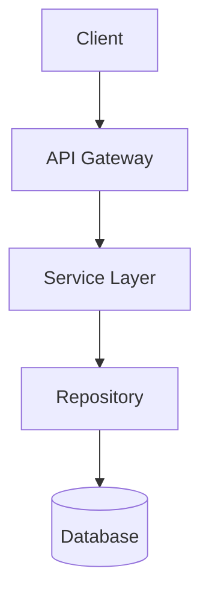

# Project Template

Use this template when documenting a new project.

---

## Overview

<!-- Brief description of what the project does -->

**Project Name:** [Project Name]  
**Level:** Beginner / Intermediate / Advanced  
**Status:** 🟢 Complete / 🟡 In Progress / 🔴 Planned  
**GitHub:** [Repository Link]()

---

## Technologies Used

| Category | Technology |
|----------|------------|
| Language | Java 17+ |
| Framework | Spring Boot |
| Database | PostgreSQL |
| Build Tool | Maven |
| Testing | JUnit 5, Mockito |

---

## Architecture



---

## Key Features

- [ ] Feature 1
- [ ] Feature 2
- [ ] Feature 3

---

## What I Learned

1. **Concept 1** - Description
2. **Concept 2** - Description
3. **Concept 3** - Description

---

## Setup Instructions

### Prerequisites

- Java 17+
- Maven 3.8+
- PostgreSQL

### Running the Project

```bash
# Clone the repository
git clone https://github.com/username/project.git
cd project

# Build the project
mvn clean install

# Run the application
mvn spring-boot:run
```

---

## Screenshots

<!-- Add screenshots here -->

---

## Resources

- [Link to related documentation]()
- [Link to tutorial followed]()
